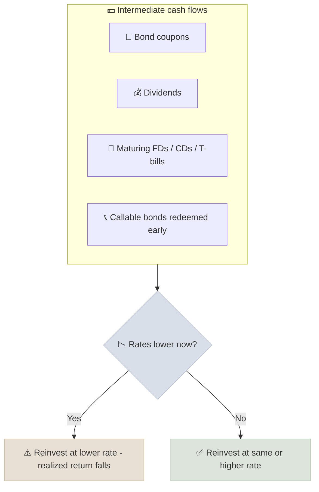

# Reinvestment Risk

Reinvestment risk is the chance that the cash flows you receive - coupons, dividends, maturing deposits - can only be reinvested at a lower rate than you originally earned, so your realized return falls short of the promised one.

```objectives
time: 35 min
outcomes:
  - Explain why a bond's yield to maturity assumes coupons are reinvested at that same yield
  - Calculate the realized (horizon) return on a bond under different reinvestment rates
  - Describe the trade-off between reinvestment risk and price (interest rate) risk
  - Name practical tools that reduce reinvestment risk - zero-coupon bonds, ladders, duration matching
prerequisites:
  - "[Compound Interest Mechanics](01-Compound-Interest-Mechanics.mdx) - future value and annuities"
```

## Why It Matters

<div class="audience-beginner" markdown="1">

Say you bought a 5-year deposit paying 7.5% in 2019. When it matured in 2024, rates had changed, and you had to reinvest at whatever the bank offered then. The same thing happens every time a bond pays you interest: that interest has to go somewhere, at today's rate, not the old one.

Retirees feel this most. When rates fall, the income from rolling over deposits falls with them, even though nothing "went wrong."

</div>

<div class="audience-analyst" markdown="1">

The yield to maturity (YTM) is an internal rate of return. Like any IRR, it implicitly assumes every intermediate cash flow is reinvested at the IRR itself. When reinvestment rates differ from the YTM, the realized horizon return differs too. For long, high-coupon bonds, the interest-on-interest component can be more than half of total dollar return, so the reinvestment assumption is not a rounding error.

</div>

## Where Reinvestment Risk Comes From



Callable bonds are the sharpest case: issuers call bonds precisely when rates have fallen, so the investor gets money back exactly when it is hardest to reinvest.

## The Math: Realized Horizon Return

For a bond bought at price $$P_0$$ and held to maturity over $$n$$ periods, with coupons $$C$$ reinvested at rate $$i$$ and face value $$F$$ repaid at the end:

$$
\text{Terminal value} = C \times \frac{(1 + i)^{n} - 1}{i} + F
$$

$$
\text{Realized return per period} = \left(\frac{\text{Terminal value}}{P_0}\right)^{1/n} - 1
$$

Only when $$i = \text{YTM}$$ does the realized return equal the YTM.

### Worked Example

A 10-year bond with a 1,000 face value pays an 8% annual coupon and is bought at par (YTM = 8%).

| Reinvestment rate | Coupons + interest-on-interest | Terminal value | Realized annual return |
|---|---|---|---|
| 8% (the YTM) | 1,158.9 | 2,158.9 | 8.00% |
| 5% | 1,006.3 | 2,006.3 | 7.21% |
| 2% | 876.0 | 1,876.0 | 6.49% |
| 11% | 1,337.7 | 2,337.7 | 8.86% |

Coupons alone total 800. At 8%, interest-on-interest adds another 358.9 - about 31% of the bond's total 1,158.9 dollar return. Cut the reinvestment rate to 2% and most of that disappears.

## Reinvestment Risk vs Price Risk

Interest rate moves create two opposite effects on a bond investor:

| Rates... | Price risk | Reinvestment risk | Net effect depends on |
|---|---|---|---|
| Rise | Bond price falls | Coupons reinvest at higher rates | Horizon vs duration |
| Fall | Bond price rises | Coupons reinvest at lower rates | Horizon vs duration |

When your investment horizon equals the bond's **Macaulay duration**, the two effects approximately cancel for a small, one-time parallel shift in rates. This is the basis of **immunization**, used by pension funds and insurers (see [Asset-Liability Matching](../../14-Advisory-Practice/Notes/03-Asset-Liability-Matching.mdx)).

## Managing Reinvestment Risk

| Tool | How it helps | Trade-off |
|---|---|---|
| Zero-coupon bonds (US Treasury STRIPS, Indian G-sec STRIPS) | No coupons, so nothing to reinvest - the yield is locked in | Highest price volatility for the maturity |
| Bond or FD ladder | Money matures in stages, averaging reinvestment rates over time | Some cash always reinvests at the current rate |
| Duration matching | Balances price and reinvestment risk for a known horizon | Needs rebalancing as rates and time change |
| Non-callable bonds | Removes early redemption risk | Lower yield than comparable callables |
| Longer-dated fixed deposits | Locks the rate for longer | Less liquidity; premature withdrawal penalties |

Equity investors face a version of this too: dividends reinvested at high valuations buy fewer shares. That is why reinvested dividends compound faster in bear markets, when prices are low.

## Red Flags

- **Treating YTM as a guaranteed return** on a coupon bond or bond fund. It is a promise only for zero-coupon bonds held to maturity.
- **Income plans built on today's deposit rates** for a 30-year retirement.
- **High-coupon callable bonds priced to yield-to-maturity** rather than yield-to-worst.
- **Concentrated maturities.** One large FD or bond maturing in a single year leaves the investor fully exposed to that year's rates.

## Case Studies

**US - retirees after 2008.** One-year CD rates in the US were roughly 3-5% before 2008 and fell to well under 1% for most of 2009-2021. Retirees living on CD income saw that income fall by more than 80% without losing a dollar of principal - pure reinvestment risk. Many moved into longer or riskier assets to replace the income, trading one risk for another.

**India - falling FD rates, 2014-2021.** One-year fixed deposit rates at large Indian banks fell from around 9% in 2014 to around 5% by 2021 as the RBI cut the repo rate. Senior citizens rolling over deposits lost close to half their interest income. The government-backed Senior Citizens Savings Scheme and the Pradhan Mantri Vaya Vandana Yojana (closed to new investors in 2023) became popular partly because they lock in a rate for 5-10 years.

> Rates are approximate and for teaching. Check RBI and FDIC data for exact historical values.

## Check Yourself

```quiz
- q: "What does a coupon bond's yield to maturity assume about coupons?"
  options: ["They are spent", "They are reinvested at the YTM", "They are reinvested at the risk-free rate", "They are reinvested at zero"]
  answer: 2
  explain: "YTM is an internal rate of return, and IRR math assumes intermediate cash flows are reinvested at the IRR itself."
- q: "Which instrument has no reinvestment risk if held to maturity?"
  options: ["A callable corporate bond", "A 10-year 7% G-sec", "A zero-coupon Treasury STRIP", "A dividend stock"]
  answer: 3
  explain: "A zero-coupon bond makes no intermediate payments, so its yield is locked in when held to maturity."
- q: "Rates fall sharply the day after you buy a 10-year coupon bond you plan to hold to maturity. What happens?"
  options: ["The price rises and the realized return rises", "The price rises, but the realized return to maturity falls", "Nothing changes", "The bond defaults"]
  answer: 2
  explain: "The mark-to-market price rises, but if you hold to maturity the price gain disappears and coupons reinvest at lower rates."
- q: "Why do issuers call bonds, and why is that bad for the investor?"
  answer: "Issuers call bonds when rates have fallen, so they can refinance more cheaply. The investor gets principal back exactly when reinvestment rates are low, and loses the above-market coupon."
```

## Exercises

```exercise
- title: Realized return at a lower rate
  task: |
    You buy a 5-year, 1,000 face value bond with a 7% annual coupon at par. Coupons can be reinvested at only 4%.

    1. What is the terminal value at maturity?
    2. What is your realized annual return?
  hints:
    - "FV of coupons = 70 × ((1.04^5 - 1) / 0.04)."
  solution: |
    1. FV of coupons = 70 × 5.4163 = 379.1. Terminal value = 379.1 + 1,000 = **1,379.1**.
    2. Realized return = (1,379.1 / 1,000)^(1/5) - 1 = **6.64%**, versus a 7% YTM.
- title: Build a ladder
  task: |
    A retiree has 50 lakh (or 500,000) to put into fixed deposits. Design a five-rung ladder, explain what happens each year, and explain how it changes the retiree's exposure to reinvestment risk compared with one 5-year deposit.
  solution: |
    Split into five equal deposits of 1, 2, 3, 4 and 5 years. Each year one deposit matures and is reinvested for 5 years, so after the first cycle all deposits are 5-year deposits with one maturing every year. Only 20% of the money is exposed to any single year's rate, so the income tracks an average of five years of rates instead of jumping with one year's rate. Compared with a single 5-year deposit, the ladder also provides yearly liquidity.
```

## Study Notes

- Reinvestment risk: intermediate cash flows may only earn lower rates later.
- **YTM assumes reinvestment at the YTM.** Realized return depends on actual reinvestment rates.
- Interest-on-interest can be a large share of a long bond's dollar return.
- Price risk and reinvestment risk move in opposite directions; matching horizon to duration roughly balances them.
- Tools: zero-coupon bonds, ladders, duration matching, non-callable bonds.

## References

- Fabozzi, *Bond Markets, Analysis, and Strategies*, 10th ed. (Pearson, 2021) - yield measures and reinvestment risk
- CFA Institute, *Fixed Income: Understanding Fixed-Income Risk and Return*, CFA Program Level I curriculum (2025)
- Reserve Bank of India, [Database on Indian Economy - deposit rates](https://data.rbi.org.in/) (accessed 2026)
- FDIC, [National Rates and Rate Caps](https://www.fdic.gov/resources/bankers/national-rates/) (accessed 2026)

*Last reviewed: 2026-09*
