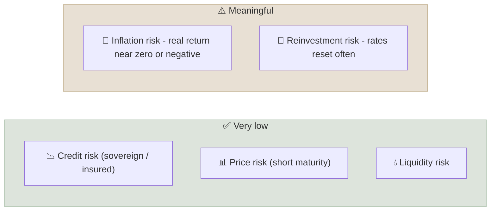

# Cash Equivalents

Cash equivalents are short-term, high-quality, highly liquid instruments - Treasury bills, money market funds, bank deposits - that preserve capital and can be turned into cash within days at a known value.

```objectives
time: 30 min
outcomes:
  - List the main cash-equivalent instruments in the US and India and how each is protected
  - Calculate the yield of a discount instrument such as a T-bill
  - Explain why cash has near-zero nominal risk but meaningful real (inflation) risk
  - Decide how much of a portfolio belongs in cash, and why
prerequisites:
  - "[Terminal Wealth Drag](../../01-Money-and-Compounding/Notes/03-Terminal-Wealth-Drag.mdx) - real vs nominal returns"
```

## Why It Matters

<div class="audience-beginner" markdown="1">

Cash is the part of your money that must be there tomorrow: the emergency fund, next year's school fees, the house deposit. Its job is not to grow fast - it is to not fall. The trade-off is that over long periods cash usually only just keeps up with inflation, and sometimes falls behind it.

</div>

<div class="audience-analyst" markdown="1">

Cash equivalents set the **risk-free rate** that every other asset is measured against: the Sharpe ratio's hurdle, CAPM's intercept, the opportunity cost of every investment. They also provide optionality - dry powder to buy when other assets are cheap - which does not show up in cash's own return.

</div>

## The Instruments

| Instrument | US | India | Typical maturity | Protection |
|---|---|---|---|---|
| Government bills | Treasury bills (4 to 52 weeks) | Treasury bills (91, 182, 364 days) | Under 1 year | Sovereign credit |
| Money market funds | Government and prime MMFs | Liquid funds, overnight funds, money market funds | Portfolio maturity under ~60-90 days | Diversification, regulation (SEC Rule 2a-7 / SEBI) |
| Bank deposits | Savings accounts, CDs | Savings accounts, fixed deposits | Overnight to 5+ years | FDIC insurance up to 250,000 dollars per depositor per bank; DICGC insurance up to 5 lakh rupees |
| Commercial paper | Corporate CP | CP from companies and NBFCs | Up to 270 days (US) / 1 year (India) | Issuer credit only |
| Sweep accounts | Brokerage sweeps | Auto-sweep FDs | Daily | Depends on the destination |

## Pricing a Discount Instrument

T-bills pay no coupon. You buy below face value and receive the face value at maturity. For a bill with face value $$F$$, price $$P$$ and $$d$$ days to maturity:

$$
\text{Holding period return} = \frac{F - P}{P}
$$

$$
\text{Annualized yield (money market basis)} = \frac{F - P}{P} \times \frac{365}{d}
$$

US Treasury auction results also quote a discount rate on a 360-day basis, $$\frac{F - P}{F} \times \frac{360}{d}$$, which understates the investor's true yield. Always compare instruments on the same basis.

**Example.** A 91-day Indian T-bill with face value 100 is bought at 98.30.

$$
\text{Yield} = \frac{100 - 98.30}{98.30} \times \frac{365}{91} = 1.729\% \times 4.011 = 6.94\%
$$

## Risk Profile



Money market funds are very safe but not risk-free. In September 2008 the Reserve Primary Fund "broke the buck" because it held Lehman Brothers commercial paper. In India, several credit-risk and short-duration debt funds froze redemptions in 2019-2020 after IL&FS and DHFL defaults. For true cash, choose government-only money funds or overnight funds.

## How Much Cash?

| Purpose | Rule of thumb |
|---|---|
| Emergency fund | 3-6 months of essential expenses (6-12 for self-employed or single-income households) |
| Known spending within 1-3 years | Hold in cash or short-term deposits, not equities |
| Retirees | 1-2 years of withdrawals, as a buffer against selling equities in a crash |
| Opportunity reserve | Optional; a small percentage for rebalancing or buying in drawdowns |

Beyond these needs, long-term cash holdings usually lose purchasing power after tax. Real returns on US T-bills averaged well under 1% a year over the last century.

## Red Flags

- **"Cash-like" products with credit risk** - high-yield corporate FDs, NBFC deposits, prime money funds holding lower-rated paper.
- **Yields well above government bills** for supposedly safe instruments - the extra yield is paying for a risk.
- **Deposits above the insurance limit** at a single bank.
- **Idle cash in a checking or savings account** paying far less than a money market fund.

## Case Studies

**US - 2023 regional bank failures.** When Silicon Valley Bank failed in March 2023, about 90% of its deposits were above the 250,000 dollar FDIC limit. Regulators ultimately protected all depositors, but the episode showed why large cash balances should be spread across banks or held in Treasury bills and government money market funds.

**India - PMC Bank, 2019.** When RBI restricted withdrawals at Punjab and Maharashtra Co-operative Bank in 2019, depositors could initially withdraw only a small amount. DICGC cover was raised from 1 lakh to 5 lakh rupees in 2020 partly in response. The lesson: cash in a weak bank is not risk-free cash.

## Check Yourself

```quiz
- q: "A 182-day T-bill with face value 100 costs 96.80. What is its annualized money market yield?"
  options: ["3.20%", "6.63%", "6.40%", "3.31%"]
  answer: 2
  explain: "(100 - 96.80) / 96.80 = 3.306%, times 365 / 182 = 6.63%."
- q: "What is the main long-term risk of holding cash?"
  options: ["Default", "Price volatility", "Inflation eroding purchasing power", "Currency pegs"]
  answer: 3
  explain: "Cash rarely loses nominal value, but after inflation and tax its real return is often near zero or negative."
- q: "What is the current deposit insurance limit per depositor per bank in the US and in India?"
  answer: "250,000 dollars (FDIC) in the US, and 5 lakh rupees (DICGC) in India."
```

## Exercises

```exercise
- title: Size an emergency fund
  task: |
    A household spends 60,000 rupees (or 4,000 dollars) a month, of which 45,000 (or 3,000) is essential. Both earners are salaried. Recommend an emergency fund size and where to hold it, and explain your choice.
  solution: |
    With two salaried earners, 4-6 months of essential expenses is reasonable: 1.8-2.7 lakh rupees (12,000-18,000 dollars). Hold part in a savings account or sweep FD for instant access and the rest in an overnight or liquid fund (India) or a government money market fund or T-bills (US). Keep it at an insured bank or in government-backed instruments, not in higher-yield credit products.
```

## Study Notes

- Cash equivalents: T-bills, money market funds, bank deposits, short CP.
- **Yield** on a discount bill = (F - P) / P × 365 / d.
- Nominal risk is low; **inflation** and **reinvestment** risk are real.
- Deposit insurance: 250,000 dollars (FDIC), 5 lakh rupees (DICGC), per depositor per bank.
- Hold enough for emergencies and near-term spending; not much more.

## References

- SEC, [Money Market Fund Reforms](https://www.sec.gov/investment/money-market-fund-reform) (2023 amendments)
- FDIC, [Deposit Insurance FAQs](https://www.fdic.gov/resources/deposit-insurance/) (accessed 2026)
- DICGC, [A Guide to Deposit Insurance](https://www.dicgc.org.in/) (accessed 2026)
- RBI, [Treasury Bills - FAQs](https://www.rbi.org.in/) (accessed 2026)
- Dimson, Marsh & Staunton, *UBS Global Investment Returns Yearbook* (2024) - long-run real returns on bills

*Last reviewed: 2026-09*
