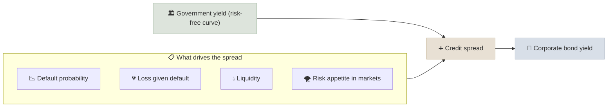

# Sovereign & Corporate Bonds

A bond is a loan you make to a government or company in exchange for fixed interest payments (coupons) and the return of your principal at maturity; its price moves inversely with interest rates and with the borrower's credit quality.

```objectives
time: 55 min
outcomes:
  - Price a bond from its coupons, face value and yield
  - Estimate a bond's price change for a rate move using modified duration and convexity
  - Explain credit spreads, ratings and the difference between sovereign and corporate risk
  - Compare the ways retail investors can buy bonds in the US and India
prerequisites:
  - "[Compound Interest Mechanics](../../01-Money-and-Compounding/Notes/01-Compound-Interest-Mechanics.mdx)"
  - "[Reinvestment Risk](../../01-Money-and-Compounding/Notes/02-Reinvestment-Risk.mdx)"
```

## Why It Matters

<div class="audience-beginner" markdown="1">

Bonds are the steadier half of most portfolios. You lend money, you receive regular interest, and you get your money back at the end - if the borrower can pay. Two things can hurt you: interest rates rising (which makes your older, lower-paying bond worth less if you sell early) and the borrower getting into trouble.

</div>

<div class="audience-analyst" markdown="1">

Bonds are the anchor of asset pricing: government yields define the risk-free curve, corporate spreads price credit risk, and duration links rate changes to price changes. Equity valuations are discounted at rates built on this curve, which is why rising yields compress equity multiples, particularly for long-duration growth stocks.

</div>

## Pricing a Bond

A bond's price is the present value of its cash flows, discounted at its yield to maturity $$y$$:

$$
P = \sum_{t=1}^{n} \frac{C}{(1 + y)^{t}} + \frac{F}{(1 + y)^{n}}
$$

- Coupon = yield: bond trades at **par**
- Coupon > yield: bond trades at a **premium**
- Coupon < yield: bond trades at a **discount**

**Example.** A 5-year bond, 1,000 face value, 6% annual coupon, priced at a 7% yield:

$$
P = 60 \times \frac{1 - 1.07^{-5}}{0.07} + \frac{1{,}000}{1.07^{5}} = 246.01 + 712.99 = 959.00
$$

## Duration and Convexity

**Macaulay duration** is the weighted average time to receive a bond's cash flows. **Modified duration** turns it into price sensitivity:

$$
D_{\text{mod}} = \frac{D_{\text{Mac}}}{1 + y}
$$

$$
\frac{\Delta P}{P} \approx -D_{\text{mod}} \times \Delta y + \frac{1}{2} \times \text{Convexity} \times (\Delta y)^{2}
$$

| Property | Effect on duration |
|---|---|
| Longer maturity | Higher duration |
| Higher coupon | Lower duration (more cash comes back early) |
| Higher yield | Lower duration |
| Zero-coupon bond | Duration = maturity |

**Example.** A 10-year G-sec with modified duration 7.0 and convexity 60. Yields rise 1 percentage point (0.01):

$$
\frac{\Delta P}{P} \approx -7.0 \times 0.01 + 0.5 \times 60 \times 0.0001 = -7.0\% + 0.3\% = -6.7\%
$$

## Credit Risk and Spreads



| Rating (S&P / CRISIL style) | Grade | Typical spread over government (rough, varies with cycle) |
|---|---|---|
| AAA, AA | High investment grade | 0.5-1.5% |
| A, BBB | Investment grade | 1-2.5% |
| BB, B | High yield ("junk") | 3-6% |
| CCC and below | Distressed | 8%+ |

Spreads widen sharply in recessions, so corporate bonds tend to fall exactly when equities fall. Government bonds are the diversifier; lower-rated corporate bonds behave partly like equities.

## Sovereign vs Corporate

| | US Treasuries | Indian G-secs and SDLs | Corporate bonds |
|---|---|---|---|
| Credit risk | Treated as risk-free in dollars | Risk-free in rupees (central), near risk-free (state SDLs) | Depends on issuer |
| Liquidity | Deepest market in the world | Liquid in benchmark maturities | Often thin for retail |
| Retail access | TreasuryDirect, brokers, ETFs | RBI Retail Direct, NSE goBID, gilt funds | Brokers, OBPPs in India, bond funds |
| Tax | Federal tax; exempt from state tax | Slab rate on interest | Slab / ordinary income |
| Inflation-linked | TIPS | Not widely available to retail | Rare |

## Red Flags

- **Yield far above peers with the same rating.** The market is pricing a risk the rating has not caught up with.
- **Heavy use of short-term debt to fund long-term assets** - the pattern behind IL&FS and many NBFC failures.
- **Long-duration bond funds bought for "safety"** just before rates rise.
- **Perpetual bonds (AT1) sold as fixed deposits.** They can be written off entirely in a bank rescue.
- **Covenant-lite issues** that give lenders little protection.

## Case Studies

**US - 2022, the worst bond year in decades.** As the Federal Reserve raised rates from near zero to over 4%, the Bloomberg US Aggregate Bond Index lost about 13% and long-term Treasuries lost around 30%. Investors who thought of bonds as riskless learned what a duration of 15-20 means. Investors who held to maturity recovered their principal but earned below-inflation returns in the meantime.

**India - Yes Bank AT1 write-off, 2020.** When Yes Bank was rescued in March 2020, about 8,400 crore rupees of its Additional Tier 1 bonds were written down to zero. Many buyers were retail investors who had been told these were as safe as deposits. The case is a lesson in reading the prospectus: seniority and write-down clauses matter more than the coupon.

**India - IL&FS, 2018.** IL&FS was rated AAA months before it defaulted on its obligations in 2018. The default triggered losses and redemption freezes in several debt mutual funds. Ratings are opinions that can lag reality.

## Check Yourself

```quiz
- q: "A bond's coupon is 8% and similar bonds now yield 6%. How does it trade?"
  options: ["At a discount", "At par", "At a premium"]
  answer: 3
  explain: "Its coupons are worth more than the market rate, so buyers pay more than face value."
- q: "A bond fund has modified duration 5. Yields fall 0.5 percentage points. Roughly how does the fund's price change?"
  options: ["-2.5%", "+2.5%", "+5%", "+0.5%"]
  answer: 2
  explain: "Price change ≈ -5 × (-0.005) = +2.5%."
- q: "Why do lower-rated corporate bonds tend to fall when equities fall?"
  options: ["They are linked to stock indices by law", "Credit spreads widen as default risk and risk aversion rise in downturns", "Their coupons fall", "They have zero duration"]
  answer: 2
  explain: "In a recession, expected defaults and investor risk aversion rise together, widening spreads and lowering prices - the same forces that hit equities."
- q: "Which has the higher duration: a 10-year 9% coupon bond or a 10-year zero-coupon bond?"
  answer: "The zero-coupon bond. Its duration equals its 10-year maturity, while the coupon bond returns some cash early, pulling its duration below 10."
```

## Exercises

```exercise
- title: Price and duration
  task: |
    A 3-year, 1,000 face value bond pays an annual coupon of 5% and yields 5%.

    1. What is its price?
    2. Calculate its Macaulay and modified duration.
    3. Estimate its price if the yield rises to 6%, using duration only.
  hints:
    - "Macaulay duration = sum of (t × PV of cash flow at t) / price."
  solution: |
    1. Coupon = yield, so price = **1,000**.
    2. PVs: 47.62 (t=1), 45.35 (t=2), 907.03 (t=3). Weighted: 47.62 + 90.70 + 2,721.09 = 2,859.41. Macaulay = **2.859** years. Modified = 2.859 / 1.05 = **2.723**.
    3. ΔP/P ≈ -2.723 × 0.01 = -2.72%, so price ≈ **972.8**. The exact price at 6% is 973.27; the difference is convexity.
- title: Read a rating report
  task: |
    Download the latest rating rationale for one Indian corporate bond (CRISIL, ICRA or CARE) or one US issuer (S&P or Moody's summary). List the three factors the agency cites most and one risk it flags that the coupon alone would not tell you.
```

## Study Notes

- **Price = PV of coupons + PV of face value**, at the yield to maturity.
- Price and yield move inversely; **modified duration** measures sensitivity.
- **Convexity** makes the price rise more when yields fall than it falls when yields rise.
- Corporate yield = government yield + **credit spread**; spreads widen in recessions.
- Ratings lag. Read seniority and write-down clauses, especially for AT1 and perpetual bonds.

## References

- Fabozzi, *Bond Markets, Analysis, and Strategies*, 10th ed. (Pearson, 2021)
- CFA Institute, *Fixed Income: Introduction to Fixed-Income Valuation*, CFA Program Level I curriculum (2025)
- RBI, [Retail Direct Scheme](https://rbiretaildirect.org.in/) (2021)
- US Treasury, [TreasuryDirect](https://www.treasurydirect.gov/) (accessed 2026)
- SEBI, [Online Bond Platform Providers framework](https://www.sebi.gov.in/) (2022)
- Bloomberg, US Aggregate Bond Index annual returns (2022)

*Last reviewed: 2026-09*
