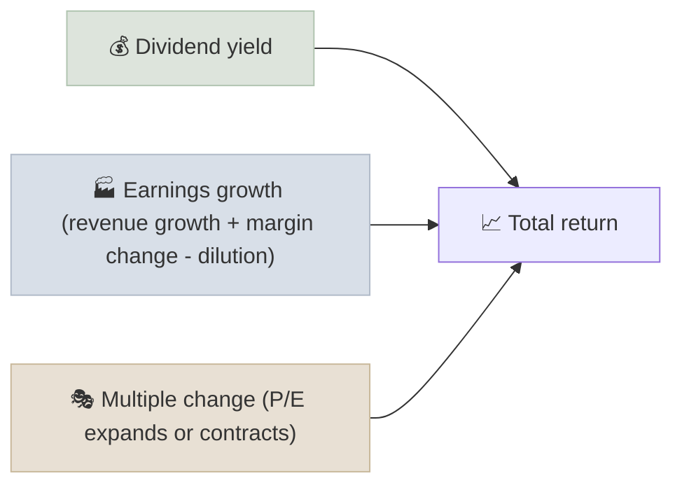

# Equities

A share of equity is a fractional ownership claim on a company's future profits after everyone else - suppliers, employees, lenders, the tax authority - has been paid, which makes equities the highest-returning and most volatile of the major asset classes.

```objectives
time: 40 min
outcomes:
  - Decompose a stock's total return into dividend yield, earnings growth and change in valuation
  - Explain the equity risk premium and why equities have historically outperformed bonds and cash
  - Describe how US and Indian equity markets are organized - exchanges, indices, size classes, settlement
  - Explain the rights and risks of common shareholders
prerequisites:
  - "[Compound Interest Mechanics](../../01-Money-and-Compounding/Notes/01-Compound-Interest-Mechanics.mdx)"
```

## Why It Matters

<div class="audience-beginner" markdown="1">

When you buy a share, you own a small piece of a real business. If the business grows its profits for decades, your piece grows with it. That is why equities have been the best long-term way to beat inflation. The price for that is a bumpy ride: falls of 30-50% have happened several times in every major market.

</div>

<div class="audience-analyst" markdown="1">

Equity is a residual, perpetual, levered claim on free cash flow. Its value is the present value of all future distributions, which makes it highly sensitive to both growth expectations and discount rates. Every framework later in this course - metrics, valuation, screening - is a way of estimating those two inputs better than the market does.

</div>

## Where Equity Returns Come From

Over any period, a stock's (or an index's) total return decomposes as:

$$
\text{Total return} \approx \underbrace{\text{Dividend yield}}_{\text{income}} + \underbrace{\text{EPS growth}}_{\text{fundamentals}} + \underbrace{\text{Change in P/E}}_{\text{sentiment}}
$$



Over 1-3 years, multiple change dominates - sentiment moves prices. Over 10-20 years, earnings growth and dividends dominate, because the P/E can only move so far. This is the arithmetic behind "in the short run the market is a voting machine; in the long run it is a weighing machine" (Graham).

**Example.** A stock yields 2%, grows EPS at 10% a year, and its P/E falls from 30 to 20 over 10 years. The annual drag from the multiple is $$(20/30)^{1/10} - 1 = -4.0\%$$. Expected annual return ≈ 2% + 10% - 4.0% ≈ **8.0%** - well below the 12% that the fundamentals alone would suggest.

## The Equity Risk Premium

The **equity risk premium (ERP)** is the extra return investors demand for holding equities instead of risk-free government bonds. Historical realized premiums over bills were around 5-6% a year in the US over the 20th century, and forward-looking estimates today are typically 4-6%. The ERP appears in CAPM, in WACC, and in every discount rate in the [Valuation](../../06-Valuation/INDEX.mdx) module.

## Market Structure

| | United States | India |
|---|---|---|
| Main exchanges | NYSE, Nasdaq | NSE, BSE |
| Benchmark indices | S&P 500, Nasdaq-100, Russell 2000, Dow Jones | Nifty 50, Sensex, Nifty Midcap 150, Nifty Smallcap 250 |
| Size classes | Large cap (roughly 10 billion dollars+), mid, small, micro - no official rule | SEBI rule: large cap = top 100 by market cap, mid cap = 101-250, small cap = 251 onwards |
| Settlement | T+1 (since May 2024) | T+1 (fully since January 2023), T+0 optional for some stocks |
| Regulator | SEC, FINRA | SEBI |
| Ownership disclosure | 13F, Form 4 insider filings | Quarterly shareholding pattern (promoter, FII, DII, public) |
| Foreign access | Open | FPI registration for foreigners; US residents face PFIC and reporting complexity |

## Shareholder Rights

- **Residual claim** on profits and assets after creditors.
- **Voting rights** on board elections and major transactions (some companies have dual-class shares - Alphabet, Meta in the US; DVR shares such as Tata Motors DVR historically in India).
- **Dividends** when declared by the board - never guaranteed.
- **Limited liability** - you can lose your investment but not more.

In India, **promoters** (founding families or parent groups) often own 50-75% of a company. That aligns their interests with minority shareholders in good cases and creates related-party and governance risk in bad ones. Analyze promoter holding, pledging and related-party transactions (see [Management & Capital Allocation](../../11-Annual-Report-Analysis/Notes/03-Management-and-Capital-Allocation.mdx)).

## Risks

| Risk | What it means |
|---|---|
| Market (systematic) risk | The whole market falls; diversification does not help |
| Company (idiosyncratic) risk | One company fails; diversification helps |
| Valuation risk | You pay too much; the business does fine but your return is poor |
| Permanent loss of capital | Fraud, disruption or leverage wipes out the equity |
| Behavioral risk | Selling in panic at the bottom - often the largest risk of all |

## Red Flags

- **Returns explained mostly by multiple expansion.** When P/E has doubled while EPS barely moved, future returns are borrowing from the past.
- **A single stock above 20-25% of a portfolio** without a deliberate reason.
- **High promoter pledging** in India - a falling price can trigger forced selling.
- **Dual-class structures with no sunset** where insiders control votes but own little economic interest.

## Case Studies

**US - the Nifty Fifty, 1972-1974.** In the early 1970s, US investors bought a set of admired "one-decision" growth stocks at P/E ratios of 40-90. Many of the businesses kept growing, but the multiples collapsed in the 1973-74 bear market and prices fell 50-80%. It took years for some of them to recover. Great companies can be poor investments at the wrong price.

**India - the 2008 and 2020 crashes.** The Sensex fell roughly 60% from January 2008 to March 2009 and about 38% from January to March 2020. Investors who kept their SIPs running through both falls bought units at low prices, and long-run SIP returns from those periods were strong. Equity returns come with drawdowns; the behavior during drawdowns decides whether an investor actually earns them.

> Index levels and returns are approximate.

## Check Yourself

```quiz
- q: "A stock yields 3%, earnings grow 7% a year, and its P/E is unchanged over 10 years. What is its approximate annual total return?"
  options: ["7%", "10%", "3%", "21%"]
  answer: 2
  explain: "With no multiple change, total return ≈ dividend yield + EPS growth = 3% + 7% = 10%."
- q: "Over long horizons (15+ years), which component usually dominates equity returns?"
  options: ["Change in P/E", "Earnings growth and dividends", "Currency moves", "Share buybacks alone"]
  answer: 2
  explain: "P/E can only change so much, so over long periods its annual contribution shrinks toward zero while earnings growth and dividends compound."
- q: "Under SEBI's classification, what makes an Indian stock mid cap?"
  options: ["Market cap between 5,000 and 20,000 crore", "Rank 101-250 by full market capitalization", "Being in the Nifty Next 50", "Having a P/E between 15 and 30"]
  answer: 2
  explain: "SEBI defines large cap as the top 100, mid cap as 101-250 and small cap as 251 onward, by full market capitalization. AMFI publishes the list twice a year."
- q: "What is the equity risk premium and where is it used?"
  answer: "The expected extra return of equities over risk-free government bonds, as compensation for their higher risk. It is used in CAPM to estimate the cost of equity, and so in WACC and every DCF discount rate."
```

## Exercises

```exercise
- title: Decompose a decade
  task: |
    Pick one index (S&P 500 or Nifty 50) and one decade (e.g. 2014-2024). Using index data, find the starting and ending index level, P/E and dividend yield. Estimate how much of the total return came from earnings growth, dividends and change in P/E.
  hints:
    - "Implied EPS = index level / P/E."
- title: Expected return from today's price
  task: |
    An index trades at a P/E of 24 with a 1.3% dividend yield. You expect EPS to grow 8% a year and the P/E to revert to 18 over 10 years. Estimate the expected annual return.
  solution: |
    Multiple drag = (18/24)^(1/10) - 1 = -2.84% a year. Expected return ≈ 1.3% + 8% - 2.84% ≈ **6.5%** a year.
```

## Study Notes

- Equity = residual, perpetual claim on profits.
- **Total return ≈ dividend yield + EPS growth + change in P/E.**
- Short term: sentiment (P/E) dominates. Long term: fundamentals dominate.
- **ERP** ≈ 4-6% forward-looking; used in every discount rate.
- US and India both settle T+1; SEBI defines size classes by rank.
- Watch promoter holdings, pledges and dual-class structures.

## References

- Graham & Dodd, *Security Analysis*, 6th ed. (McGraw-Hill, 2008)
- Siegel, *Stocks for the Long Run*, 6th ed. (McGraw-Hill, 2022)
- Damodaran, [Implied Equity Risk Premiums for the US Market](https://pages.stern.nyu.edu/~adamodar/New_Home_Page/datafile/implpr.html) (updated annually) and his annual paper *Equity Risk Premiums: Determinants, Estimation and Implications*
- SEBI, [Categorization and Rationalization of Mutual Fund Schemes](https://www.sebi.gov.in/legal/circulars/oct-2017/categorization-and-rationalization-of-mutual-fund-schemes_36199.html) (2017) - size class definitions
- SEC, [Shortening the Securities Transaction Settlement Cycle (T+1)](https://www.sec.gov/) (2023 final rule, effective May 2024)

*Last reviewed: 2026-09*
