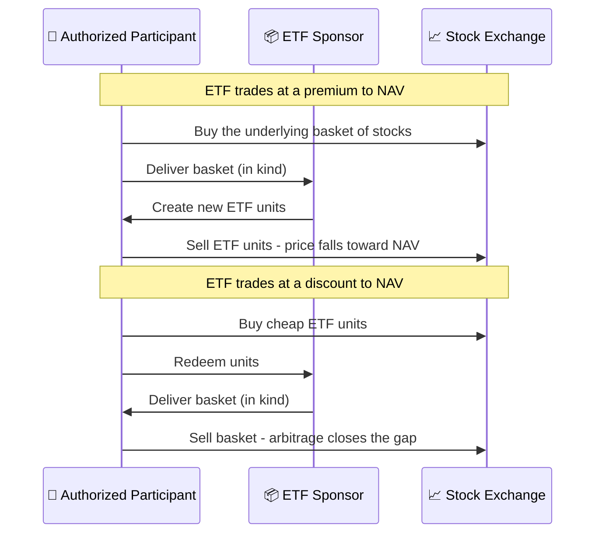

# Index Funds, ETFs & Mutual Funds

Pooled funds let many investors own one diversified portfolio: an index fund copies a benchmark at low cost, an actively managed fund tries to beat it, and an ETF is a fund wrapper that trades on an exchange like a stock - and can hold either strategy.

```objectives
time: 45 min
outcomes:
  - Distinguish strategy (passive vs active) from structure (mutual fund vs ETF)
  - Measure a fund's tracking difference, tracking error and active share
  - Explain the ETF creation and redemption mechanism and why it improves tax efficiency in the US
  - Choose between an index fund, an ETF and an active fund for a given investor
prerequisites:
  - "[Terminal Wealth Drag](../../01-Money-and-Compounding/Notes/03-Terminal-Wealth-Drag.mdx) - cost of fees"
  - "[Equities](03-Equities.mdx)"
```

## Why It Matters

<div class="audience-beginner" markdown="1">

Most people should not pick individual stocks for their core savings. A fund lets you own hundreds of companies with one purchase. The big choice is whether to pay a manager to try to beat the market (active) or just own the whole market cheaply (passive). The evidence says most active managers fail to beat the market over long periods after their fees.

</div>

<div class="audience-analyst" markdown="1">

Sharpe's "arithmetic of active management" (1991) shows that before costs, the average actively managed dollar must earn the market return; after costs, it must underperform. Active management is therefore a zero-sum game before fees and negative-sum after. The analyst's question is not "active or passive?" but "where is there enough inefficiency, and a manager with enough skill, to overcome the cost hurdle?"

</div>

## Strategy vs Structure

Two independent choices are often confused:

| | Mutual fund structure | ETF structure |
|---|---|---|
| **Passive strategy** | Index mutual fund (Vanguard 500 Index; UTI Nifty 50 Index Fund) | Index ETF (SPY, VOO; Nippon India Nifty BeES) |
| **Active strategy** | Classic active fund (most Indian equity funds) | Active ETF (growing fast in the US since 2019) |

| Feature | Mutual fund | ETF |
|---|---|---|
| Trading | Once a day at NAV | Throughout the day at market price |
| Minimums | Often none; SIPs from 100-500 rupees | One unit (or fractional at some brokers) |
| Needs a demat / brokerage account | No | Yes |
| Price vs NAV | Always NAV | Can trade at a premium or discount, especially in illiquid Indian ETFs |
| US tax efficiency | Capital gains distributions common | In-kind redemptions usually avoid distributions |
| India tax | Same rules for equity MFs and equity ETFs | Same |
| Automatic investing | Easy (SIPs) | Depends on broker |

## Measuring an Index Fund

**Tracking difference** - the fund's return minus the index return over a period. It is roughly the negative of the fund's total costs:

$$
\text{TD} = R_{\text{fund}} - R_{\text{index}}
$$

**Tracking error** - the standard deviation of the return differences. It shows how consistently the fund follows the index:

$$
\text{TE} = \sigma\left(R_{\text{fund},t} - R_{\text{index},t}\right)
$$

A good index fund has a tracking difference close to its expense ratio and a tracking error under about 0.1-0.2% a year. SEBI requires Indian index funds and ETFs to disclose tracking error, and caps it at 2%.

## Measuring an Active Fund

**Active share** - how different the portfolio is from its benchmark:

$$
\text{Active Share} = \frac{1}{2} \sum_{i=1}^{N} \left| w_{\text{fund},i} - w_{\text{index},i} \right|
$$

Active share below about 60% with an active-fund fee is a warning sign of a **closet indexer** - a fund charging active fees for a portfolio close to the index. Evaluate active funds on after-fee, risk-adjusted returns over full cycles (see [Sharpe Ratio](../../03-Risk-and-Return/Notes/02-Sharpe-Ratio.mdx)).

## How ETFs Stay Close to NAV



In the US, in-kind redemptions let the fund hand out its lowest-cost-basis shares without selling them, which is why equity ETFs rarely distribute capital gains. In India, where market making is thinner for many ETFs, check the bid-ask spread and the premium or discount to iNAV before trading.

## The Evidence on Active vs Passive

S&P's SPIVA scorecards consistently find that over 10-15 years, a large majority of actively managed large-cap funds underperform their benchmark after fees - roughly 85-90% in the US. In India the share is lower but still a majority for large-cap funds over 10 years, while mid- and small-cap categories have shown more room for active outperformance. Past winners also rarely stay winners (SPIVA Persistence Scorecard).

| Market segment | Case for passive | Case for active |
|---|---|---|
| US large cap | Very strong | Weak |
| India large cap | Strong and growing | Weakening since the 2018 benchmark change to TRI |
| Small cap, emerging markets | Moderate | Better, if costs are low |
| Bonds | Moderate | Credit selection can add value |

## Red Flags

- **Expense ratio above about 1% for a large-cap fund** (regular plans in India often charge 1.5-2%).
- **Low active share with active fees** - a closet indexer.
- **Thinly traded ETFs** with wide spreads or large premiums to NAV.
- **Thematic and sector funds launched after a big run** - they often arrive near the top.
- **Leveraged and inverse ETFs held long term** - daily rebalancing makes long-run returns diverge from the multiple of the index.
- **Past performance ranking as the main selection criterion.**

## Case Studies

**US - the index fund revolution.** Vanguard launched the first retail index fund in 1976; it was mocked as "Bogle's folly." By 2024, passive funds held more assets than active funds in US equity mutual funds and ETFs combined. The lesson for investors was cost: the index did not need to be brilliant, only cheaper than the average active dollar.

**India - the TRI benchmark change.** Until 2018, many Indian funds compared themselves with price-return indices that ignored dividends, making outperformance look easier by roughly the dividend yield. SEBI required Total Return Index (TRI) benchmarks from February 2018. Measured against TRI, far fewer large-cap funds beat their benchmarks, and passive large-cap assets grew rapidly afterward.

## Check Yourself

```quiz
- q: "An index fund returned 11.6% in a year its index returned 12.0%. What is its tracking difference?"
  options: ["+0.4%", "-0.4%", "0.4% tracking error", "11.6%"]
  answer: 2
  explain: "Tracking difference = fund return - index return = -0.4%, mostly reflecting its costs."
- q: "Why do US equity ETFs rarely distribute capital gains?"
  options: ["They are exempt from tax by law", "In-kind redemptions let them remove low-cost-basis shares without selling", "They never sell stocks", "They only hold dividend stocks"]
  answer: 2
  explain: "When authorized participants redeem units, the ETF hands over shares in kind, which is not a taxable sale for the fund."
- q: "A fund's active share is 35% and its expense ratio is 1.8%. What is the concern?"
  options: ["It is too concentrated", "It may be a closet indexer charging active fees for a near-index portfolio", "It has high tracking error", "Nothing - this is normal"]
  answer: 2
  explain: "With only 35% of the portfolio different from the index, it is hard to overcome a 1.8% fee."
- q: "Is 'ETF vs mutual fund' the same choice as 'passive vs active'?"
  answer: "No. ETF vs mutual fund is a choice of structure (how you buy, trade and are taxed). Passive vs active is a choice of strategy (copy an index or try to beat it). Every combination exists."
```

## Exercises

```exercise
- title: Compare three funds
  task: |
    For your market, find one index mutual fund, one index ETF and one active fund with the same benchmark (e.g. S&P 500 or Nifty 50). Record the expense ratio, 5-year tracking difference (or excess return for the active fund), tracking error, and for the ETF the average bid-ask spread. Which would you choose for a 20-year SIP, and why?
- title: Active share by hand
  task: |
    A benchmark holds A 40%, B 30%, C 20%, D 10%. A fund holds A 20%, B 30%, C 10%, E 40%. Compute its active share.
  solution: |
    Differences: A 20, B 0, C 10, D 10, E 40. Sum = 80. Active share = 80 / 2 = **40%**.
```

## Study Notes

- **Strategy** (passive / active) and **structure** (mutual fund / ETF) are separate choices.
- **Tracking difference** ≈ cost; **tracking error** = consistency.
- **Active share** below ~60% with high fees suggests a closet indexer.
- ETF creation/redemption keeps prices near NAV and improves US tax efficiency.
- Most active large-cap funds underperform after fees over 10-15 years.

## References

- Sharpe, [The Arithmetic of Active Management](https://web.stanford.edu/~wfsharpe/art/active/active.htm), *Financial Analysts Journal* (1991)
- Cremers & Petajisto, "How Active Is Your Fund Manager? A New Measure That Predicts Performance," *Review of Financial Studies* (2009)
- S&P Dow Jones Indices, [SPIVA Scorecards - US, India, Persistence](https://www.spglobal.com/spdji/en/research-insights/spiva/) (2025)
- SEC, [Exchange-Traded Funds Rule 6c-11](https://www.sec.gov/rules/final/2019/33-10695.pdf) (2019)
- SEBI, Circular on benchmarking of scheme performance to Total Return Index, SEBI/HO/IMD/DF3/CIR/P/2018/04 (2018)
- Bogle, *The Little Book of Common Sense Investing*, 10th anniversary ed. (Wiley, 2017)

*Last reviewed: 2026-09*
