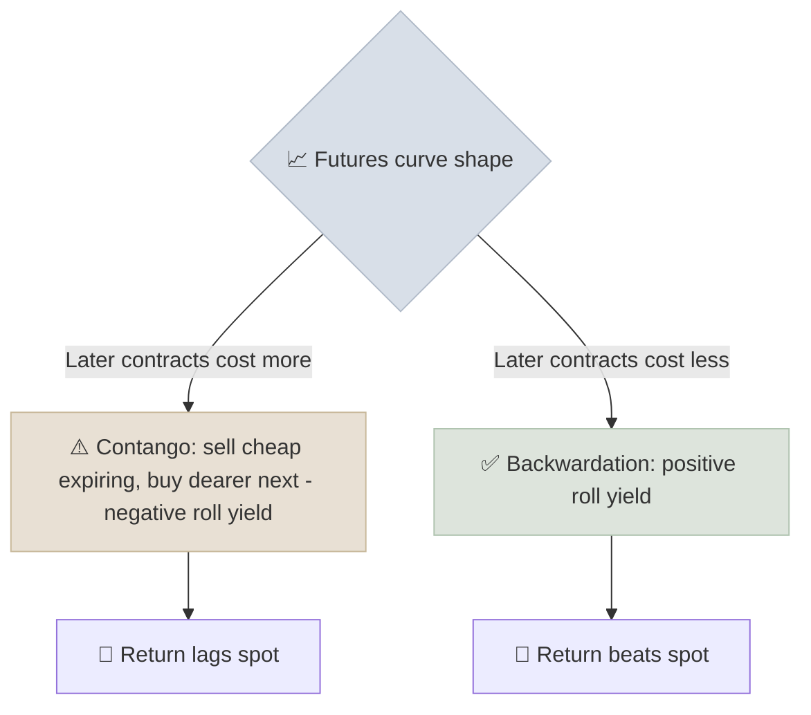

# Alternatives - REITs & Commodities

Alternatives are assets outside the stock-bond-cash core; for most investors the accessible ones are REITs (listed owners of income-producing real estate) and commodities (gold, energy, metals and agricultural goods, held physically or through futures).

```objectives
time: 45 min
outcomes:
  - Value a REIT with cap rates, FFO, AFFO and price-to-NAV rather than P/E
  - Explain the REIT distribution rules in the US and India, and what they mean for growth
  - Decompose a commodity futures return into spot, roll and collateral yield
  - Judge what role gold and commodities can and cannot play in a portfolio
prerequisites:
  - "[Equities](03-Equities.mdx) and [Sovereign & Corporate Bonds](02-Sovereign-and-Corporate-Bonds.mdx)"
```

## Why It Matters

<div class="audience-beginner" markdown="1">

A REIT lets you own a slice of office towers, malls or warehouses and receive most of the rent as regular payouts, without buying a building. Gold and other commodities do not pay any income at all; people hold them mainly because they sometimes rise when stocks and bonds fall, or when inflation spikes.

</div>

<div class="audience-analyst" markdown="1">

REITs are equities with bond-like payout constraints: mandated distributions leave little retained cash, so growth depends on external capital and the spread between cap rates and funding costs. Commodities have no cash flows and no intrinsic yield; their expected return comes from risk premia in futures markets and the collateral they sit on. Both deserve different metrics from ordinary operating companies.

</div>

## REITs

### Rules

| | US REITs | Indian REITs |
|---|---|---|
| Distribution | At least 90% of taxable income | At least 90% of net distributable cash flows, at least twice a year |
| Asset test | 75% of assets in real estate | At least 80% of value in completed, income-generating properties |
| Leverage | No statutory cap | Capped by SEBI (up to 49% of asset value with conditions) |
| Listed examples | Prologis (logistics), Realty Income (net lease), Equinix (data centres) | Embassy Office Parks (2019, the first), Mindspace, Brookfield India, Nexus Select Trust (retail) |
| Investor tax | Most distributions taxed as ordinary income, reduced by the Section 199A (QBI) deduction - check current law | Split into interest, dividend and debt repayment components, each taxed differently |

India also has **InvITs** (infrastructure investment trusts) holding roads, power transmission and pipelines under a similar framework.

### REIT Metrics

Net income understates REIT earnings because it deducts depreciation on buildings that often appreciate. Use:

$$
\text{FFO} = \text{Net income} + \text{Real estate depreciation} - \text{Gains on property sales}
$$

$$
\text{AFFO} = \text{FFO} - \text{Maintenance capex} - \text{Straight-line rent adjustments}
$$

$$
\text{Cap rate} = \frac{\text{Net operating income (NOI)}}{\text{Property value}}
$$

| Metric | What it tells you | Rough benchmarks |
|---|---|---|
| Price / AFFO | The REIT equivalent of P/E | 12-25x depending on sector and growth |
| AFFO payout ratio | Distribution safety | Under 80-85% is comfortable |
| Price / NAV | Premium or discount to private market value | Discounts can signal value or trouble |
| Occupancy, WALE (weighted average lease expiry) | Income stability | Higher is better; watch expiries |
| Net debt / EBITDA | Leverage | Under about 6x for most US REITs |

A REIT grows value when it can buy properties at cap rates **above** its cost of capital. When interest rates rise faster than cap rates, that spread closes and REIT prices fall, which is why REITs are rate-sensitive.

## Commodities

### How Investors Get Exposure

| Route | Examples | Notes |
|---|---|---|
| Physical | Gold coins and bars | Storage, purity and resale spread |
| Physically backed ETFs | GLD, IAU (US); gold and silver ETFs (India) | Track spot closely |
| Government gold bonds | Sovereign Gold Bonds (India) | Paid 2.5% interest on top of gold price; capital gains tax-free at maturity; no new tranches since early 2024 |
| Futures-based funds | Broad commodity index funds, oil ETFs (US) | Returns differ from spot because of roll yield |
| Commodity producers | Miners, oil companies | Equity risk plus operating leverage to the commodity |

### Why Futures Returns Differ From Spot

$$
\text{Futures index return} \approx \text{Spot return} + \text{Roll yield} + \text{Collateral yield}
$$



The collateral yield is the interest earned on the cash backing the futures position - roughly the T-bill rate.

### What Commodities Can and Cannot Do

- **Can:** hedge unexpected inflation (especially energy), diversify in some crises (gold), provide a currency hedge (gold for rupee investors).
- **Cannot:** compound like a business. With no cash flows, a commodity's long-run real return is close to zero before risk premia. Gold's real return over very long periods has been low, with decades-long drawdowns.

## Red Flags

- **REIT distributions above AFFO**, funded with debt or asset sales.
- **High REIT leverage with near-term debt maturities** in a rising-rate environment.
- **Large tenant concentration** (one tenant providing a big share of rent).
- **Futures funds bought as a long-term spot proxy** in persistent contango.
- **Commodity allocations sized as a core holding** rather than a 5-10% diversifier.

## Case Studies

**US - the oil ETF in April 2020.** When the May 2020 WTI futures contract went negative on April 20, 2020, the largest US oil ETF, which held front-month futures, suffered massive losses and had to change its rolling strategy. Investors who thought they owned "oil" actually owned a series of futures contracts in extreme contango.

**India - Embassy Office Parks.** India's first REIT listed in April 2019 at 300 rupees a unit, holding office parks leased largely to multinational technology tenants. Through the 2020-2021 work-from-home period, occupancy and valuations came under pressure, while distributions continued. It shows both sides of REITs: steady contractual income, and sensitivity to shifts in demand for the underlying property type.

**Gold for Indian investors.** Rupee gold prices rose substantially more than dollar gold prices over 2000-2024 because the rupee depreciated against the dollar. For an Indian investor, gold is partly a currency hedge - part of why Indian households hold so much of it.

## Check Yourself

```quiz
- q: "Why do analysts use FFO or AFFO instead of net income for REITs?"
  options: ["REITs do not report net income", "Net income deducts depreciation on buildings that often hold or gain value", "FFO includes gains on property sales", "Regulators require it"]
  answer: 2
  explain: "Real estate depreciation is a large non-cash charge that does not reflect the economic value of well-maintained property, so FFO adds it back."
- q: "A futures curve is in contango. What happens to a fund that keeps rolling long futures?"
  options: ["It earns positive roll yield", "It earns negative roll yield and lags spot", "It matches spot exactly", "It earns the T-bill rate only"]
  answer: 2
  explain: "In contango the fund sells the cheaper expiring contract and buys the more expensive next one, losing money on each roll."
- q: "A REIT buys a property with NOI of 8 crore for 100 crore, funded at a 9% cost of capital. Is this accretive?"
  options: ["Yes - 8 crore of income", "No - the 8% cap rate is below the 9% cost of capital", "It depends only on occupancy"]
  answer: 2
  explain: "The cap rate is 8 / 100 = 8%, below the 9% funding cost, so the deal destroys value unless NOI grows."
- q: "Why is gold often described as a currency hedge for Indian investors?"
  answer: "Gold is priced globally in dollars. When the rupee weakens, the rupee price of gold rises even if the dollar price is flat, so gold offsets some of the loss of rupee purchasing power."
```

## Exercises

```exercise
- title: Value a REIT
  task: |
    A REIT reports net income 400, real estate depreciation 300, gains on property sales 50, maintenance capex 80 and straight-line rent adjustments 20 (all in crore or millions). It has 100 units outstanding, trading at 150 each, and distributes 5.2 per unit.

    1. Compute FFO and AFFO.
    2. Compute Price / AFFO and the AFFO payout ratio.
    3. Is the distribution covered?
  solution: |
    1. FFO = 400 + 300 - 50 = **650**. AFFO = 650 - 80 - 20 = **550**.
    2. AFFO per unit = 5.5. Price / AFFO = 150 / 5.5 = **27.3x**. Payout = 5.2 / 5.5 = **94.5%**.
    3. Covered, but only just - a payout above 90% of AFFO leaves little room if occupancy or rents fall.
```

## Study Notes

- REITs must distribute ~90%; growth relies on external capital.
- Value REITs with **FFO, AFFO, cap rate, P/AFFO and P/NAV**, not P/E.
- REITs create value when acquisition cap rates exceed their cost of capital.
- Futures returns = spot + **roll yield** + collateral yield; contango hurts.
- Commodities have no cash flows; use them as small diversifiers, not compounders.

## References

- Nareit, [REIT Industry Financial Snapshot and FFO definition](https://www.reit.com/) (accessed 2026)
- SEBI, [Real Estate Investment Trusts Regulations, 2014](https://www.sebi.gov.in/) (as amended)
- Gorton & Rouwenhorst, "Facts and Fantasies about Commodity Futures," *Financial Analysts Journal* (2006)
- Erb & Harvey, "The Golden Dilemma," *Financial Analysts Journal* (2013)
- US Commodity Futures Trading Commission, Interim Staff Report on the WTI price movement of April 20, 2020 (2020)
- RBI, [Sovereign Gold Bond Scheme FAQs](https://www.rbi.org.in/) (accessed 2026)

*Last reviewed: 2026-09*
