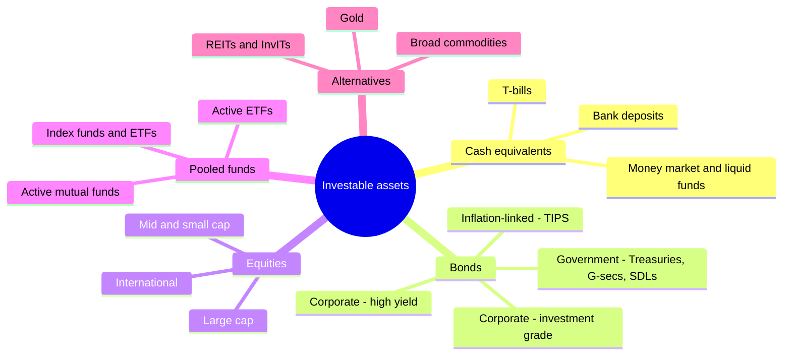

# Asset Class Comparison

A side-by-side view of every investable asset class in this module - return drivers, risks, liquidity, costs and tax treatment - so you can match each one to the job it does in a portfolio.

```objectives
time: 30 min
outcomes:
  - Compare the major asset classes on return, volatility, liquidity, cost and tax
  - Match each asset class to a portfolio role (growth, income, stability, diversification, liquidity)
  - Use long-run historical ranges as a reasonableness check on return assumptions
prerequisites:
  - "The other five notes in this module"
```

## The Map



## Side-by-Side

| | Cash | Government bonds | Corporate bonds | Equities | REITs | Gold / commodities |
|---|---|---|---|---|---|---|
| **Main return driver** | Short-term interest rate | Yield + rate changes | Yield + spread changes | Earnings growth + dividends + P/E | Rent growth + distributions | Price change; roll yield for futures |
| **Main risk** | Inflation | Rising rates (duration) | Default, spread widening | Drawdowns, valuation | Rates, occupancy, leverage | No cash flows, long drawdowns |
| **Typical volatility** | Very low | Low to moderate | Moderate | High | High | High |
| **Liquidity** | Daily | Daily (listed) | Often thin | Daily | Daily | Daily (ETFs) |
| **Typical cost** | Minimal | Low | Low to moderate | 0.03-2% a year via funds | 0.1-0.8% via funds | 0.1-1% via ETFs |
| **Inflation protection** | Partial (rates reset) | Poor (except TIPS) | Poor | Good over the long run | Moderate | Good for energy; mixed for gold |
| **Portfolio role** | Liquidity, emergency fund | Stability, crash protection | Income | Long-term growth | Income + real assets | Diversifier, crisis hedge |

## Long-Run Returns (Approximate)

These are rough historical nominal averages, for sanity-checking assumptions. They are not forecasts.

| Asset | US, 1928-2024 (annual, geometric) | India, roughly 1980-2024 |
|---|---|---|
| Large-cap equities | about 10% | about 14-16% (Sensex, including dividends) |
| 10-year government bonds | about 4.5-5% | about 7-8% |
| Cash (T-bills / FDs) | about 3.3% | about 7% (bank FDs) |
| Gold | about 5% (since 1971, when it floated) | about 10-11% in rupees |
| Inflation | about 3% | about 7% |

**Real returns matter.** In both countries equities earned roughly 6-8% a year above inflation over the long run, while cash earned roughly 0-1%. Indian nominal returns look higher mainly because Indian inflation was higher.

## Correlations in Practice

Diversification comes from assets that do not fall together. Correlations are unstable and tend to rise in crises, but the rough pattern is:

| | Equities | Gov. bonds | Corporate HY | Gold |
|---|---|---|---|---|
| **Equities** | 1 | Low to negative (most of 2000-2021), positive in inflationary periods like 2022 | High | Low |
| **Gov. bonds** | | 1 | Low | Low to moderate |
| **Corporate HY** | | | 1 | Low |
| **Gold** | | | | 1 |

The key lesson from 2022: government bonds hedge equities in **growth** scares, but not in **inflation** scares, when both fall together.

## Choosing by Goal

| Goal and horizon | Core asset classes |
|---|---|
| Emergency fund; spending within 1 year | Cash equivalents |
| Known expense in 1-5 years | Short-term bonds, deposits, target-maturity funds |
| Retirement 15+ years away | Mostly equities via index funds, some bonds |
| Retirement income | Bonds and dividend payers for income; equities for inflation-beating growth; a cash buffer |
| Inflation hedge | Equities over the long run; TIPS; some commodities and REITs |

These choices are formalized in [Portfolio Construction](../../13-Portfolio-Construction/INDEX.mdx).

## Red Flags

- **Return assumptions above long-run history** without a clear reason (e.g. 15% a year for US equities).
- **Mixing nominal and real returns** when comparing US and Indian assets.
- **Assuming correlations stay low in a crisis** - many "diversifiers" fell together in 2008 and 2022.

## Check Yourself

```quiz
- q: "Which asset class has historically been the best protection against long-run inflation?"
  options: ["Cash", "Long-term government bonds", "Equities", "Corporate bonds"]
  answer: 3
  explain: "Company revenues and profits tend to rise with prices over time, so equities have beaten inflation by roughly 6-8% a year over the long run."
- q: "Why did many balanced portfolios have an unusually bad year in 2022?"
  options: ["Gold crashed", "Equities and government bonds fell together as inflation drove rates up", "Cash yields went negative", "REITs were delisted"]
  answer: 2
  explain: "In an inflation-driven rate shock, bond prices and equity valuations both fall, so the usual equity-bond diversification failed."
- q: "Indian nominal equity returns have been higher than US nominal equity returns. Does that mean Indian equities delivered much more real wealth?"
  answer: "Not necessarily. Indian inflation was also much higher, so real returns in both markets were broadly in the same range, roughly 6-8% a year. Currency moves also matter for a foreign investor."
```

## Exercises

```exercise
- title: Assign the job
  task: |
    For each goal, choose the primary asset class and justify it in one sentence: (a) a car purchase in 18 months, (b) a child's university fees in 12 years, (c) a retiree's next two years of spending, (d) a hedge against a sharp rupee depreciation.
  solution: |
    (a) Cash equivalents or a short FD - the horizon is too short for equity risk. (b) Mostly equity index funds, moving to bonds over the final 3-5 years. (c) Cash and short-term bonds - the money must not be exposed to an equity drawdown. (d) Gold or international (US) equities, whose rupee value rises when the rupee falls.
```

## Study Notes

- Every asset class has a **job**: liquidity, stability, income, growth, diversification.
- Compare **real** returns; Indian nominal returns are higher mostly because of inflation.
- Stock-bond correlation is negative in growth scares and positive in inflation scares.
- Use long-run history as a sanity check, never as a forecast.

## References

- Damodaran, [Historical Returns on Stocks, Bonds and Bills: 1928-2024](https://pages.stern.nyu.edu/~adamodar/New_Home_Page/datafile/histretSP.html) (2025)
- Dimson, Marsh & Staunton, *UBS Global Investment Returns Yearbook* (2024)
- RBI, [Handbook of Statistics on the Indian Economy](https://www.rbi.org.in/) (2024)
- Ilmanen, *Expected Returns: An Investor's Guide to Harvesting Market Rewards* (Wiley, 2011)

*Last reviewed: 2026-09*
