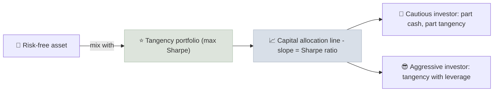

# Sharpe Ratio

The Sharpe ratio measures how much return above the risk-free rate a portfolio earned for each unit of total volatility it carried.

```objectives
time: 40 min
outcomes:
  - Calculate a Sharpe ratio from periodic returns and annualize it correctly
  - Compare funds or strategies with different volatility on a risk-adjusted basis
  - Explain the capital allocation line and why the highest-Sharpe portfolio is special
  - List the situations where the Sharpe ratio misleads
prerequisites:
  - "[Return & Volatility](01-Return-and-Volatility.mdx) - mean and standard deviation of returns"
  - "[Cash Equivalents](../../02-Asset-Classes/Notes/01-Cash-Equivalents.mdx) - the risk-free rate"
```

## Why It Matters

<div class="audience-beginner" markdown="1">

Two funds both returned 12% last year. One moved smoothly; the other swung up and down 30% along the way. They are not equally good. The Sharpe ratio puts a number on this: how much extra return you got for the bumps you had to sit through. Higher is better.

</div>

<div class="audience-analyst" markdown="1">

Under mean-variance assumptions, the portfolio with the highest Sharpe ratio is the tangency portfolio: combined with the risk-free asset, it dominates every other risky portfolio at every level of risk. That makes Sharpe the natural ranking metric for anything that will be levered or diluted with cash to a target volatility.

</div>

## Formula

$$
S = \frac{R_p - R_f}{\sigma_p}
$$

- $$R_p$$ - the portfolio's average return over the period
- $$R_f$$ - the risk-free rate (T-bill or 91-day Indian T-bill yield) over the same period
- $$\sigma_p$$ - the standard deviation of the portfolio's returns (strictly, of its excess returns)

### Annualizing

Sharpe ratios computed from monthly data must be annualized before comparison. Mean excess return scales with time; volatility scales with the square root of time:

$$
S_{\text{annual}} = S_{\text{monthly}} \times \sqrt{12} \qquad S_{\text{annual}} = S_{\text{daily}} \times \sqrt{252}
$$

This assumes returns are independent from period to period. Strategies with autocorrelated returns - private assets, smoothed hedge fund marks - get overstated Sharpe ratios this way.

## Worked Example

| | Fund A | Fund B |
|---|---|---|
| Annual return | 14% | 11% |
| Volatility | 20% | 10% |
| Risk-free rate | 5% | 5% |
| Sharpe | (14 - 5) / 20 = **0.45** | (11 - 5) / 10 = **0.60** |

Fund B is the better risk-adjusted choice. An investor who wants Fund A's 20% volatility could hold Fund B at 2x leverage (borrowing at 5%) and expect $$5\% + 2 \times 6\% = 17\%$$, beating Fund A's 14% at the same risk.

## The Capital Allocation Line



Every portfolio of cash and one risky portfolio lies on a straight line whose slope is that portfolio's Sharpe ratio. The steepest line wins. This is why [Modern Portfolio Theory](../../13-Portfolio-Construction/Notes/01-Modern-Portfolio-Theory.mdx) separates the choice of risky portfolio (maximize Sharpe) from the choice of how much risk to take (the investor's risk tolerance).

## Benchmarks

| Sharpe (annualized, long-run) | Interpretation |
|---|---|
| Below 0 | Did not beat cash |
| 0.2-0.4 | Typical of broad equity indices over long periods |
| 0.5-1.0 | Good; hard to sustain for long-only equity |
| Above 1.0 | Excellent - verify carefully before believing it |
| Above 2.0 sustained | Rare; check for smoothing, leverage, hidden tail risk or errors |

Long-run Sharpe ratios for the S&P 500 and Nifty 50 have been roughly 0.3-0.5, varying by period.

## Computing It

```python
import numpy as np
import pandas as pd

def sharpe_ratio(returns: pd.Series, rf_annual: float, periods_per_year: int = 12) -> float:
    """Annualized Sharpe ratio from periodic simple returns."""
    rf_period = (1 + rf_annual) ** (1 / periods_per_year) - 1
    excess = returns - rf_period
    return excess.mean() / excess.std(ddof=1) * np.sqrt(periods_per_year)

# Example: monthly returns of a fund
monthly = pd.Series([0.021, -0.013, 0.034, 0.008, -0.027, 0.041,
                     0.012, -0.006, 0.019, 0.025, -0.018, 0.030])
print(round(sharpe_ratio(monthly, rf_annual=0.05), 2))
```

In a spreadsheet: compute monthly excess returns in a column, then `=AVERAGE(range)/STDEV.S(range)*SQRT(12)`.

## Where Sharpe Misleads

- **Asymmetric returns.** Sharpe penalizes upside volatility as much as downside. A strategy with occasional large gains looks worse than it is; one that sells options and occasionally blows up looks better than it is. Use [Sortino](03-Sortino-Ratio.mdx) and drawdown alongside.
- **Short or calm samples.** Three years of a bull market produce flattering Sharpe ratios.
- **Illiquid or smoothed assets.** Appraisal-based returns (private equity, real estate funds) understate volatility.
- **Leverage and fat tails.** A high Sharpe with high leverage can still end in ruin.
- **Wrong risk-free rate or mixed frequencies.** Always use the same period for returns and the risk-free rate.

## Red Flags

- A fund advertising a Sharpe above 2 with no explanation of its strategy.
- A Sharpe calculated over less than 3 years, or only over a bull market.
- Monthly Sharpe ratios presented as if they were annual (they look about 3.5 times smaller).
- Returns that almost never fall in any month - a sign of smoothing or worse.

## Case Studies

**US - Madoff's too-smooth returns.** Bernard Madoff's feeder funds reported roughly 10-12% a year with very few down months for over a decade, implying a Sharpe ratio above 2 for a supposedly simple options strategy. Harry Markopolos pointed out to the SEC from 2000 onward that such returns were statistically implausible. An extraordinary Sharpe ratio is a question to investigate, not a reason to invest.

**India - comparing hybrid funds.** Indian aggressive hybrid funds and large-cap funds often show similar 5-year returns, but hybrid funds carry lower volatility because of their 20-35% debt allocation. On a Sharpe basis, a hybrid fund with slightly lower returns can be the better choice for a moderate-risk investor. Fund factsheets from AMFI members publish Sharpe ratios - check the period and risk-free rate they use.

## Check Yourself

```quiz
- q: "A portfolio returned 10% with 16% volatility; the risk-free rate is 6%. What is its Sharpe ratio?"
  options: ["0.625", "0.25", "0.375", "1.6"]
  answer: 2
  explain: "(10 - 6) / 16 = 0.25."
- q: "A strategy's monthly Sharpe ratio is 0.20. What is its approximate annualized Sharpe ratio?"
  options: ["0.20", "2.40", "0.69", "0.058"]
  answer: 3
  explain: "0.20 × √12 = 0.20 × 3.464 = 0.69."
- q: "Why is the portfolio with the highest Sharpe ratio special in mean-variance theory?"
  options: ["It has the lowest risk", "Combined with cash or leverage, it offers the best return for any level of risk", "It has the highest return", "It is always the market index"]
  answer: 2
  explain: "It is the tangency portfolio. Every other risk level is best reached by mixing it with the risk-free asset."
- q: "Give one type of strategy for which a high Sharpe ratio would be misleading, and explain why."
  answer: "Option-selling (short volatility) strategies: they collect small steady premiums, so volatility looks low and Sharpe high, until a rare large loss. Sharpe does not capture that tail risk. Smoothed private-asset returns are another example."
```

## Exercises

```exercise
- title: Rank three funds
  task: |
    With a risk-free rate of 6.5%, rank these funds by Sharpe ratio: X returned 15% with 22% volatility; Y returned 12% with 13% volatility; Z returned 9% with 5% volatility. Which would you lever to 15% volatility, and what return would you expect?
  solution: |
    Sharpe: X = 8.5 / 22 = 0.39; Y = 5.5 / 13 = 0.42; Z = 2.5 / 5 = 0.50. Z ranks first. Levering Z to 15% volatility (3x) gives an expected 6.5% + 3 × 2.5% = **14%** - better than X's 15% at 22% volatility on a risk-adjusted basis, but it depends on borrowing at the risk-free rate, which retail investors usually cannot.
- title: Your own fund
  task: |
    Download 5 years of monthly NAVs for one fund you own, convert them to monthly returns, and compute its annualized Sharpe ratio with the Python function above or a spreadsheet. Compare it with the Sharpe on the fund's factsheet and explain any difference.
```

## Study Notes

- **Sharpe = (R_p - R_f) / σ_p** - excess return per unit of total volatility.
- Annualize: × √12 for monthly, × √252 for daily.
- The max-Sharpe portfolio is the **tangency portfolio**; the CAL slope is the Sharpe ratio.
- Long-run equity indices: roughly 0.3-0.5. Above 1 needs scrutiny; above 2 needs suspicion.
- Misleads with skewed returns, short samples, smoothing and leverage.

## References

- Sharpe, "Mutual Fund Performance," *Journal of Business* (1966)
- Sharpe, [The Sharpe Ratio](https://web.stanford.edu/~wfsharpe/art/sr/sr.htm), *Journal of Portfolio Management* (1994)
- Lo, "The Statistics of Sharpe Ratios," *Financial Analysts Journal* (2002)
- Markopolos, *No One Would Listen: A True Financial Thriller* (Wiley, 2010)
- CFA Institute, *Portfolio Management: Portfolio Risk and Return*, CFA Program Level I curriculum (2025)

*Last reviewed: 2026-09*
