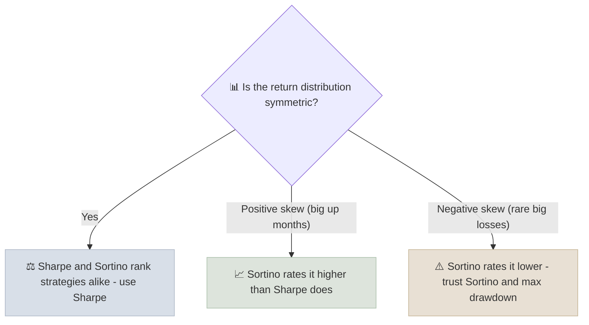

# Sortino Ratio

The Sortino ratio measures return above a target for each unit of downside deviation - it counts only the volatility investors actually dislike, the returns that fall below their minimum acceptable return.

```objectives
time: 30 min
outcomes:
  - Calculate downside deviation and the Sortino ratio from a return series
  - Choose an appropriate minimum acceptable return (MAR) for a client or mandate
  - Explain when Sortino and Sharpe rank strategies differently, and which to trust
prerequisites:
  - "[Sharpe Ratio](02-Sharpe-Ratio.mdx)"
```

## Why It Matters

<div class="audience-beginner" markdown="1">

Nobody complains when their fund jumps up 8% in a month. People worry about the drops. The Sharpe ratio treats a big jump and a big fall as equally "risky." The Sortino ratio only counts the falls, which is closer to how investors actually feel about risk.

</div>

<div class="audience-analyst" markdown="1">

Sortino replaces total standard deviation with a lower partial moment of order 2 relative to a chosen threshold. For symmetric return distributions the two ratios rank strategies the same way. They diverge for skewed strategies: positively skewed ones (trend following, long options, growth equities in bull runs) look better on Sortino; negatively skewed ones (short volatility, credit carry) look worse.

</div>

## Formula

$$
\text{Sortino} = \frac{R_p - \text{MAR}}{\sigma_D}
$$

where the **downside deviation** uses only the returns that fall short of the minimum acceptable return, but divides by the **total** number of observations $$N$$:

$$
\sigma_D = \sqrt{\frac{1}{N} \sum_{t=1}^{N} \min(0,\ R_t - \text{MAR})^{2}}
$$

Dividing by $$N$$ (not just the number of bad periods) is the standard definition. Some software divides by the count of below-MAR periods instead, which gives a different number - check the method before comparing across sources.

Annualize a monthly Sortino ratio the same way as Sharpe, by multiplying by $$\sqrt{12}$$ (with the same caveats).

### Choosing the MAR

| MAR choice | Use when |
|---|---|
| 0% | The client cares about not losing money in nominal terms |
| Risk-free rate | Comparing with Sharpe; "did it beat cash?" |
| Inflation | The goal is preserving purchasing power |
| Required return from a financial plan | Retirement plans with a specific funding target |

## Worked Example

Six monthly returns, MAR = 0%:

| Month | Return | Shortfall below MAR | Shortfall squared |
|---|---|---|---|
| 1 | +4% | 0 | 0 |
| 2 | -2% | -2% | 4 |
| 3 | +3% | 0 | 0 |
| 4 | -5% | -5% | 25 |
| 5 | +6% | 0 | 0 |
| 6 | +1% | 0 | 0 |

Mean return = (4 - 2 + 3 - 5 + 6 + 1) / 6 = **1.167%**.

Downside deviation = $$\sqrt{(4 + 25)/6} = \sqrt{4.833} = 2.198\%$$.

Monthly Sortino = 1.167 / 2.198 = **0.53**. Annualized ≈ 0.53 × 3.464 = **1.84**.

For comparison, the sample standard deviation of all six returns is 4.07%, giving a monthly Sharpe (with a 0% risk-free rate) of 0.29, or about 0.99 annualized. The Sortino ratio is higher because much of this series' volatility is on the upside.

## Sharpe vs Sortino



| | Sharpe | Sortino |
|---|---|---|
| Risk measure | Total volatility | Downside deviation below MAR |
| Hurdle | Risk-free rate | MAR (flexible) |
| Best for | Symmetric strategies, leverage decisions | Skewed strategies, client-goal framing |
| Weakness | Penalizes upside | Few downside observations make it noisy |

## Computing It

```python
import numpy as np
import pandas as pd

def sortino_ratio(returns: pd.Series, mar_annual: float = 0.0, periods_per_year: int = 12) -> float:
    """Annualized Sortino ratio; downside deviation divides by all N observations."""
    mar = (1 + mar_annual) ** (1 / periods_per_year) - 1
    shortfall = np.minimum(returns - mar, 0.0)
    downside_dev = np.sqrt((shortfall ** 2).mean())
    return (returns.mean() - mar) / downside_dev * np.sqrt(periods_per_year)

monthly = pd.Series([0.04, -0.02, 0.03, -0.05, 0.06, 0.01])
print(round(sortino_ratio(monthly), 2))  # about 1.84
```

## Red Flags

- **Sortino reported with no MAR stated** - the number is meaningless without it.
- **Very high Sortino from a short sample** with only one or two down periods.
- **Sortino much higher than Sharpe for a strategy that should be negatively skewed** (option selling, credit) - check whether the sample simply missed the bad years.

## Case Studies

**US - trend-following funds in 2008.** Managed futures (trend-following) funds had positive returns in 2008 as equities fell by roughly 37%. Their return streams have positive skew: many small losses and occasional large gains. Their Sharpe ratios over 2000-2020 were modest, but Sortino ratios looked noticeably better - which is exactly the case for using both.

**India - credit risk funds before 2019.** Indian credit risk debt funds delivered steady 8-9% returns with very few down months until the IL&FS and DHFL defaults of 2018-2019 caused sudden losses and side-pocketed assets. Before the events, both Sharpe and Sortino looked excellent. The lesson: no ratio can see risks that are not in the sample. Combine ratios with an understanding of what the fund owns.

## Check Yourself

```quiz
- q: "What does downside deviation measure?"
  options: ["The standard deviation of all returns", "The dispersion of returns below the minimum acceptable return", "The worst single loss", "The average negative return"]
  answer: 2
  explain: "It is the root-mean-square shortfall below the MAR, counting above-MAR periods as zero shortfall."
- q: "A strategy has frequent small gains and rare large losses. How will its Sortino compare with its Sharpe?"
  options: ["Sortino will look relatively worse", "Sortino will look relatively better", "They will be identical"]
  answer: 1
  explain: "Its volatility is concentrated on the downside, so downside deviation is large relative to total volatility, and Sortino penalizes it more."
- q: "A retiree needs a 4% nominal return to fund withdrawals. What MAR would you use for their Sortino ratio?"
  options: ["0%", "4%", "The equity market return", "The inflation rate in 1980"]
  answer: 2
  explain: "Returns below the 4% required return are what threaten this client's plan, so that is the relevant threshold."
```

## Exercises

```exercise
- title: Sharpe vs Sortino ranking
  task: |
    Fund P: monthly returns +2, +2, +2, +2, +2, -8 (%). Fund Q: monthly returns -1, -1, -1, -1, -1, +7 (%). With MAR = 0 and risk-free = 0, compute each fund's mean, standard deviation, Sharpe (monthly) and Sortino (monthly). Which does each ratio prefer?
  hints:
    - "Both funds have the same mean return."
  solution: |
    Both means = 0.333%. Sample standard deviation: P = 4.08%, Q = 3.27%. Sharpe: P = 0.082, Q = 0.102.

    Downside deviation: P = √(64 / 6) = 3.27%; Q = √(5 / 6) = 0.913%. Sortino: P = 0.102, Q = **0.365**.

    Both ratios prefer Q, but Sortino prefers it far more strongly: Q's losses are small and frequent while its volatility comes from one big gain, whereas P hides a large loss.
```

## Study Notes

- **Sortino = (R_p - MAR) / downside deviation.**
- Downside deviation squares only below-MAR shortfalls, and divides by **all N** periods.
- State the **MAR**: 0%, risk-free, inflation, or the client's required return.
- Sharpe and Sortino agree for symmetric returns; Sortino is more informative for skewed ones.
- No ratio sees risks absent from the sample.

## References

- Sortino & Price, "Performance Measurement in a Downside Risk Framework," *Journal of Investing* (1994)
- Sortino & van der Meer, "Downside Risk," *Journal of Portfolio Management* (1991)
- CFA Institute, *Performance Evaluation*, CFA Program Level III curriculum (2025)
- Rollinger & Hoffman, "Sortino: A 'Sharper' Ratio," Red Rock Capital white paper (2013) - on the N-denominator convention

*Last reviewed: 2026-09*
