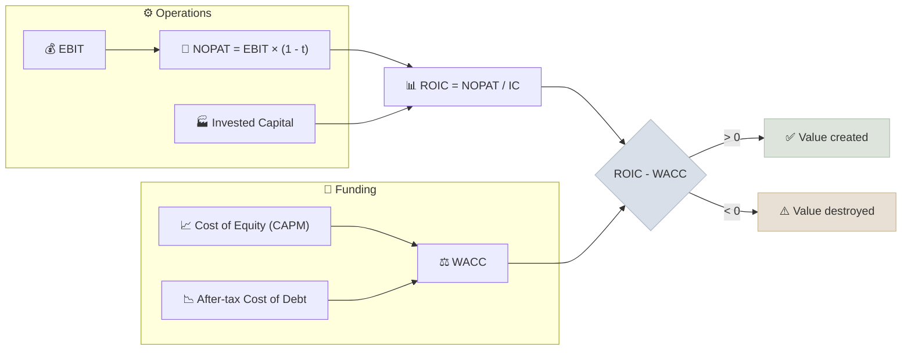

# ROIC vs WACC

A company creates economic value only when its return on invested capital (ROIC) is higher than its weighted average cost of capital (WACC). The gap between the two is the clearest numeric sign of a moat.

```objectives
time: 50 min
outcomes:
  - Calculate ROIC from an income statement and balance sheet, choosing a consistent definition of invested capital
  - Estimate a company's WACC from its cost of equity, after-tax cost of debt and capital weights
  - Judge whether a business creates or destroys value by comparing its ROIC-WACC spread over a full cycle
  - Explain why growth destroys value when ROIC is below WACC
prerequisites:
  - "[Balance Sheet](../../04-Accounting-Foundations/Notes/02-Balance-Sheet.mdx) - assets, liabilities and equity"
  - "[Income Statement](../../04-Accounting-Foundations/Notes/01-Income-Statement.mdx) - EBIT and tax"
```

## Why It Matters

<div class="audience-beginner" markdown="1">

Imagine you borrow money from friends and family to open a bakery. Your friends expect 12% a year back on what they gave you. If the bakery earns 20% a year on the money invested in it, you are building wealth for everyone. If it earns 8%, you are slowly giving their money away, even if the bakery shows a profit.

ROIC is what the bakery earns. WACC is what your friends expect. **A good business earns more than it costs to fund.**

</div>

<div class="audience-analyst" markdown="1">

ROIC and WACC are the two sides of the economic-profit identity. Accounting profit ignores the cost of equity; economic profit does not. Value creation is:

$$
\text{Economic Profit} = (\text{ROIC} - \text{WACC}) \times \text{Invested Capital}
$$

Every valuation model (DCF, residual income, EVA) is ultimately a statement about how large this spread is, how long it lasts, and how much capital can be reinvested at it.

</div>

## Definitions and Formulas

### Return on Invested Capital

$$
\text{ROIC} = \frac{\text{NOPAT}}{\text{Invested Capital}}
$$

where NOPAT (net operating profit after tax) removes the effect of financing:

$$
\text{NOPAT} = \text{EBIT} \times (1 - t)
$$

and invested capital is the capital tied up in operations. Two equivalent ways to build it:

| Approach | Formula |
|---|---|
| Operating (asset side) | Net working capital + Net PP&E + Operating intangibles (+ goodwill, if you want acquisition-inclusive ROIC) |
| Financing (claims side) | Total debt + Lease liabilities + Shareholders' equity - Excess cash |

Use the **average** of opening and closing invested capital for the year, and keep the definition identical across years and peers. Report two numbers where acquisitions matter: ROIC **excluding goodwill** (how good the underlying business is) and **including goodwill** (how good management was at buying it).

### Weighted Average Cost of Capital

$$
\text{WACC} = \frac{E}{D+E} \cdot r_E + \frac{D}{D+E} \cdot r_D \cdot (1 - t)
$$

- $$E$$ and $$D$$ are the market values of equity and debt (target weights if the structure is changing)
- $$r_E$$ is the cost of equity, usually from CAPM: $$r_E = r_f + \beta \times \text{ERP}$$
- $$r_D$$ is the pre-tax cost of debt (yield on the company's bonds, or rate on new borrowing)
- $$t$$ is the marginal tax rate; interest is tax-deductible, so debt is cheaper after tax

### The Spread



## Worked Example

A manufacturer reports (in millions):

| Item | Value |
|---|---|
| EBIT | 500 |
| Tax rate | 25% |
| Invested capital, start of year | 2,300 |
| Invested capital, end of year | 2,700 |
| Market value of equity | 6,000 |
| Market value of debt | 2,000 |
| Cost of equity | 11% |
| Pre-tax cost of debt | 7% |

**ROIC.** NOPAT = 500 × 0.75 = 375. Average invested capital = (2,300 + 2,700) / 2 = 2,500.

$$
\text{ROIC} = \frac{375}{2{,}500} = 15.0\%
$$

**WACC.** Weights: equity 6,000 / 8,000 = 75%, debt 25%.

$$
\text{WACC} = 0.75 \times 11\% + 0.25 \times 7\% \times (1 - 0.25) = 8.25\% + 1.31\% = 9.56\%
$$

**Spread and economic profit.** 15.0% - 9.56% = 5.44 percentage points. Economic profit = 5.44% × 2,500 = **136 million**. The company is creating value, and each extra unit of capital reinvested at 15% adds value too.

## Sector Benchmarks

ROIC levels depend heavily on how capital-intensive a business is. Compare a company with its own history and with close peers, not with the whole market. The ranges below are rough through-the-cycle guides, not rules.

| Sector | Typical ROIC (ex-goodwill) | Typical WACC | Notes |
|---|---|---|---|
| Software / internet platforms | 20-50%+ | 8-11% | Low physical capital; watch capitalized R&D and stock comp |
| Consumer staples / branded goods | 15-30% | 6-9% | Brands and distribution are the moat |
| Industrials | 10-18% | 7-10% | Cyclical; judge over a full cycle |
| Utilities | 5-8% | 5-7% | Regulated returns sit just above WACC by design |
| Telecom | 4-9% | 6-9% | Spectrum and network capex compress returns |
| Airlines / commodities | 0-10%, highly cyclical | 8-11% | Many destroy value across a full cycle |
| Banks | Use ROE vs cost of equity instead | - | Debt is raw material, not financing |

In India, WACC is structurally higher than in the US because the risk-free rate is higher (the 10-year Government of India bond has traded roughly 6.5-7.5% in recent years versus roughly 4-5% for the 10-year US Treasury). An Indian company with a 14% ROIC may be creating less value than a US peer at 11%.

## Red Flags

- **ROIC boosted by shrinking equity.** Buybacks funded with debt, or large write-downs, shrink the denominator and flatter ROIC without improving the business.
- **ROIC falling while revenue grows.** New capital is being deployed at lower returns than the old capital - often a sign of empire building or competitive pressure.
- **ROIC above WACC only at the cycle peak.** For cyclicals, average ROIC over 7-10 years; a single boom year says little.
- **Goodwill-inclusive ROIC far below goodwill-exclusive ROIC.** Management overpaid for acquisitions.
- **Ignored leases or capitalized costs.** Excluding lease liabilities (retail, airlines) or R&D (pharma, software) makes ROIC incomparable across peers.
- **A WACC you picked to make the answer work.** If a 1 point change in WACC flips the conclusion, the spread is not a moat.

## How It Interacts With Other Metrics

| Metric | Interaction |
|---|---|
| [Revenue CAGR vs EPS CAGR](08-Revenue-vs-EPS-CAGR.mdx) | Growth creates value only when ROIC > WACC. Fast growth at ROIC < WACC destroys value faster. |
| [FCF Yield](04-FCF-Yield.mdx) | Reinvestment rate = Growth / ROIC. High ROIC means a company can grow while still converting most profit to free cash flow. |
| [P/E vs PEG](01-PE-vs-PEG.mdx) | Two companies with the same growth deserve different P/E multiples if their ROIC differs - the high-ROIC one needs less capital to grow. |
| [Operating Margin Trajectory](06-Margin-Trajectory.mdx) | ROIC = NOPAT margin × capital turnover (Sales / IC). A retailer can earn a high ROIC on a thin margin through fast turnover. |
| [Leverage Ratios](05-Leverage-Ratios.mdx) | Leverage raises ROE but not ROIC. A high ROE with a low ROIC is financial engineering, not a moat. |

The growth-ROIC link is worth memorizing. In steady state:

$$
g = \text{ROIC} \times \text{Reinvestment Rate} \quad\Rightarrow\quad \text{FCF} = \text{NOPAT} \times \left(1 - \frac{g}{\text{ROIC}}\right)
$$

A company growing 10% with a 40% ROIC reinvests only 25% of NOPAT. The same growth at 12% ROIC needs 83% of NOPAT, leaving little free cash flow.

## Case Studies

**US - Costco (retail, capital turnover).** Costco runs operating margins of only around 3-4%, yet its ROIC has sat in the high teens to low 20s for years. The reason is capital turnover: membership fees and fast inventory turns mean each dollar of invested capital supports several dollars of sales. The lesson is to decompose ROIC before judging a low-margin business.

**US - airlines (value destruction).** US airlines as a group earned less than their cost of capital over most of the decades before 2015. Revenue grew, and profits appeared in good years, but new capacity was repeatedly added at returns below WACC. Warren Buffett's line that a far-sighted capitalist "should have shot Orville Wright" sums up the industry's economic profit.

**India - Asian Paints (a durable spread).** Asian Paints reported return on capital employed well above 25% for most of the last two decades, against an Indian cost of capital of roughly 11-13%. Its dealer network, tinting-machine installed base and brand let it reinvest at high returns while paying a large dividend. The recent entry of well-funded competitors is exactly what an analyst should watch, because a moat shows up first as a narrowing spread.

**India - telecom before consolidation.** Heavy spectrum payments and a tariff war after 2016 pushed ROIC for several Indian telecom operators far below their cost of capital, forcing consolidation from many operators down to a few. Large capital, commodity pricing and regulatory payments are the classic recipe for a negative spread.

> Company figures are approximate and for teaching. Check the latest annual report before using any of them.

## Check Yourself

```quiz
- q: "A company earns EBIT of 200 with a 25% tax rate on average invested capital of 1,000. What is its ROIC?"
  options: ["20%", "15%", "25%", "12%"]
  answer: 2
  explain: "NOPAT = 200 × 0.75 = 150. ROIC = 150 / 1,000 = 15%."
- q: "Why is the cost of debt multiplied by (1 - t) in the WACC formula?"
  options: ["Lenders charge less to profitable companies", "Interest expense is tax-deductible, so the effective cost to the company is lower", "Debt is always cheaper than equity", "To convert nominal rates to real rates"]
  answer: 2
  explain: "Interest reduces taxable income, so each unit of interest costs the company only (1 - t) after tax."
- q: "A company grows revenue 20% a year with ROIC of 7% and WACC of 10%. What happens to shareholder value as it grows?"
  options: ["It rises, because growth always adds value", "It is unchanged", "It falls - each new unit of capital earns less than it costs", "It depends only on the P/E ratio"]
  answer: 3
  explain: "With ROIC below WACC, every reinvested unit destroys value. Faster growth destroys it faster."
- q: "Why should you look at ROIC both including and excluding goodwill?"
  answer: "Excluding goodwill shows the returns of the underlying operating business. Including goodwill shows the returns on the price management actually paid for acquisitions. A large gap means acquisitions were bought at prices that dilute returns."
- q: "Why do analysts use ROE vs cost of equity, not ROIC vs WACC, for banks?"
  answer: "For a bank, debt (deposits and borrowings) is the raw material of the business, not a financing choice, so separating operating returns from financing is not meaningful. Returns are judged on equity instead."
```

## Exercises

```exercise
- title: Build the spread
  task: |
    A consumer company reports EBIT of 1,200, a 24% tax rate, and invested capital of 5,600 (start) and 6,400 (end). Its equity market value is 18,000, debt is 2,000, cost of equity 10.5% and pre-tax cost of debt 6%.

    1. Calculate ROIC.
    2. Calculate WACC.
    3. Calculate economic profit.
  hints:
    - "Use average invested capital."
    - "Debt weight = 2,000 / 20,000."
  solution: |
    1. NOPAT = 1,200 × 0.76 = 912. Average IC = 6,000. ROIC = 912 / 6,000 = **15.2%**.
    2. WACC = 0.9 × 10.5% + 0.1 × 6% × 0.76 = 9.45% + 0.456% = **9.91%**.
    3. Spread = 5.29%. Economic profit = 5.29% × 6,000 = **about 317**.
- title: Growth that destroys value
  task: |
    Two companies each earn NOPAT of 100 and plan to grow 10% a year forever. Company A has ROIC of 30%; Company B has ROIC of 9%. Both have WACC of 9%.

    1. How much of NOPAT must each reinvest?
    2. What free cash flow does each produce?
    3. Which company's growth is worth paying for, and why?
  hints:
    - "Reinvestment rate = g / ROIC."
  solution: |
    1. A reinvests 10% / 30% = 33% (33.3). B reinvests 10% / 9% = 111% - it must raise outside capital to grow.
    2. A: FCF = 100 × (1 - 0.333) = **66.7**. B: FCF = 100 × (1 - 1.11) = **-11.1**.
    3. Only A. B's ROIC equals its WACC at best, so growth adds no value; in reality it is funding growth with new capital that earns only its cost. Growth is worth paying for only when ROIC > WACC.
- title: Your own company
  task: |
    Pick one US and one Indian listed company you know. From the last five annual reports, compute ROIC each year (state your definition of invested capital) and estimate a WACC for each. Write two sentences on whether each company has a durable spread.
```

## Study Notes

- **ROIC = NOPAT / Invested Capital.** Use average capital and a consistent definition.
- **WACC** blends the cost of equity (CAPM) and after-tax cost of debt at market-value weights.
- **Value is created only when ROIC > WACC.** Growth amplifies whichever sign the spread has.
- **ROIC = NOPAT margin × capital turnover** - decompose before judging.
- **Reinvestment rate = g / ROIC**, which links growth, ROIC and free cash flow.
- Judge cyclicals over a full cycle, and report ROIC with and without goodwill.
- Indian WACCs are structurally higher than US WACCs because of the higher risk-free rate.

## References

- Koller, Goedhart & Wessels, *Valuation: Measuring and Managing the Value of Companies*, 7th ed. (McKinsey & Company, 2020) - chapters on ROIC and economic profit
- Mauboussin & Callahan, [Return on Invested Capital: How to Calculate ROIC and Handle Common Issues](https://www.morganstanley.com/im/publication/insights/articles/article_returnoninvestedcapital.pdf) (Morgan Stanley Investment Management, 2022)
- Damodaran, [Return on Capital (ROC), Return on Invested Capital (ROIC) and Return on Equity (ROE): Measurement and Implications](https://pages.stern.nyu.edu/~adamodar/pdfiles/papers/returnmeasures.pdf) (NYU Stern, 2007)
- Damodaran, [Cost of Capital by Sector (US and Emerging Markets datasets)](https://pages.stern.nyu.edu/~adamodar/New_Home_Page/datacurrent.html) (updated each January)
- Buffett, [Berkshire Hathaway Shareholder Letter](https://www.berkshirehathaway.com/letters/2007ltr.pdf) (2007) - on businesses that consume capital

*Last reviewed: 2026-09*
