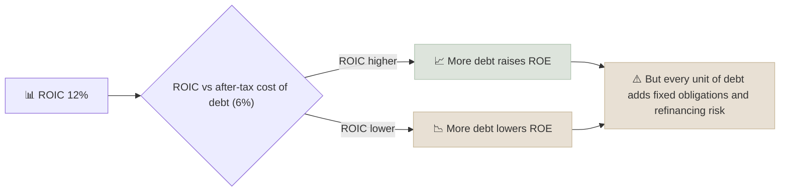

# Debt-to-Equity & Net Debt / EBITDA

Leverage ratios measure how much a company relies on borrowed money: debt-to-equity compares debt with the shareholders' stake on the balance sheet, and net debt to EBITDA compares debt with the operating earnings available to repay it.

```objectives
time: 45 min
outcomes:
  - Calculate debt-to-equity, net debt / EBITDA and interest coverage from filings
  - Explain why leverage raises both return on equity and the risk of permanent loss
  - Set sector-appropriate leverage limits and recognize distress early
  - Use the Altman Z-score as a quick distress screen
prerequisites:
  - "[Balance Sheet](../../04-Accounting-Foundations/Notes/02-Balance-Sheet.mdx)"
  - "[EV / EBITDA](02-EV-to-EBITDA.mdx)"
```

## Why It Matters

<div class="audience-beginner" markdown="1">

Debt is like a magnifying glass. In good years it makes shareholders' returns bigger. In bad years it makes losses bigger too - and unlike shareholders, lenders must be paid on time. Most permanent losses in the stock market come from companies that borrowed too much and could not refinance when times got hard.

</div>

<div class="audience-analyst" markdown="1">

Leverage converts business risk into financial risk. It raises ROE by $$\text{ROE} = \text{ROIC} + (\text{ROIC} - r_D(1-t)) \times D/E$$ when ROIC exceeds the after-tax cost of debt, but it also raises equity beta, shortens the time to distress, and creates refinancing risk that depends on credit markets rather than on the business. Solvency analysis is about the **maturity profile and coverage**, not just the ratio.

</div>

## Formulas

$$
\text{Debt-to-Equity} = \frac{\text{Total debt (+ lease liabilities)}}{\text{Shareholders' equity}}
$$

$$
\text{Net Debt / EBITDA} = \frac{\text{Total debt} + \text{Leases} - \text{Cash and liquid investments}}{\text{EBITDA}}
$$

$$
\text{Interest coverage} = \frac{\text{EBIT}}{\text{Interest expense}}
$$

Net debt / EBITDA reads as "years of current EBITDA needed to repay net debt." It is the metric lenders and rating agencies use in covenants; D/E is the balance-sheet view.

**Why use both?** Book equity can be tiny or negative after large buybacks (many US consumer brands) or huge after revaluations, making D/E misleading. EBITDA-based measures relate debt to earning power instead.

## Leverage and ROE



With ROIC of 12% and an after-tax cost of debt of 6%:

| D/E | ROE = ROIC + (ROIC - 6%) × D/E |
|---|---|
| 0.0 | 12% |
| 0.5 | 15% |
| 1.0 | 18% |
| 2.0 | 24% |

If ROIC falls to 4% in a recession, the same D/E of 2.0 gives ROE of 4% + (4% - 6%) × 2 = **0%**, and interest payments are still due.

## Sector Benchmarks

| Sector | Comfortable net debt / EBITDA | Interest coverage | Notes |
|---|---|---|---|
| Software, asset-light consumer | Under 1.5x (often net cash) | Over 10x | Debt adds little value |
| Consumer staples | 1.5-3x | Over 6x | Stable cash flows support moderate debt |
| Industrials | 1-2.5x | Over 5x | Use mid-cycle EBITDA |
| Telecom, cable | 2.5-4x | Over 3x | Long-lived assets, subscription revenue |
| Utilities, REITs | 4-6x | Over 2.5x | Regulated or contracted cash flows |
| Commodities, airlines, autos | Under 1.5x at mid-cycle | Over 6x | EBITDA can halve in a downturn |
| Banks, NBFCs | Not applicable | - | Use capital adequacy (CET1, CRAR) and leverage ratio |

Rough investment-grade line: net debt / EBITDA below about 3x and interest coverage above about 4x for a typical industrial company.

### Altman Z-Score (manufacturing firms)

$$
Z = 1.2 A + 1.4 B + 3.3 C + 0.6 D + 1.0 E
$$

A = working capital / total assets, B = retained earnings / total assets, C = EBIT / total assets, D = market value of equity / total liabilities, E = sales / total assets. Z above 2.99 is the "safe" zone, 1.81-2.99 the "grey" zone, below 1.81 the "distress" zone. It is a screen, not a verdict.

## Red Flags

- **Short-term debt funding long-term assets** - refinancing risk when credit markets close.
- **Large maturities in the next 12-24 months** relative to cash and FCF (read the debt maturity note).
- **Interest coverage below 2-3x** outside regulated sectors.
- **EBITDA covenants measured on "adjusted" EBITDA** with generous add-backs.
- **Off-balance-sheet obligations** - guarantees for group companies (common in Indian business groups), supplier finance, pension deficits.
- **Promoter pledges** in India - a falling share price can trigger margin calls and forced selling.
- **Debt rising while management talks about deleveraging.**

## How It Interacts With Other Metrics

| Metric | Interaction |
|---|---|
| [ROIC vs WACC](03-ROIC-vs-WACC.mdx) | Leverage raises ROE but not ROIC; high ROE with modest ROIC means financial engineering. |
| [EV/EBITDA](02-EV-to-EBITDA.mdx) | A low multiple plus high net debt / EBITDA often means the equity is a small, risky slice of EV. |
| [FCF yield](04-FCF-Yield.mdx) | FCF is what repays debt; net debt / FCF is a stricter test than net debt / EBITDA. |
| [Payout & FCF coverage](07-Dividend-Payout-and-FCF-Coverage.mdx) | Dividends funded with new debt are not safe. |

## Case Studies

**US - Bed Bath & Beyond.** Between 2004 and 2022 the company spent more than 11 billion dollars on buybacks, partly funded with debt, while sales stagnated and competition from online retailers intensified. As EBITDA turned negative, its debt load became unmanageable and it filed for bankruptcy in April 2023. Leverage turned a struggling retailer into a zero for shareholders.

**India - DHFL and the NBFC crisis, 2018-2019.** DHFL funded long-term housing loans with short-term commercial paper and bank lines. After the IL&FS default in 2018, short-term funding markets froze, DHFL could not roll over its debt, and it defaulted in 2019. Asset-liability mismatch, not just the size of debt, broke the company.

**India - the deleveraging of Indian corporates, 2016-2023.** After the twin-balance-sheet problem of the mid-2010s and the Insolvency and Bankruptcy Code (2016), many large Indian companies cut net debt / EBITDA sharply. Lower leverage is part of why Indian corporate earnings held up better in 2020-2023 than in previous downturns.

## Check Yourself

```quiz
- q: "Debt 3,000, leases 500, cash 700, EBITDA 1,400. What is net debt / EBITDA?"
  options: ["2.0x", "2.5x", "1.5x", "2.1x"]
  answer: 1
  explain: "Net debt = 3,000 + 500 - 700 = 2,800. 2,800 / 1,400 = 2.0x."
- q: "A company's ROIC is 8% and its after-tax cost of debt is 5%. What happens to ROE if it moves from D/E 0 to D/E 1?"
  options: ["Falls from 8% to 5%", "Rises from 8% to 11%", "Stays at 8%", "Rises to 16%"]
  answer: 2
  explain: "ROE = 8% + (8% - 5%) × 1 = 11%."
- q: "Why can debt-to-equity be misleading for companies that have bought back a lot of stock?"
  options: ["Buybacks increase debt by law", "Buybacks shrink book equity, sometimes below zero, making D/E huge or meaningless", "Buybacks raise EBITDA", "D/E ignores cash"]
  answer: 2
  explain: "Buybacks reduce book equity. D/E then says more about buyback history than about solvency, so use net debt / EBITDA and coverage instead."
- q: "What made DHFL's debt especially dangerous, beyond its size?"
  answer: "An asset-liability mismatch: it funded long-term housing loans with short-term borrowings. When short-term credit markets froze after IL&FS, it could not refinance maturing debt."
```

## Exercises

```exercise
- title: Stress test
  task: |
    A cyclical manufacturer has net debt of 4,000 and EBITDA of 2,000 (2.0x), interest expense of 280 and D&A of 600. In a recession, EBITDA falls 45%. Recompute net debt / EBITDA and interest coverage (EBIT / interest). Would you still be comfortable owning the equity?
  solution: |
    Recession EBITDA = 1,100. Net debt / EBITDA = 4,000 / 1,100 = **3.6x**. EBIT = 1,100 - 600 = 500; coverage = 500 / 280 = **1.8x**. A comfortable-looking 2.0x becomes a stressed 3.6x with coverage below 2x - covenant breaches and refinancing difficulty become real risks. For a cyclical, 2.0x at the peak is not conservative.
- title: Maturity ladder
  task: |
    From one company's annual report, find the debt maturity table. Compare debt due in the next two years with cash plus two years of expected FCF. Write whether the company could repay without new borrowing.
```

## Study Notes

- **D/E** = debt / equity; **net debt / EBITDA** = years to repay; **coverage** = EBIT / interest.
- Leverage raises ROE when ROIC > after-tax cost of debt, and amplifies losses when it is not.
- Judge leverage against **cash-flow stability** and the **maturity profile**.
- Investment-grade rough line: net debt / EBITDA under ~3x, coverage over ~4x.
- Watch pledges, group guarantees and short-term funding of long-term assets.

## References

- Altman, "Financial Ratios, Discriminant Analysis and the Prediction of Corporate Bankruptcy," *Journal of Finance* (1968)
- S&P Global Ratings, [Corporate Methodology: Ratios and Adjustments](https://www.spglobal.com/ratings/) (2024 update)
- Bed Bath & Beyond Inc., Chapter 11 filings, US Bankruptcy Court, District of New Jersey (2023)
- Reserve Bank of India, *Financial Stability Report* (June 2019) - on NBFC funding stress
- Insolvency and Bankruptcy Board of India, [IBC resources](https://ibbi.gov.in/) (accessed 2026)

*Last reviewed: 2026-09*
