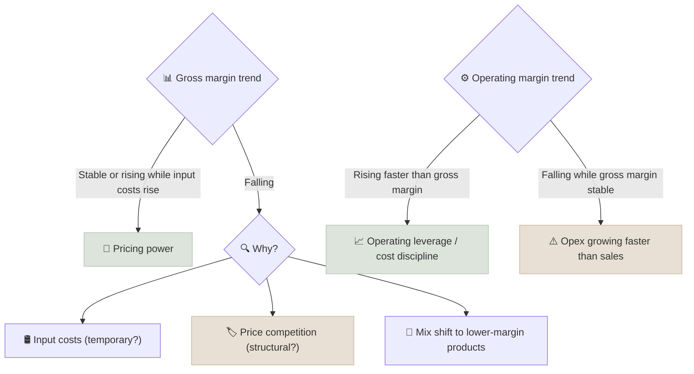

# Operating & Gross Margin Trajectory

Gross margin shows how much of each sale is left after the direct cost of the product, and operating margin shows how much is left after running the whole business; the direction these margins move over time reveals pricing power and cost discipline better than any single year.

```objectives
time: 40 min
outcomes:
  - Calculate gross, EBITDA, operating and net margins and read a multi-year margin trend
  - Separate price, mix, input-cost and operating-leverage effects on margins
  - Calculate the degree of operating leverage and explain its effect on earnings volatility
  - Benchmark margins by sector and recognize unsustainable margin expansion
prerequisites:
  - "[Income Statement](../../04-Accounting-Foundations/Notes/01-Income-Statement.mdx)"
```

## Why It Matters

<div class="audience-beginner" markdown="1">

If a company can raise prices without losing customers, its margins stay high or rise even when its costs go up. That is pricing power, and it is one of the best signs of a strong business. Falling margins, on the other hand, often mean competitors are forcing prices down or the company is losing control of its costs - usually before it shows up in revenue.

</div>

<div class="audience-analyst" markdown="1">

Margins are where competitive advantage becomes visible in the income statement. Gross margin level and stability indicate product differentiation; operating margin trajectory reflects scale economies and cost discipline. Because EPS growth ≈ revenue growth + margin change - dilution, margin assumptions drive most of the gap between bull and bear cases in any model. Mean reversion of margins is the default assumption unless there is a structural reason against it.

</div>

## Formulas

$$
\text{Gross margin} = \frac{\text{Revenue} - \text{Cost of goods sold}}{\text{Revenue}}
$$

$$
\text{Operating margin} = \frac{\text{EBIT}}{\text{Revenue}} \qquad \text{EBITDA margin} = \frac{\text{EBITDA}}{\text{Revenue}}
$$

**Incremental margin** - how much of each new unit of revenue becomes operating profit:

$$
\text{Incremental operating margin} = \frac{\Delta \text{EBIT}}{\Delta \text{Revenue}}
$$

**Degree of operating leverage (DOL):**

$$
\text{DOL} = \frac{\%\Delta \text{EBIT}}{\%\Delta \text{Revenue}} \approx \frac{\text{Contribution margin}}{\text{Operating margin}}
$$

A company with high fixed costs has high DOL: a 10% rise in revenue may lift EBIT by 30%, and a 10% fall may cut it by 30%.

## Reading a Margin Trend



Always look at **at least 5-10 years**, ideally through one downturn. A single year's margin says little; the pattern does.

## Worked Example

| Year | Revenue | Gross profit | Opex | EBIT | Gross margin | Operating margin |
|---|---|---|---|---|---|---|
| 1 | 1,000 | 450 | 300 | 150 | 45.0% | 15.0% |
| 2 | 1,150 | 529 | 320 | 209 | 46.0% | 18.2% |
| 3 | 1,300 | 611 | 345 | 266 | 47.0% | 20.5% |

Revenue grew 30% over two years; EBIT grew 77%. Incremental operating margin from year 1 to 3 = (266 - 150) / (1,300 - 1,000) = **38.7%**, far above the starting margin. Gross margin rose modestly (pricing or mix), and opex grew only 15% (operating leverage). The question for the analyst: how much further can this go before competition or reinvestment pulls it back?

## Sector Benchmarks

| Sector | Gross margin | Operating margin | Notes |
|---|---|---|---|
| Software (SaaS) | 70-85% | 10-35% at maturity | Gross margin below 60% suggests heavy services or hosting costs |
| Branded consumer / FMCG | 45-60% | 15-25% (US); 18-28% (India leaders) | Stability matters more than level |
| Pharma (branded) | 60-80% | 20-35% | Generics much lower |
| Specialty chemicals | 30-45% | 12-20% | |
| Industrials | 25-40% | 10-18% | Cyclical |
| Retail (grocery / warehouse clubs) | 12-30% | 2-6% | Win on turnover, not margin |
| Auto manufacturing | 12-20% | 5-10% | High DOL |
| IT services (India) | 30-40% | 18-26% | Employee cost is the COGS |

## Red Flags

- **Gross margin falling for 3+ years** while management blames "temporary" factors.
- **Operating margin rising only because R&D, marketing or maintenance were cut** - borrowing from future growth.
- **Margins far above all peers without a clear moat** - a target for competitors, or an accounting question.
- **Capitalizing costs** (software development, customer acquisition) to lift reported margins.
- **Record margins at a cyclical peak** extrapolated in forecasts.
- **Revenue growth with flat or falling gross profit dollars** - buying growth with price cuts.

## How It Interacts With Other Metrics

| Metric | Interaction |
|---|---|
| [ROIC vs WACC](03-ROIC-vs-WACC.mdx) | ROIC = NOPAT margin × capital turnover. Low margins can still give high ROIC with fast turnover. |
| [Revenue CAGR vs EPS CAGR](08-Revenue-vs-EPS-CAGR.mdx) | Margin expansion is the main reason EPS grows faster than revenue - and it cannot continue forever. |
| [Rule of 40](../../07-Growth-Investing/Notes/03-Rule-of-40.mdx) | For growth companies, margin and growth are traded off explicitly. |
| [FCF yield](04-FCF-Yield.mdx) | Rising margins should raise FCF; if they do not, check working capital and capex. |

## Case Studies

**US - Coca-Cola's pricing power.** Coca-Cola's gross margin has stayed close to 60% for decades, through several bouts of input-cost inflation. In 2021-2023, as sugar, aluminium and freight costs rose, it raised prices and its gross margin dipped only modestly before recovering. Stable gross margin through an inflationary shock is strong evidence of pricing power.

**US - Intel's margin erosion.** Intel's gross margin was around 60% or higher for most of the 2010s. As manufacturing delays let competitors take share and it invested heavily in new fabs, gross margin fell to around 40% by 2023 and operating margin turned negative. The margin trajectory signalled the competitive problem years before the full financial impact.

**India - Asian Paints and crude oil.** Paint raw materials are largely crude-oil derivatives. When crude prices spiked in 2021-2022, Asian Paints' gross margin fell several percentage points, then recovered as it passed on price increases and input costs eased. The speed of margin recovery after an input shock is a practical test of pricing power.

> Margin figures are approximate and for teaching.

## Check Yourself

```quiz
- q: "Revenue rises from 2,000 to 2,400 and EBIT rises from 200 to 320. What is the incremental operating margin?"
  options: ["13.3%", "30%", "16%", "60%"]
  answer: 2
  explain: "ΔEBIT / ΔRevenue = 120 / 400 = 30%."
- q: "A company's gross margin is stable but its operating margin has fallen for three years. What is the most likely cause?"
  options: ["Input costs rose", "Operating expenses are growing faster than revenue", "Its prices fell", "Tax rates rose"]
  answer: 2
  explain: "Gross margin captures prices and direct costs; if it is stable, the squeeze is coming from opex below the gross profit line."
- q: "Why does a company with high fixed costs have more volatile earnings?"
  options: ["It pays more tax", "Its degree of operating leverage is high, so small revenue changes cause large EBIT changes", "It has more debt", "It has lower gross margins"]
  answer: 2
  explain: "Fixed costs do not fall with revenue, so EBIT moves proportionally more than revenue in both directions."
- q: "What evidence would convince you a company has pricing power?"
  answer: "Gross margin that stays stable or recovers quickly during input-cost inflation, price increases without volume losses, and margins consistently above peers over a full cycle."
```

## Exercises

```exercise
- title: Ten-year margin chart
  task: |
    For one US and one Indian company in the same industry, chart 10 years of gross and operating margin. Mark input-cost shocks and recessions. Write a paragraph on which company has more pricing power and why.
- title: Operating leverage
  task: |
    A company has revenue of 1,000, variable costs of 600 and fixed costs of 250. Compute EBIT, contribution margin, operating margin and DOL. What happens to EBIT if revenue falls 10%?
  solution: |
    EBIT = 1,000 - 600 - 250 = **150**. Contribution margin = 400 / 1,000 = 40%. Operating margin = 15%. DOL = 40% / 15% = **2.67**. A 10% revenue fall: revenue 900, variable costs 540, EBIT = 900 - 540 - 250 = **110**, down 26.7% - 2.67 times the revenue decline.
```

## Study Notes

- **Gross margin** = product-level pricing power; **operating margin** = whole-business efficiency.
- Read **trajectory** over 5-10 years, not one year.
- **Incremental margin** and **DOL** explain why EBIT moves more than revenue.
- EPS growth ≈ revenue growth + margin change - dilution.
- Assume margins mean-revert unless there is a clear structural reason.

## References

- Porter, *Competitive Strategy* (Free Press, 1980)
- Mauboussin & Callahan, "Measuring the Moat: Assessing the Magnitude and Sustainability of Value Creation," Morgan Stanley Investment Management / Credit Suisse (2016, updated 2024)
- The Coca-Cola Company, Form 10-K (2023)
- Intel Corporation, Form 10-K (2023)
- Asian Paints Ltd., Annual Reports (fiscal 2022 and 2023)

*Last reviewed: 2026-09*
