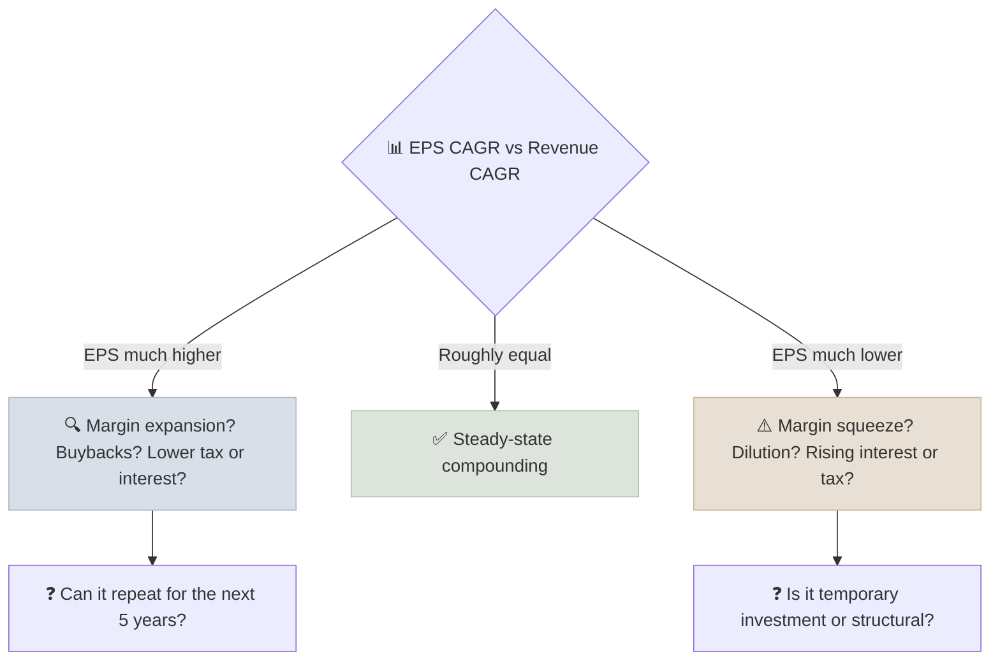

# Revenue CAGR vs EPS CAGR

Comparing a company's compound annual growth in revenue with its compound annual growth in earnings per share shows whether top-line expansion is actually becoming per-share value for shareholders - and what (margins, buybacks, dilution, leverage) explains any gap.

```objectives
time: 40 min
outcomes:
  - Calculate revenue, net income and EPS CAGRs over the same period
  - Decompose EPS growth into revenue growth, margin change and share count change
  - Explain why EPS growth faster than revenue growth cannot continue indefinitely
  - Spot growth that dilutes shareholders or relies on financial engineering
prerequisites:
  - "[Compound Interest Mechanics](../../01-Money-and-Compounding/Notes/01-Compound-Interest-Mechanics.mdx) - CAGR"
  - "[Margin Trajectory](06-Margin-Trajectory.mdx)"
```

## Why It Matters

<div class="audience-beginner" markdown="1">

A company can double its sales and still leave its shareholders no better off - if its profits did not grow, or if it issued lots of new shares to fund that growth. What matters to you as an owner is growth **per share**. Comparing sales growth with EPS growth tells you whether growth is reaching you.

</div>

<div class="audience-analyst" markdown="1">

The identity $$\text{EPS} = \frac{\text{Revenue} \times \text{Net margin}}{\text{Shares}}$$ means EPS growth decomposes exactly into revenue growth, margin change and share count change. Revenue growth is the most durable driver; margin expansion is bounded; buybacks depend on valuation and balance sheet capacity; dilution is a cost. A high-quality compounder shows EPS CAGR close to or modestly above revenue CAGR over a decade, with a stable or falling share count.

</div>

## Formulas

$$
\text{CAGR} = \left(\frac{\text{Ending value}}{\text{Beginning value}}\right)^{1/n} - 1
$$

Calculate revenue CAGR, net income CAGR and diluted EPS CAGR **over the same period**, ideally 5 and 10 years, and ideally trough to trough or peak to peak for cyclical businesses.

**Decomposition** (multiplicative, exact):

$$
(1 + g_{\text{EPS}}) = (1 + g_{\text{Revenue}}) \times \frac{1 + g_{\text{Margin}}}{1 + g_{\text{Shares}}}
$$

where $$g_{\text{Margin}}$$ is the annual growth rate of the net margin itself and $$g_{\text{Shares}}$$ is the annual change in diluted share count (negative for buybacks).

## Worked Example

| | Year 0 | Year 5 | CAGR |
|---|---|---|---|
| Revenue | 10,000 | 16,105 | **10.0%** |
| Net margin | 10.0% | 12.8% | 5.1% (margin growth) |
| Net income | 1,000 | 2,061 | 15.6% |
| Diluted shares | 500 | 452 | -2.0% |
| EPS | 2.00 | 4.56 | **17.9%** |

Decomposition: $$1.10 \times 1.051 / 0.980 = 1.1797$$, so EPS CAGR ≈ 17.9%. Of the ~8 points of excess EPS growth over revenue growth, about 5 came from margin expansion and about 2 from buybacks. Both have limits: margins cannot expand forever, and buybacks are only accretive when shares are bought below intrinsic value.

## Reading the Gap



| Pattern | Typical cause | Sustainable? |
|---|---|---|
| EPS > revenue by 2-5 points for a decade | Operating leverage + modest buybacks | Often, for scaled businesses with pricing power |
| EPS > revenue by 10+ points | Recovery from depressed margins, heavy buybacks, tax changes | Rarely |
| EPS ≈ revenue | Stable margins, stable share count | Yes |
| EPS < revenue | Margin compression, stock-based dilution, acquisitions paid in shares | Needs a reason |
| Revenue growing, EPS falling | Growth bought with price cuts, rising costs or massive dilution | A red flag |

## Benchmarks

| Company profile | Revenue CAGR (10y) | EPS CAGR (10y) |
|---|---|---|
| Quality compounder | 8-15% | 10-18% |
| Mature dividend payer | 3-6% | 5-8% |
| High-growth tech | 20%+ | Often volatile; watch share count |
| Cyclical | Meaningless over short windows | Use peak-to-peak |

The hybrid GARP + dividend framework in this course targets **revenue CAGR 10-15% with EPS CAGR equal or higher** (see [GARP + Dividend Growth Framework](../../09-GARP-and-Hybrid/Notes/01-GARP-and-Dividend-Growth-Framework.mdx)).

## Red Flags

- **Share count rising 3-5%+ a year** from stock-based compensation or equity raises - EPS lags net income.
- **EPS growth driven by debt-funded buybacks** while revenue stagnates.
- **Acquisition-driven revenue growth** with flat organic growth - check organic growth in the MD&A.
- **Endpoint cherry-picking** - a CAGR from a trough year looks far better than one from a peak.
- **Adjusted EPS growing much faster than GAAP / reported EPS** for years.
- **Falling tax rate or interest expense** supplying most of the EPS growth.

## How It Interacts With Other Metrics

| Metric | Interaction |
|---|---|
| [P/E vs PEG](01-PE-vs-PEG.mdx) | The growth rate in PEG should be sustainable EPS growth - usually closer to revenue growth than to a margin-driven burst. |
| [ROIC vs WACC](03-ROIC-vs-WACC.mdx) | Revenue growth only creates value if ROIC > WACC. |
| [Margin trajectory](06-Margin-Trajectory.mdx) | Explains the margin component of the gap. |
| [Payout & coverage](07-Dividend-Payout-and-FCF-Coverage.mdx) | Dividend growth tracks EPS growth over the long run. |

## Case Studies

**US - IBM, 2012-2020.** IBM's revenue declined for most of this period, yet heavy buybacks kept operating EPS relatively stable for years, partly funded with debt. EPS stability masked a shrinking business; the stock underperformed the market substantially. When revenue CAGR is negative, EPS growth from buybacks is not compounding.

**US - Microsoft, 2014-2024.** Microsoft's revenue grew at a low-teens CAGR over the decade while EPS grew faster, around the high teens, driven by operating margin expansion from its cloud business and a slowly declining share count. The gap was large but explained by a structural mix shift toward higher-margin revenue - the kind of explanation analysts should demand.

**India - Bajaj Finance and dilution.** Fast-growing Indian lenders such as Bajaj Finance periodically raised equity through QIPs to fund balance sheet growth. Net income growth was very high, but EPS growth ran somewhat below it in raise years. For lenders, some dilution is the price of growth; the test is whether ROE stays well above the cost of equity after each raise.

> Figures are approximate and for teaching.

## Check Yourself

```quiz
- q: "Revenue grew from 500 to 805 over 5 years. What is the revenue CAGR?"
  options: ["12.2%", "10.0%", "61%", "8.5%"]
  answer: 2
  explain: "(805 / 500)^(1/5) - 1 = 1.61^0.2 - 1 = 10.0%."
- q: "Revenue grows 6% a year, net margin is flat, and the share count falls 3% a year. What is the approximate EPS CAGR?"
  options: ["3%", "6%", "9.3%", "18%"]
  answer: 3
  explain: "1.06 / 0.97 = 1.093, so about 9.3%."
- q: "Why can EPS not keep growing much faster than revenue forever?"
  options: ["Accounting rules forbid it", "The gap comes from margin expansion and share count reduction, both of which have limits", "Revenue always catches up by law", "Taxes rise automatically"]
  answer: 2
  explain: "Net margin cannot exceed 100% (and competition caps it far below), and buybacks require cash and sensible prices."
- q: "A company reports 25% revenue CAGR but diluted shares grew 8% a year and net margin was flat. What is its EPS CAGR, and what does it tell you?"
  answer: "About 15.7% (1.25 / 1.08 - 1). Nearly a third of the growth was given to new shareholders through dilution, so existing owners captured much less than the headline revenue growth."
```

## Exercises

```exercise
- title: Decompose a real company
  task: |
    Pick one company in each market. From 10 years of annual reports, record revenue, net income, diluted share count and EPS. Compute each CAGR and decompose EPS growth into revenue, margin and share count. Which component dominated?
- title: Endpoint sensitivity
  task: |
    A cyclical company's EPS was 2.0 (trough) in year 0, 6.0 (peak) in year 3, and 3.5 in year 8. Compute the EPS CAGR from year 0 to 8, from year 3 to 8, and explain why neither alone is a fair picture.
  solution: |
    Year 0 to 8: (3.5 / 2.0)^(1/8) - 1 = **7.3%**. Year 3 to 8: (3.5 / 6.0)^(1/5) - 1 = **-10.2%**. Trough-start flatters; peak-start punishes. For cyclicals, measure peak to peak or trough to trough, or use averages across a full cycle.
```

## Study Notes

- **EPS growth = revenue growth × margin change ÷ share count change** (multiplicative).
- Revenue growth is the most durable driver; margins and buybacks are bounded.
- Watch dilution, acquisition-led growth and endpoint choice.
- Quality compounders show EPS CAGR a little above revenue CAGR, with a flat or falling share count.

## References

- Koller, Goedhart & Wessels, *Valuation*, 7th ed. (McKinsey & Company, 2020) - chapter on growth
- Mauboussin & Callahan, "Share Repurchase from All Angles," Morgan Stanley Investment Management (2020)
- International Business Machines Corp., Forms 10-K (2012-2020)
- Microsoft Corporation, Form 10-K (fiscal 2024)
- Bajaj Finance Ltd., Annual Reports and QIP placement documents (2017-2023)

*Last reviewed: 2026-09*
