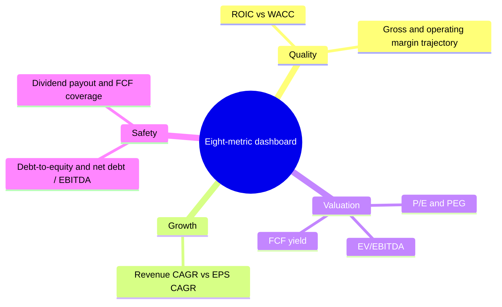

# How the Metrics Interact

No single metric can judge a company; the eight metrics in this module form a system in which each one cross-checks the others, and the contradictions between them are usually where the real analysis begins.

```objectives
time: 50 min
outcomes:
  - Build a one-page, eight-metric dashboard for any company
  - Group the metrics into quality, growth, valuation and safety, and explain what each group answers
  - Use cross-checks between metrics to detect accounting distortion and financial engineering
  - Turn the dashboard into a short, evidence-based verdict
prerequisites:
  - "All eight metric notes in this module"
```

## The System



| Group | Question it answers | Metrics |
|---|---|---|
| **Quality** | Is this a good business? | ROIC vs WACC, margin trajectory |
| **Growth** | Is it getting bigger per share, and is that growth valuable? | Revenue CAGR vs EPS CAGR (with ROIC) |
| **Valuation** | What am I paying for it? | P/E and PEG, EV/EBITDA, FCF yield |
| **Safety** | Can it survive a bad year and keep paying me? | Leverage ratios, payout and FCF coverage |

The order matters. Judge quality first, then growth, then price. A cheap price does not rescue a bad business; a great business can be a poor investment at the wrong price.

## The Key Identities That Link Them

These relationships make the metrics consistent with one another. When a company's numbers break them, something needs explaining.

$$
\text{ROIC} = \underbrace{\frac{\text{NOPAT}}{\text{Revenue}}}_{\text{margin}} \times \underbrace{\frac{\text{Revenue}}{\text{Invested capital}}}_{\text{turnover}}
$$

$$
\text{FCF} = \text{NOPAT} \times \left(1 - \frac{g}{\text{ROIC}}\right)
$$

$$
1 + g_{\text{EPS}} = (1 + g_{\text{Revenue}}) \times \frac{1 + g_{\text{Margin}}}{1 + g_{\text{Shares}}}
$$

$$
\text{Justified P/E} = \frac{1 - g/\text{ROE}}{r - g} \qquad E[R] \approx \text{FCF yield} + g
$$

## Cross-Checks

| If you see... | ...check | Because |
|---|---|---|
| High ROE | ROIC and D/E | High ROE with low ROIC is leverage, not quality |
| Rising margins | FCF conversion | Margins that do not show up in cash may be accruals or capitalized costs |
| EPS growing much faster than revenue | Share count, margin history, tax rate | Buybacks and margin expansion have limits |
| Low P/E | EV/EBITDA and net debt / EBITDA | A low P/E can hide high debt |
| Low EV/EBITDA | Capex / D&A and FCF yield | EBITDA ignores capex |
| High dividend yield | FCF payout and net debt trend | The market may be pricing a cut |
| High growth | ROIC vs WACC | Growth below WACC destroys value |
| High FCF yield | Capex vs depreciation | Under-investment inflates FCF temporarily |

## The Dashboard

Fill this in for every company you research. It goes into the [Company Deep Dive](../../12-Research-Templates/Templates/01-Company-Deep-Dive.mdx) template.

| Metric | Company | 5-yr avg | Sector range | Signal |
|---|---|---|---|---|
| ROIC (ex-goodwill) vs WACC | | | | |
| Gross margin / trend | | | | |
| Operating margin / trend | | | | |
| Revenue CAGR (5y / 10y) | | | | |
| EPS CAGR (5y / 10y) | | | | |
| Forward P/E / PEG | | | | |
| EV/EBITDA | | | | |
| FCF yield / cash conversion | | | | |
| Net debt / EBITDA, interest coverage | | | | |
| Payout ratio / FCF coverage | | | | |

Use three signals: **strength**, **neutral**, **concern**. The verdict is not a sum of scores - one serious concern (for example, negative FCF with rising debt) can outweigh several strengths.

## Computing It

```python
from dataclasses import dataclass

@dataclass
class Financials:
    price: float; shares: float; revenue: float; gross_profit: float
    ebit: float; da: float; tax_rate: float; net_income: float
    cfo: float; capex: float; sbc: float; dividends: float
    debt: float; leases: float; cash: float; invested_capital: float
    interest: float; eps_growth: float  # expected, e.g. 0.12

def dashboard(f: Financials, wacc: float) -> dict:
    mcap = f.price * f.shares
    ev = mcap + f.debt + f.leases - f.cash
    ebitda = f.ebit + f.da
    fcf = f.cfo - f.capex - f.sbc
    pe = mcap / f.net_income
    roic = f.ebit * (1 - f.tax_rate) / f.invested_capital
    return {
        "ROIC - WACC": roic - wacc,
        "Gross margin": f.gross_profit / f.revenue,
        "Operating margin": f.ebit / f.revenue,
        "P/E": pe,
        "PEG": pe / (f.eps_growth * 100),
        "EV/EBITDA": ev / ebitda,
        "FCF yield": fcf / mcap,
        "Cash conversion": fcf / f.net_income,
        "Net debt / EBITDA": (f.debt + f.leases - f.cash) / ebitda,
        "Interest coverage": f.ebit / f.interest,
        "FCF payout": f.dividends / fcf,
    }
```

Add five years of history and the CAGRs from [Revenue CAGR vs EPS CAGR](08-Revenue-vs-EPS-CAGR.mdx) to turn this into a trend view.

## Worked Example: Two Companies

| Metric | Company A | Company B |
|---|---|---|
| ROIC vs WACC | 24% vs 9% | 7% vs 10% |
| Gross margin trend | 58%, stable | 31%, falling 1 pt a year |
| Revenue / EPS CAGR (5y) | 11% / 13% | 14% / 19% |
| Share count change | -1% a year | -5% a year |
| Forward P/E / PEG | 28x / 2.2 | 11x / 0.6 |
| EV/EBITDA | 18x | 7x |
| FCF yield | 3.4% | 1.2% |
| Net debt / EBITDA | 0.4x | 3.5x (rising) |
| FCF payout | 45% | 140% |

On valuation alone, B looks like the bargain: P/E 11, PEG 0.6, EV/EBITDA 7. But B's ROIC is below WACC, margins are falling, EPS growth depends on debt-funded buybacks, and the dividend is not covered by FCF. The cross-checks turn a "cheap growth stock" into a probable value trap. A is expensive, but its growth is high-return, cash-backed and self-funded - the question for A is only whether the price already reflects that.

## Red Flags in Combination

- **Low valuation + low ROIC + rising leverage** - the classic value trap.
- **High growth + negative FCF + rising share count** - growth funded by other people's money.
- **High yield + FCF payout above 100% + rising net debt** - a dividend cut in waiting.
- **Rising EPS + falling cash conversion + rising receivables** - earnings quality problem.

## Check Yourself

```quiz
- q: "A company has ROE of 28% but ROIC of 8% and D/E of 3. What is driving its ROE?"
  options: ["A strong moat", "Leverage", "Low taxes", "High FCF yield"]
  answer: 2
  explain: "Leverage raises ROE without raising ROIC; the underlying business earns only 8%."
- q: "EV/EBITDA is 5x (very low) but FCF yield is only 1%. What is the most likely explanation?"
  options: ["The share price is too high", "Heavy capex or working capital absorbs most of EBITDA", "The company has no debt", "The tax rate is zero"]
  answer: 2
  explain: "EBITDA is before capex and working capital; if little of it becomes FCF, the low multiple is misleading."
- q: "In what order should the four metric groups be judged, and why?"
  answer: "Quality first (is it a good business?), then growth (is value compounding per share?), then valuation (what am I paying?), with safety as a veto throughout. A low price cannot fix a poor business, and a serious safety concern can outweigh everything else."
```

## Exercises

```exercise
- title: Build your first dashboard
  task: |
    Choose one US and one Indian company from the same industry. Fill in the full dashboard with current and 5-year average values and sector ranges. Mark each metric strength, neutral or concern, and write a five-sentence verdict that cites at least two cross-checks.
- title: Spot the value trap
  task: |
    Run a low-P/E screen (P/E under 10) in your market. Take the first five results and apply the cross-checks table. How many survive? For each one that fails, name the cross-check that caught it.
```

## Study Notes

- Four groups: **quality, growth, valuation, safety** - judged in that order, with safety as a veto.
- Key links: ROIC = margin × turnover; FCF = NOPAT × (1 - g/ROIC); EPS growth decomposition; justified P/E.
- Contradictions between metrics are where to dig.
- One serious concern can outweigh several strengths.

## References

- Koller, Goedhart & Wessels, *Valuation*, 7th ed. (McKinsey & Company, 2020)
- Greenblatt, *The Little Book That Still Beats the Market* (Wiley, 2010) - combining return on capital with earnings yield
- Piotroski, "Value Investing: The Use of Historical Financial Statement Information to Separate Winners from Losers," *Journal of Accounting Research* (2000)
- Mauboussin & Callahan, "Measuring the Moat," Morgan Stanley Investment Management (updated 2024)

*Last reviewed: 2026-09*
