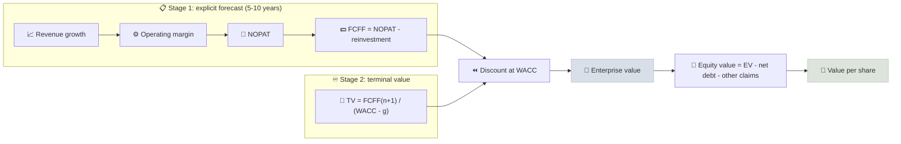

# DCF Modeling

A discounted cash flow (DCF) model values a business as the present value of all the free cash flow it will generate, discounted at a rate that reflects the risk of those cash flows.

```objectives
time: 70 min
outcomes:
  - Build a two-stage DCF from free cash flow forecasts, WACC and a terminal value
  - Bridge from enterprise value to equity value per share
  - Sanity-check a terminal value with the implied exit multiple and the value-driver formula
  - Run a sensitivity table and explain why DCF outputs are ranges, not points
prerequisites:
  - "[ROIC vs WACC](../../05-Metric-Toolkit/Notes/03-ROIC-vs-WACC.mdx)"
  - "[Free Cash Flow Yield](../../05-Metric-Toolkit/Notes/04-FCF-Yield.mdx)"
```

## Why It Matters

<div class="audience-beginner" markdown="1">

A business is worth the cash it will hand to its owners over its whole life. Money in 10 years is worth less than money today, so future cash is "discounted" back to today's value. A DCF writes this down year by year. Its real value is not the final number - it is that it forces you to spell out what you believe about growth, margins and risk.

</div>

<div class="audience-analyst" markdown="1">

Every multiple is a shorthand DCF. Building the explicit model exposes the assumptions a multiple hides: growth duration, reinvestment needs (via ROIC), and the discount rate. Most DCF value sits in the terminal value, so the discipline is in making the terminal assumptions consistent - terminal growth below nominal GDP, and reinvestment consistent with terminal ROIC.

</div>

## The Structure



### Step 1 - Forecast Free Cash Flow to the Firm

$$
\text{FCFF}_t = \text{EBIT}_t (1 - t) + \text{D\&A}_t - \text{Capex}_t - \Delta\text{NWC}_t
$$

Forecast the **drivers**, not FCF directly: revenue growth, operating margin, tax rate, and reinvestment (capex, D&A and working capital as a share of revenue, or reinvestment = growth / ROIC).

### Step 2 - Discount at WACC

$$
\text{PV of explicit FCF} = \sum_{t=1}^{n} \frac{\text{FCFF}_t}{(1 + \text{WACC})^{t}}
$$

See [ROIC vs WACC](../../05-Metric-Toolkit/Notes/03-ROIC-vs-WACC.mdx) for estimating WACC.

### Step 3 - Terminal Value

**Perpetuity growth (Gordon) method:**

$$
\text{TV}_n = \frac{\text{FCFF}_{n+1}}{\text{WACC} - g} = \frac{\text{FCFF}_n (1 + g)}{\text{WACC} - g}
$$

**Value-driver form** (keeps reinvestment consistent with growth):

$$
\text{TV}_n = \frac{\text{NOPAT}_{n+1}\left(1 - \frac{g}{\text{RONIC}}\right)}{\text{WACC} - g}
$$

where RONIC is the return on new invested capital in the terminal period. Setting RONIC = WACC means terminal growth adds no value - a conservative assumption for businesses without a durable moat.

**Exit multiple method:** $$\text{TV}_n = \text{EBITDA}_n \times \text{multiple}$$. Use it as a cross-check, not the primary method - it imports today's market mood into a 10-year-out value.

### Step 4 - Equity Bridge

$$
\text{Equity value} = \text{EV} - \text{Debt} - \text{Leases} - \text{Minority interest} - \text{Preferred} + \text{Cash} + \text{Non-operating assets}
$$

$$
\text{Value per share} = \frac{\text{Equity value}}{\text{Diluted shares}}
$$

## Worked Example

Current FCFF = 100. Growth 12% for years 1-5, 8% for years 6-10, then 3% forever. WACC = 9%. Net debt = 300. Diluted shares = 100.

| Year | FCFF | PV at 9% |
|---|---|---|
| 1 | 112.0 | 102.8 |
| 2 | 125.4 | 105.6 |
| 3 | 140.5 | 108.5 |
| 4 | 157.4 | 111.5 |
| 5 | 176.2 | 114.5 |
| 6 | 190.3 | 113.5 |
| 7 | 205.6 | 112.4 |
| 8 | 222.0 | 111.4 |
| 9 | 239.8 | 110.4 |
| 10 | 258.9 | 109.4 |
| **Sum** | | **1,100.0** |

Terminal value at year 10: $$\frac{258.9 \times 1.03}{0.09 - 0.03} = 4{,}445.2$$, worth $$4{,}445.2 / 1.09^{10} = 1{,}877.7$$ today.

EV = 1,100.0 + 1,877.7 = **2,977.7**. Equity = 2,977.7 - 300 = 2,677.7. **Value per share ≈ 26.8.**

Notice that **63%** of the value is in the terminal value. That is normal - and it is why terminal assumptions deserve the most scrutiny.

**Sanity check - implied exit multiple.** TV / FCFF in year 10 = 4,445.2 / 258.9 ≈ 17.2x trailing FCF. If comparable mature companies trade at 12-15x FCF, the terminal assumptions are generous.

## Sensitivity

Value per share for different WACC and terminal growth rates:

| WACC \ g | 2% | 3% | 4% |
|---|---|---|---|
| **8%** | 29.0 | 33.3 | 39.8 |
| **9%** | 23.9 | **26.8** | 30.8 |
| **10%** | 20.2 | 22.1 | 24.8 |

A 1-point change in WACC or terminal growth moves the answer by 15-25%. Always present a range, and let the range - not the midpoint - drive the [Margin of Safety](05-Margin-of-Safety.mdx).

## Building It

Spreadsheet layout, one column per year:

```text
Row  Item                  Formula (year t)
 1   Revenue               = prior * (1 + growth_t)
 2   EBIT                  = Revenue * margin_t
 3   NOPAT                 = EBIT * (1 - tax)
 4   Reinvestment          = NOPAT * growth_{t+1} / ROIC   (or capex - D&A + ΔNWC)
 5   FCFF                  = NOPAT - Reinvestment
 6   Discount factor       = 1 / (1 + WACC)^t
 7   PV of FCFF            = FCFF * Discount factor
 8   Terminal value        = FCFF_n * (1 + g) / (WACC - g)      (last column only)
 9   EV                    = SUM(PV of FCFF) + TV * Discount factor_n
```

Python version:

```python
def dcf_value_per_share(fcff0, growth_path, wacc, g_terminal, net_debt, shares):
    """Two-stage DCF; growth_path is a list of annual growth rates for the explicit period."""
    fcff, pv = fcff0, 0.0
    for t, g in enumerate(growth_path, start=1):
        fcff *= 1 + g
        pv += fcff / (1 + wacc) ** t
    n = len(growth_path)
    tv = fcff * (1 + g_terminal) / (wacc - g_terminal)
    ev = pv + tv / (1 + wacc) ** n
    return (ev - net_debt) / shares

print(round(dcf_value_per_share(100, [0.12] * 5 + [0.08] * 5, 0.09, 0.03, 300, 100), 1))  # 26.8
```

## Rules of Thumb

- **Terminal growth ≤ long-run nominal GDP growth** of the currency - roughly 2-4% in dollars, 5-7% in rupees (with a correspondingly higher rupee WACC).
- **Match currency and inflation**: rupee cash flows with a rupee WACC; dollar with dollar.
- **Forecast until the business reaches a steady state**, often 10 years for growth companies.
- **Growth must be paid for** with reinvestment; growth with no reinvestment implies infinite ROIC.
- **Model the base, bull and bear cases** with explicit driver differences.

## Red Flags

- Terminal growth at or above WACC (the formula explodes) or above nominal GDP.
- Margins expanding every year to the end of the forecast.
- FCF growing faster than revenue forever with no reinvestment.
- A WACC chosen to make the answer match the price.
- More than about 80% of value in the terminal value for a company that is already mature.
- Net debt, leases, pension deficits or dilution from options left out of the equity bridge.

## Case Studies

**US - Amazon in the 2000s.** Traditional multiples made Amazon look perpetually expensive because it reinvested most of its operating cash flow. A DCF that modelled reinvestment at high returns and eventual margin expansion made its value clearer - and also showed how dependent that value was on the assumption that margins would eventually rise. Analysts who wrote down and tracked those margin assumptions could test them each year.

**India - valuing a consumer company in rupees.** Indian consumer companies often trade at 50-70x earnings. A DCF with a rupee WACC of about 11-12% and terminal growth of about 6-7% (in line with nominal GDP expectations) shows how those multiples can be justified only by long high-growth periods with high returns on capital - and how sensitive value is when the long-run growth assumption drops by a point or two.

## Check Yourself

```quiz
- q: "FCFF in year 5 is 200. Terminal growth is 4% and WACC is 10%. What is the terminal value at year 5?"
  options: ["2,000", "3,333", "3,467", "5,200"]
  answer: 3
  explain: "TV = 200 × 1.04 / (0.10 - 0.04) = 208 / 0.06 = 3,466.7."
- q: "Why should terminal growth not exceed long-run nominal GDP growth?"
  options: ["Regulators forbid it", "A company growing faster than the economy forever would eventually become larger than the economy", "It makes WACC negative", "It lowers the value"]
  answer: 2
  explain: "Perpetual growth above the economy's growth is mathematically impossible over infinite time."
- q: "A DCF puts 85% of a mature utility's value in its terminal value. What should you check?"
  options: ["Nothing - this is always normal", "Whether terminal growth, RONIC and the implied exit multiple are reasonable", "Only the tax rate", "The share count"]
  answer: 2
  explain: "A very high terminal share for a mature company suggests aggressive terminal assumptions."
- q: "What does setting RONIC equal to WACC in the terminal value mean?"
  answer: "New investment in the terminal period earns exactly its cost of capital, so growth adds no value. The terminal value then equals NOPAT(n+1) / WACC regardless of the growth rate - a conservative assumption for companies without a lasting moat."
```

## Exercises

```exercise
- title: Build a three-scenario DCF
  task: |
    Choose a company. Build base, bull and bear DCFs with 10-year explicit forecasts. For each scenario, state revenue growth, operating margin, reinvestment rate (or ROIC), WACC and terminal growth. Report value per share and the implied exit multiple for each, and a probability-weighted value.
- title: Value-driver terminal value
  task: |
    NOPAT in year 11 is 500. WACC is 9%. Compute the terminal value for g = 3% with RONIC of 9%, 15% and 30%.
  solution: |
    TV = 500 × (1 - g/RONIC) / (0.09 - 0.03).
    - RONIC 9%: 500 × (1 - 0.333) / 0.06 = **5,556** (= 500 / 0.09 - growth adds nothing).
    - RONIC 15%: 500 × 0.80 / 0.06 = **6,667**.
    - RONIC 30%: 500 × 0.90 / 0.06 = **7,500**.
    The higher the return on new capital, the less reinvestment growth requires, and the more growth is worth.
```

## Study Notes

- **Value = PV of explicit FCFF + PV of terminal value**, then bridge to equity per share.
- Forecast **drivers** (growth, margin, reinvestment), not FCF directly.
- **TV = FCFF(n+1) / (WACC - g)**; value-driver form uses RONIC.
- Terminal value is often 60-80% of the total: sanity-check the implied multiple.
- Present a **range** via sensitivity tables and scenarios.

## References

- Koller, Goedhart & Wessels, *Valuation: Measuring and Managing the Value of Companies*, 7th ed. (McKinsey & Company, 2020)
- Damodaran, *Investment Valuation*, 3rd ed. (Wiley, 2012) and [Damodaran Online spreadsheets](https://pages.stern.nyu.edu/~adamodar/New_Home_Page/spreadsh.htm)
- CFA Institute, *Equity Valuation: Free Cash Flow Valuation*, CFA Program Level II curriculum (2025)
- Damodaran, *Narrative and Numbers: The Value of Stories in Business* (Columbia Business School Publishing, 2017)

*Last reviewed: 2026-09*
