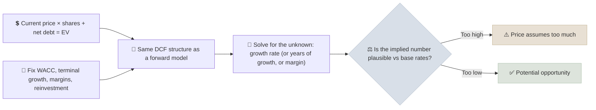

# Reverse DCF

A reverse DCF starts from today's share price and solves for the growth (or margins, or duration of growth) the market must be assuming to justify it, so you can judge whether those expectations are realistic instead of trying to forecast a precise value.

```objectives
time: 45 min
outcomes:
  - Solve for the growth rate implied by a share price using a DCF in reverse
  - Split a price into the value of current cash flows and the value of expected growth
  - Compare implied expectations with base rates for revenue growth and margins
  - Use the reverse DCF as the center of an investment debate
prerequisites:
  - "[DCF Modeling](02-DCF-Modeling.mdx)"
```

## Why It Matters

<div class="audience-beginner" markdown="1">

Instead of asking "what is this company worth?", a reverse DCF asks "what does the price say the company will do?" If the price only makes sense if profits grow 25% a year for a decade, you can ask whether that is realistic. It is easier to judge someone else's forecast than to make your own from scratch.

</div>

<div class="audience-analyst" markdown="1">

Expectations investing (Rappaport and Mauboussin) reframes valuation around price-implied expectations. It reduces the anchoring on one's own forecast, focuses research on the few value drivers that matter, and turns the investment decision into a question about expectation revisions - which is what actually moves prices.

</div>

## The Method



1. Compute the market-implied **enterprise value**: market cap + net debt + other claims.
2. Build the same DCF as in [DCF Modeling](02-DCF-Modeling.mdx), with WACC and terminal growth fixed at reasonable values.
3. Choose one unknown - usually the explicit-period FCF growth rate - and solve for the value that makes DCF value equal price (Goal Seek in Excel, or bisection in code).
4. Compare the answer with **base rates**: how often have companies of this size, in this industry, achieved that growth?

### Splitting the Price

$$
\text{Price} = \underbrace{\frac{\text{Current FCF or NOPAT}}{\text{WACC}}}_{\text{no-growth value}} + \underbrace{\text{Present value of growth opportunities (PVGO)}}_{\text{what the market pays for growth}}
$$

The larger the PVGO share, the more the price depends on growth expectations being met.

## Worked Example

Using the company from [DCF Modeling](02-DCF-Modeling.mdx): current FCFF 100, WACC 9%, terminal growth 3%, net debt 300, 100 shares. Solve for a constant 10-year FCF growth rate:

| Share price | Implied 10-year FCF growth |
|---|---|
| 10.7 | 0% (flat FCF for 10 years) |
| 26.8 | 10.2% |
| 40.0 | 15.0% |
| 60.0 | 20.1% |

At 40, the market is assuming FCF compounds at about 15% a year for a decade - roughly a 4x increase. At 60, it needs 20% a year, a 6x increase.

**Base rates.** Mauboussin and Callahan's studies of corporate growth show that sustaining 15%+ annual sales growth for 10 years is achieved by only a small minority of large companies, and 20%+ by very few. The larger the company already is, the rarer it is. A price that requires top-decile outcomes has little margin for error.

## Computing It

```python
def implied_growth(price, fcff0, wacc, g_terminal, net_debt, shares, years=10):
    """Solve for the constant explicit-period FCF growth that equates DCF value to price."""
    def value(g):
        fcff, pv = fcff0, 0.0
        for t in range(1, years + 1):
            fcff *= 1 + g
            pv += fcff / (1 + wacc) ** t
        tv = fcff * (1 + g_terminal) / (wacc - g_terminal)
        return (pv + tv / (1 + wacc) ** years - net_debt) / shares

    lo, hi = -0.5, 1.0
    for _ in range(100):  # bisection
        mid = (lo + hi) / 2
        lo, hi = (mid, hi) if value(mid) < price else (lo, mid)
    return mid

print(f"{implied_growth(40, 100, 0.09, 0.03, 300, 100):.1%}")  # about 15.0%
```

In a spreadsheet: build the DCF with a growth input cell, then use **Data > What-If Analysis > Goal Seek** to set value per share = price by changing the growth cell.

## Other Unknowns to Solve For

| Solve for | Useful when |
|---|---|
| Years of above-average growth ("competitive advantage period") | Moat-driven businesses; how long must the advantage last? |
| Terminal operating margin | Early-stage or turnaround companies where margins are the big question |
| Steady-state ROIC | Capital-intensive growth; is the market assuming value-creating reinvestment? |

## Red Flags

- **Implied growth above anything the company or its industry has achieved** at comparable size.
- **Implied margins above the best company in the industry.**
- **PVGO above 70-80% of the price** for a company whose moat is unproven.
- **Using a WACC that is too low** - it lowers implied growth and makes any price look reasonable.

## Case Studies

**US - Cisco in 2000.** At its March 2000 peak, Cisco's market value was over 500 billion dollars, around 100x+ earnings. Reverse-DCF analyses at the time showed the price implied decades of very high growth. Cisco's business kept growing for years afterward, but it never came close to those implied expectations, and the stock did not regain its 2000 peak for over two decades. The business was excellent; the expectations were impossible.

**India - consumer and new-age tech listings, 2021.** Several Indian consumer internet companies that listed in 2021 at high valuations implied revenue growth of 30-40%+ a year for a decade with large margin expansion. As growth slowed in 2022, many fell 50-75% from their listing-period highs. A reverse DCF at the IPO price would have laid out exactly what had to go right.

> Figures are approximate and for teaching.

## Check Yourself

```quiz
- q: "What is the main advantage of a reverse DCF over a normal DCF?"
  options: ["It needs no assumptions", "It turns valuation into judging the market's expectations, which reduces anchoring on your own forecast", "It always gives a higher value", "It ignores WACC"]
  answer: 2
  explain: "You judge whether the implied growth is plausible instead of producing a precise value from uncertain inputs."
- q: "A company's no-growth value is 20 per share and its price is 100. What share of the price is PVGO?"
  options: ["20%", "80%", "50%", "100%"]
  answer: 2
  explain: "PVGO = 100 - 20 = 80, or 80% of the price, which depends on growth expectations being met."
- q: "Why must you choose a sensible WACC before solving a reverse DCF?"
  answer: "Because a lower WACC raises the value of any growth path, so it lowers the implied growth needed to justify the price. Choosing an artificially low WACC makes any price look reasonable."
```

## Exercises

```exercise
- title: Solve an implied growth rate
  task: |
    A company has current FCF of 50, net cash of 100, 50 shares and a price of 30. Use WACC 10%, terminal growth 4% and a 10-year explicit period. What constant FCF growth does the price imply? What is the no-growth value per share?
  hints:
    - "Net cash means you add it to EV to get equity value."
  solution: |
    The no-growth DCF (g = 0 for 10 years, then 4%) gives about **14.8** per share. Solving for price 30 gives implied 10-year FCF growth of about **10.3%** a year - roughly a 2.7x increase in FCF over the decade. Whether that is plausible depends on the company's history, size and reinvestment opportunities.
- title: Reverse DCF on a stock you own
  task: |
    Run a reverse DCF on one holding. Write the implied growth, the company's actual 5- and 10-year FCF or revenue CAGR, and a one-paragraph judgment: are expectations too high, too low, or about right?
```

## Study Notes

- A reverse DCF solves for the **expectations embedded in the price**.
- **Price = no-growth value + PVGO**; a large PVGO means high dependence on growth.
- Compare implied growth, margins or duration with **base rates**.
- Fix WACC and terminal growth sensibly before solving.

## References

- Rappaport & Mauboussin, *Expectations Investing: Reading Stock Prices for Better Returns*, revised ed. (Columbia Business School Publishing, 2021)
- Mauboussin & Callahan, "The Base Rate Book," Credit Suisse (2016)
- Mauboussin, Callahan & Majd, "Market-Expected Return on Investment," Morgan Stanley Investment Management (2021)
- Damodaran, *The Dark Side of Valuation*, 3rd ed. (FT Press, 2018)

*Last reviewed: 2026-09*
