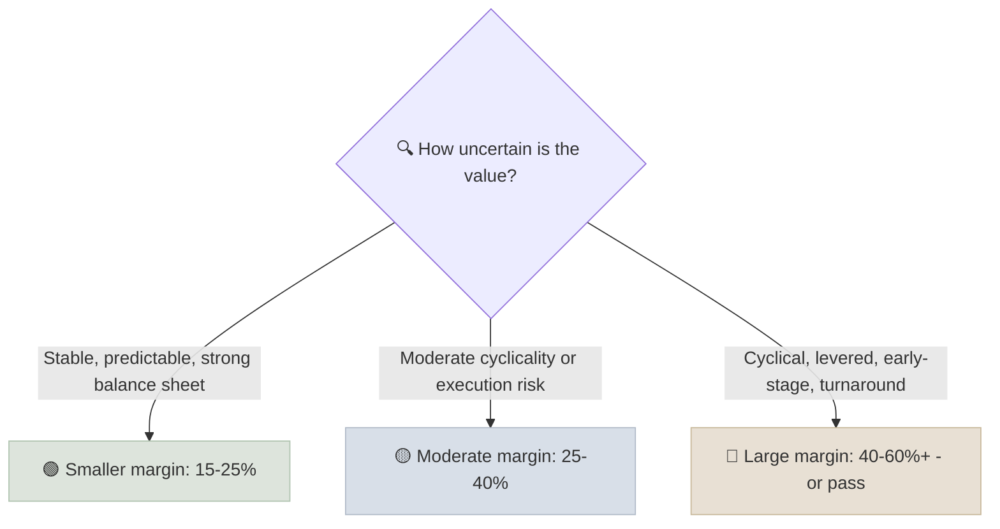

# Margin of Safety

A margin of safety is the discount between the price you pay and your estimate of a security's intrinsic value, sized so that you still do acceptably even if your estimate turns out to be too optimistic.

```objectives
time: 35 min
outcomes:
  - Calculate the margin of safety for a price and a value estimate
  - Size the required margin from the uncertainty of the business and the width of your valuation range
  - Use scenario-weighted values and downside cases instead of a single point estimate
  - Explain the asymmetry between losses and gains that makes the margin necessary
prerequisites:
  - "[DCF Modeling](02-DCF-Modeling.mdx)"
  - "[Reverse DCF](03-Reverse-DCF.mdx)"
```

## Why It Matters

<div class="audience-beginner" markdown="1">

Engineers design a bridge to carry far more weight than it will ever face, because they know their calculations might be off. Investors do the same: if you think a share is worth 100, you try to buy it at 70 or less. If you were wrong by 20%, you still do not lose money.

</div>

<div class="audience-analyst" markdown="1">

Graham introduced the margin of safety as the central concept of investment (*The Intelligent Investor*, chapter 20). In modern terms it is a response to estimation error and asymmetric payoffs: a 50% loss needs a 100% gain to recover, so avoiding large errors matters more than capturing every upside. The margin should be sized to the dispersion of plausible values, not fixed at one number.

</div>

## Formulas

$$
\text{Margin of safety} = \frac{\text{Intrinsic value} - \text{Price}}{\text{Intrinsic value}}
$$

$$
\text{Upside to value} = \frac{\text{Intrinsic value} - \text{Price}}{\text{Price}}
$$

A 33% margin of safety is a 50% upside: at value 150 and price 100, MoS = 50 / 150 = 33%, upside = 50%.

$$
\text{Maximum buy price} = \text{Intrinsic value} \times (1 - \text{Required MoS})
$$

### Why the Asymmetry Matters

| Loss | Gain needed to recover |
|---|---|
| 10% | 11% |
| 25% | 33% |
| 33% | 50% |
| 50% | 100% |
| 75% | 300% |

## Sizing the Margin



| Factor | Larger margin needed when... |
|---|---|
| Business predictability | Revenue is cyclical, contract-based or dependent on few customers |
| Balance sheet | Net debt / EBITDA is high or maturities are near |
| Valuation range | Bear and bull values are far apart |
| Your knowledge | It is outside your circle of competence |
| Governance | Management's track record or disclosure quality is weak |

## Scenario-Weighted Value

Replace one point estimate with scenarios:

| Scenario | Value per share | Probability |
|---|---|---|
| Bear | 60 | 25% |
| Base | 100 | 50% |
| Bull | 150 | 25% |
| **Expected value** | **102.5** | |

At a price of 75: margin of safety against the expected value = (102.5 - 75) / 102.5 = **27%**; against the bear case the loss would be (75 - 60) / 75 = **20%**. Asking "what do I lose in the bear case, and how likely is it?" is often more useful than the MoS percentage itself.

## Beyond Price: Other Sources of Safety

- **Balance sheet strength** - net cash gives time to recover from mistakes.
- **Asset backing** - tangible book value, real estate, or cash that sets a floor under value.
- **Durable earning power** - a moat reduces the chance that the base case collapses.
- **Diversification and position size** - no single mistake can do lasting damage (see [Position Sizing](../../13-Portfolio-Construction/Notes/04-Position-Sizing.mdx)).

## Red Flags

- **A margin of safety calculated from a single optimistic DCF.** The margin is only as good as the value estimate.
- **Buying "cheap" companies with deteriorating fundamentals** - the value estimate keeps falling toward the price (value traps).
- **Ignoring the bear case** because the base case shows a large discount.
- **Moving the value estimate up** after the price rises, so the "margin" never disappears.

## Case Studies

**US - Buffett and American Express, 1964.** After the "salad oil scandal," American Express shares fell sharply over fears of large liabilities. Buffett judged that the core charge card and traveler's cheque franchise was intact and bought at a price well below the value of those businesses. The margin came from the market pricing a temporary problem as permanent, while the moat was unaffected.

**India - buying quality in March 2020.** In the March 2020 crash, many high-quality Indian companies with net cash and high ROCE fell 30-40% within weeks, briefly trading at a meaningful discount to conservative DCF values. Investors who had pre-computed value ranges and buy prices for companies on their watchlist could act; those computing from scratch in the panic mostly could not. A margin of safety is easiest to use when prepared in advance.

## Check Yourself

```quiz
- q: "Your intrinsic value estimate is 250 and the price is 175. What is the margin of safety?"
  options: ["30%", "43%", "75%", "70%"]
  answer: 1
  explain: "(250 - 175) / 250 = 30%. The upside to value is 75 / 175 = 43%."
- q: "After a 40% loss, what gain is needed to get back to the starting value?"
  options: ["40%", "60%", "67%", "80%"]
  answer: 3
  explain: "You need 1 / 0.6 - 1 = 66.7%."
- q: "Which company deserves the larger required margin of safety?"
  options: ["A consumer staples company with net cash and 20 years of stable margins", "A levered cyclical chemical producer at peak margins", "They deserve the same margin"]
  answer: 2
  explain: "The cyclical's value range is far wider, and leverage adds the risk of permanent loss."
- q: "Why is a margin of safety easier to use if prepared before a market crash?"
  answer: "Because valuation work takes time and judgment, which are hardest to apply during panic. A watchlist with pre-computed value ranges and buy prices lets you act quickly and unemotionally when prices fall."
```

## Exercises

```exercise
- title: Scenario-weighted buy price
  task: |
    For a company, you estimate bear value 80 (30%), base value 130 (50%) and bull value 190 (20%). You require a 30% margin of safety on expected value, and you want the bear-case loss to be under 25%. What is your maximum buy price?
  solution: |
    Expected value = 0.3 × 80 + 0.5 × 130 + 0.2 × 190 = 24 + 65 + 38 = **127**. MoS rule: price ≤ 127 × 0.7 = **88.9**. Bear-case rule: loss (P - 80) / P ≤ 25% means P ≤ 80 / 0.75 = **106.7**. The binding constraint is the MoS rule, so the maximum buy price is about **89**.
- title: Watchlist
  task: |
    Build a watchlist of five companies you would like to own. For each, write a value range, a required margin of safety with one sentence of justification, and a maximum buy price. Revisit it every quarter.
```

## Study Notes

- **MoS = (Value - Price) / Value.** A 33% MoS is a 50% upside.
- Size the margin to the **uncertainty** of the value, not a fixed rule.
- Use **scenarios** and check the bear-case loss.
- Safety also comes from balance sheets, moats and position sizing.
- Prepare buy prices in advance.

## References

- Graham, *The Intelligent Investor*, revised ed. with commentary by Jason Zweig (HarperBusiness, 2003) - chapter 20
- Klarman, *Margin of Safety: Risk-Averse Value Investing Strategies for the Thoughtful Investor* (HarperBusiness, 1991)
- Buffett, "The Superinvestors of Graham-and-Doddsville," *Hermes*, Columbia Business School (1984)
- Marks, *The Most Important Thing* (Columbia Business School Publishing, 2011)

*Last reviewed: 2026-09*
