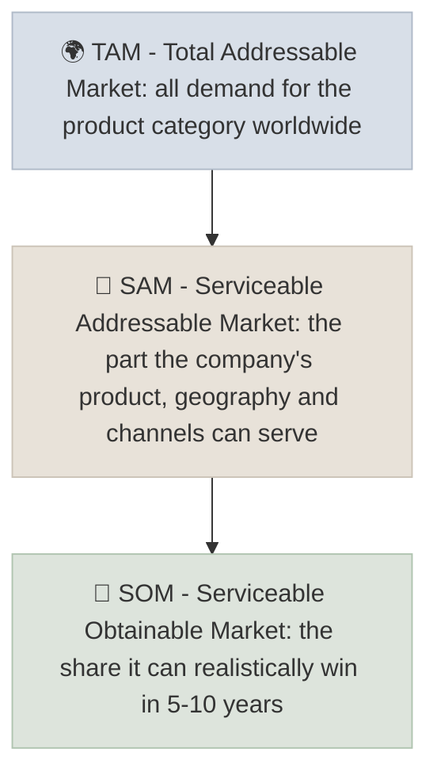

# Secular Trends & TAM/SAM/SOM

A secular trend is a multi-decade shift in how people live, work or spend that lifts demand regardless of the business cycle; TAM, SAM and SOM size the market a company can ride on that trend - total, serviceable, and realistically obtainable.

```objectives
time: 45 min
outcomes:
  - Distinguish secular growth from cyclical and one-off growth
  - Size a market top-down and bottom-up as TAM, SAM and SOM
  - Stress-test a company's claimed TAM and its implied market share
  - Link market size and share assumptions to a revenue forecast
prerequisites:
  - "[Revenue CAGR vs EPS CAGR](../../05-Metric-Toolkit/Notes/08-Revenue-vs-EPS-CAGR.mdx)"
```

## Why It Matters

<div class="audience-beginner" markdown="1">

Growth stocks are bets on the future. The easiest growth comes from being in a market that is getting bigger every year for a long time - like digital payments, cloud computing or healthcare for ageing populations. Market sizing asks two questions: how big can this market get, and how much of it can this company realistically win?

</div>

<div class="audience-analyst" markdown="1">

Revenue in year N = market size × market share. A growth thesis is a claim about both, and most valuation errors in growth stocks come from over-optimistic share assumptions in an inflated TAM. Sizing the market bottom-up, then back-solving the share implied by the price (see [Reverse DCF](../../06-Valuation/Notes/03-Reverse-DCF.mdx)), is one of the most useful disciplines in growth investing.

</div>

## Secular vs Cyclical Growth

| | Secular | Cyclical | One-off |
|---|---|---|---|
| Driver | Structural change: technology, demographics, regulation, behavior | Economic cycle, credit, commodity prices | A contract, a pandemic, a price spike |
| Duration | 10-30+ years | 2-5 years up, then down | Months to a few years |
| Example | Cloud computing, digital payments, obesity drugs, India's financialization of savings | Housing, autos, steel, semiconductors (partly) | Pandemic testing kits, 2021-22 shipping rates |
| Valuation mistake | Underestimating duration | Treating the peak as the new normal | Extrapolating the spike |

**Tests for a secular trend:**

1. Is adoption still low relative to the eventual level (penetration runway)?
2. Is the driver independent of GDP growth and interest rates?
3. Does each year of adoption make the next year's adoption easier (network effects, habit, infrastructure)?
4. Can you name the forces that could reverse it?

## TAM, SAM and SOM



### Top-Down Sizing

Start from a large published figure and narrow it:

$$
\text{SAM} = \text{TAM} \times \%\text{ in served segments} \times \%\text{ in served geographies}
$$

Fast, but vulnerable to inflated industry-report numbers.

### Bottom-Up Sizing

Build from units and prices:

$$
\text{Market size} = \text{Number of potential customers} \times \text{Adoption rate} \times \text{Annual spend per customer}
$$

Slower, but grounded in things you can check. Always do both and reconcile them.

### From Market to Revenue

$$
\text{Revenue}_{N} = \text{SAM}_{N} \times \text{Market share}_{N}
$$

$$
\text{Implied share} = \frac{\text{Revenue required by the price in year N}}{\text{SAM in year N}}
$$

## Worked Example: A Payments Company

A company sells payment terminals and software to small merchants in India.

**Bottom-up SAM (year 5):**

| Input | Value | Source / reasoning |
|---|---|---|
| Small and medium merchants in target cities | 20 million | Government and industry estimates |
| Share adopting paid terminals or software | 30% | Current penetration + growth |
| Annual revenue per merchant (fees + subscription) | 6,000 rupees | Company disclosures, competitor pricing |
| **SAM** | **3,600 crore rupees** | 20m × 30% × 6,000 = 36 billion rupees |

The current share price implies year-5 revenue of 900 crore. Implied share = 900 / 3,600 = **25%**. With three well-funded competitors and a free UPI alternative for basic payments, is 25% realistic? That question - not the size of TAM - is the investment debate.

## Red Flags

- **TAM slides quoting the whole industry** ("the 5 trillion dollar healthcare market") for a company selling one niche product.
- **TAM growing magically** at the same rate every year with no stated driver.
- **No bottom-up check** - no customer counts, prices or adoption curves.
- **Implied share above the current leader's share** with no clear advantage.
- **Confusing a cyclical boom with a secular trend** - pandemic-era home fitness and remote-work tools.
- **Ignoring substitutes** - the free or bundled alternative often caps SAM (UPI in Indian payments, bundled software in enterprise).

## Case Studies

**US - Uber's TAM debate, 2014.** Aswath Damodaran valued Uber in 2014 assuming it served the existing taxi and car-service market. Bill Gurley, an Uber investor, argued the TAM was far larger because cheap, reliable ride-hailing would expand the market by replacing car ownership and public transport trips. Gross bookings later far exceeded the original taxi-market-based TAM. The lesson: a new product can create its own market - but the argument must specify how, and the bull case still needs a bottom-up check.

**US - Peloton, 2020-2022.** Pandemic lockdowns drove a surge in home-fitness demand that Peloton treated as a secular shift, expanding capacity aggressively. As gyms reopened, demand fell, inventory piled up and the stock fell over 90% from its peak. A one-off demand spike had been mistaken for a secular trend.

**India - financialization of savings.** Indian households have historically held a large share of savings in gold and real estate. Since around 2015, demat accounts have grown from roughly 20 million to well over 150 million, and monthly mutual fund SIP inflows have risen many times over. This is a secular trend with a long runway, benefitting exchanges, depositories, asset managers and brokers - the question for each is market share and pricing, not whether the trend continues.

> Figures are approximate and for teaching.

## Check Yourself

```quiz
- q: "Which of these is most clearly a secular trend?"
  options: ["A spike in freight rates after a canal blockage", "The rising share of retail payments made digitally", "A housing boom driven by low interest rates", "Record steel prices"]
  answer: 2
  explain: "Digital payments adoption is structural and continues through economic cycles; the others are cyclical or one-off."
- q: "What distinguishes SAM from TAM?"
  options: ["SAM is always larger", "SAM is the portion of total demand the company's product, geography and channels can actually serve", "SAM counts only current customers", "They are the same"]
  answer: 2
  explain: "TAM is total category demand; SAM narrows it to what the company is positioned to serve."
- q: "A price implies 12 billion of revenue in year 10, and your SAM estimate for year 10 is 40 billion. What market share is implied?"
  options: ["12%", "30%", "33%", "40%"]
  answer: 2
  explain: "12 / 40 = 30%."
- q: "Why should you size markets both top-down and bottom-up?"
  answer: "Top-down is fast but often inflated by broad industry figures; bottom-up is grounded in checkable customer counts, adoption and prices. Reconciling the two exposes unrealistic assumptions in either."
```

## Exercises

```exercise
- title: Size a market bottom-up
  task: |
    Pick a growth company you know. Build a bottom-up SAM for 5 years out (customers × adoption × spend per customer), list the source or reasoning for each input, and compute the market share implied by current consensus revenue for that year.
- title: Secular or cyclical?
  task: |
    Classify each as secular, cyclical or one-off and give one sentence of reasoning: (a) US data-centre electricity demand, (b) Indian two-wheeler sales, (c) COVID vaccine revenue, (d) GLP-1 obesity drug demand, (e) US new home construction.
  solution: |
    (a) Secular - AI and cloud workloads drive multi-year demand, though capex can be lumpy. (b) Mostly cyclical around a secular base - rural income and financing drive swings. (c) One-off - demand peaked in 2021-22. (d) Secular - large untreated population and expanding indications, with pricing and competition risks. (e) Cyclical - driven by mortgage rates and credit.
```

## Study Notes

- **Secular** growth survives cycles; test for penetration runway, independence from GDP and self-reinforcement.
- **TAM ⊃ SAM ⊃ SOM**; SOM is what matters for forecasts.
- Size markets **top-down and bottom-up**, then reconcile.
- **Revenue = SAM × share**: back-solve the share the price implies.
- Watch substitutes and one-off spikes disguised as trends.

## References

- Damodaran, [A Disruptive Cab Ride to Riches: The Uber Payoff](https://aswathdamodaran.blogspot.com/2014/06/a-disruptive-cab-ride-to-riches-uber.html) (2014) and Gurley, [How to Miss by a Mile: An Alternative Look at Uber's Potential Market Size](https://abovethecrowd.com/2014/07/11/how-to-miss-by-a-mile-an-alternative-look-at-ubers-potential-market-size/) (2014)
- Mauboussin & Callahan, "Total Addressable Market: Methods to Estimate a Company's Potential Sales," Credit Suisse (2015)
- Christensen, *The Innovator's Dilemma* (Harvard Business Review Press, 1997)
- NSDL and CDSL, demat account statistics; AMFI, [monthly SIP data](https://www.amfiindia.com/) (accessed 2026)

*Last reviewed: 2026-09*
