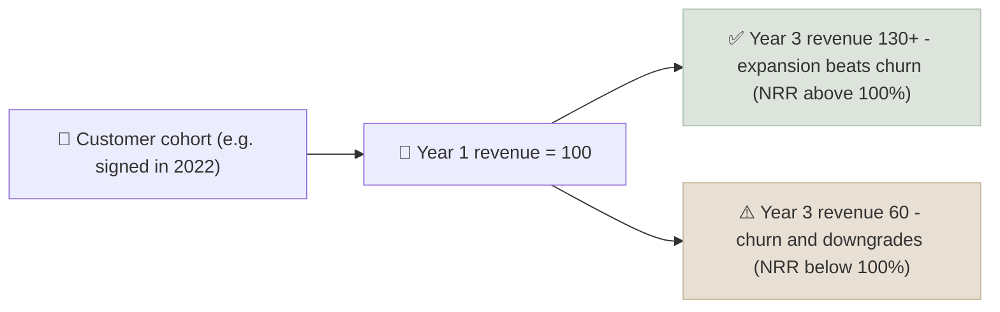

# Unit Economics & Gross Margin Defensibility

Unit economics measure whether a single customer (or order, or unit sold) is profitable once you count what it costs to win and serve them; gross margin defensibility asks whether those economics can survive competition.

```objectives
time: 50 min
outcomes:
  - Calculate CAC, customer lifetime value (LTV), LTV/CAC and CAC payback
  - Use net revenue retention and cohort data to judge whether growth is compounding or leaking
  - Identify the moat sources that protect gross margin, and the signs they are eroding
  - Decide whether a loss-making growth company is investing or simply losing money
prerequisites:
  - "[Margin Trajectory](../../05-Metric-Toolkit/Notes/06-Margin-Trajectory.mdx)"
  - "[Secular Trends & TAM/SAM/SOM](01-Secular-Trends-and-TAM.mdx)"
```

## Why It Matters

<div class="audience-beginner" markdown="1">

Many fast-growing companies lose money. Sometimes that is fine: they spend heavily to win customers who will pay them for many years. Sometimes it is not: every new customer costs more than they will ever bring in, and growing faster just loses money faster. Unit economics tell the two apart by looking at one customer at a time.

</div>

<div class="audience-analyst" markdown="1">

Reported GAAP losses in a growth company mix two things: investment in future customers (sales and marketing, onboarding) and the steady-state economics of existing customers. Unit economics separate them. The steady-state margin on the installed base, the cost to add a customer, and how revenue per customer evolves over time together determine whether scale produces a high-ROIC business or a subsidy.

</div>

## The Core Metrics

$$
\text{CAC} = \frac{\text{Sales and marketing spend in the period}}{\text{New customers acquired in the period}}
$$

$$
\text{LTV} = \frac{\text{ARPU} \times \text{Gross margin}}{\text{Churn rate}}
$$

where ARPU is average (annual) revenue per user and churn is the annual share of customers lost. A discounted version divides by $$(\text{churn} + \text{discount rate})$$ instead.

$$
\text{CAC payback (months)} = \frac{\text{CAC}}{\text{Monthly ARPU} \times \text{Gross margin}}
$$

$$
\text{Net revenue retention (NRR)} = \frac{\text{Revenue this year from last year's customers}}{\text{Revenue last year from those customers}}
$$

| Metric | Healthy | Warning |
|---|---|---|
| LTV / CAC | Above 3x | Below 1.5x |
| CAC payback | Under 12-18 months (SMB); under 24-36 months (enterprise) | Lengthening each year |
| Net revenue retention | Above 110-120% (B2B SaaS) | Below 100% |
| Gross margin | 70%+ software; 40%+ marketplaces; 25%+ e-commerce | Falling as the company scales |
| Contribution margin (after variable costs incl. delivery, payment fees) | Positive and rising | Negative per order at scale |

## Worked Example

A B2B software company:

| Input | Value |
|---|---|
| Sales and marketing spend | 30 million |
| New customers | 1,000 |
| ARPU (annual) | 15,000 |
| Gross margin | 80% |
| Annual churn | 10% |

- CAC = 30m / 1,000 = **30,000**
- LTV = 15,000 × 0.80 / 0.10 = **120,000**
- LTV / CAC = **4.0x**
- Payback = 30,000 / (1,250 × 0.80) = **30 months**

The LTV/CAC ratio is healthy, but a 30-month payback means each customer ties up cash for 2.5 years - the company needs funding to grow, and the result depends heavily on churn staying at 10%. If churn doubles to 20%, LTV halves to 60,000 and LTV/CAC falls to 2.0x.

## Cohorts: the Best Evidence



A cohort chart tracks revenue from each year's new customers over time. Rising cohort lines mean existing customers grow on their own - the "compounding" growth that makes long-duration valuations defensible. Falling lines mean the company must keep buying new customers just to stand still.

## Gross Margin Defensibility

High gross margin invites competition. It lasts only if something stops competitors from undercutting price.

| Moat source | How it protects gross margin | Evidence to look for |
|---|---|---|
| Switching costs | Customers cannot easily leave (data, workflows, training) | Low churn, price increases stick |
| Network effects | Each user makes the product more valuable for others | Take rate stable or rising as scale grows |
| Scale economies | Unit costs fall with volume faster than rivals' | Gross margin rising with scale |
| Intangibles (brand, patents, licenses) | Customers pay more, or rivals are excluded | Premium pricing, regulatory protection |
| Proprietary data or technology | Better product at the same cost | Win rates, product benchmarks |

**Erosion signals:** falling take rates, rising discounts, rising hosting or delivery costs as a share of revenue, a well-funded competitor offering the core product free or bundled.

## Red Flags

- **Company-defined metrics** (contribution margin, adjusted EBITDA) that exclude costs obviously needed to serve each customer.
- **CAC calculated on paid marketing only**, excluding sales salaries and incentives.
- **LTV with no churn data** or with churn measured over a short, favourable period.
- **Blended metrics hiding weak recent cohorts.** Ask for cohort-level data.
- **Discount-driven growth** - revenue rising while gross margin and ARPU fall.
- **NRR disclosure quietly dropped** from investor presentations.

## Case Studies

**US - Snowflake's net revenue retention.** Snowflake reported net revenue retention above 150% around its 2020 IPO, meaning existing customers spent over 50% more each year - an exceptional sign of product value. As customers optimized their cloud spending in 2023, NRR fell toward the 130% range and growth slowed. Tracking NRR gave investors an early, direct read on growth durability.

**India - food delivery unit economics.** Zomato and Swiggy lost money on many orders during their early growth. Both later shifted focus to contribution margin per order - raising platform fees, cutting discounts and improving delivery density. Zomato's food delivery business reached positive adjusted EBITDA in 2023. Scale alone did not fix the economics; pricing and density did.

**US - WeWork, 2019.** WeWork signed long leases and rented space on short flexible terms, with large building-level costs. Its "community-adjusted EBITDA" excluded major operating costs. Measured honestly per desk, the unit economics depended on high occupancy and rents that did not hold through a downturn. The IPO was withdrawn in 2019, and the company filed for bankruptcy in 2023.

> Figures are approximate and for teaching.

## Check Yourself

```quiz
- q: "Sales and marketing spend is 12 million and 3,000 new customers were won. ARPU is 5,000 a year, gross margin 75%, churn 15%. What is LTV/CAC?"
  options: ["6.3x", "2.1x", "1.25x", "25x"]
  answer: 1
  explain: "CAC = 4,000. LTV = 5,000 × 0.75 / 0.15 = 25,000. LTV / CAC = 6.25x."
- q: "Net revenue retention is 92%. What does that mean?"
  options: ["The company grew 92%", "Revenue from last year's customers shrank 8% after churn and downgrades", "92% of customers renewed", "Gross margin is 92%"]
  answer: 2
  explain: "NRR below 100% means the existing customer base shrinks on its own; all growth must come from new customers."
- q: "Which is the strongest evidence of a network-effect moat in a marketplace?"
  options: ["Rising marketing spend", "A take rate that holds or rises as the platform scales, despite competitors", "Falling gross margin", "More employees"]
  answer: 2
  explain: "If users would easily switch, competitors would force take rates down. Stable take rates at scale show users value the network."
- q: "Why does a long CAC payback matter even when LTV/CAC is high?"
  answer: "Because the company must fund each customer's acquisition cost upfront and only recover it slowly. Fast growth then needs large outside funding, and the result is sensitive to churn rising before payback is reached."
```

## Exercises

```exercise
- title: Churn sensitivity
  task: |
    Using the worked example (ARPU 15,000, gross margin 80%, CAC 30,000), compute LTV and LTV/CAC for annual churn of 5%, 10%, 15% and 25%. At what churn rate does LTV/CAC fall below 3x?
  solution: |
    LTV = 12,000 / churn. 5%: 240,000 (8.0x). 10%: 120,000 (4.0x). 15%: 80,000 (2.7x). 25%: 48,000 (1.6x). LTV/CAC = 3x when LTV = 90,000, i.e. churn = 12,000 / 90,000 = **13.3%**.
- title: Read an investor presentation
  task: |
    Pick a listed growth company (SaaS, marketplace or consumer internet). From its latest investor presentation and filings, find or estimate CAC, NRR, gross margin and contribution margin. Which metrics does it disclose, which does it not, and what would you ask management?
```

## Study Notes

- **CAC** = S&M / new customers; **LTV** = ARPU × gross margin / churn.
- Targets: **LTV/CAC > 3x**, payback under 12-24 months, **NRR > 110%** for B2B.
- **Cohorts** are the best evidence: do old customers grow or shrink?
- Gross margin lasts only with a moat: switching costs, network effects, scale, intangibles.
- Distrust company-defined metrics that exclude real costs.

## References

- Skok, [SaaS Metrics 2.0 - A Guide to Measuring and Improving What Matters](https://www.forentrepreneurs.com/saas-metrics-2/) (For Entrepreneurs, 2013)
- McCarthy & Fader, "How to Value a Company by Analyzing Its Customers," *Harvard Business Review* (2020)
- Mauboussin & Callahan, "The Economics of Customer Businesses," Morgan Stanley Investment Management (2020)
- Snowflake Inc., Form S-1 (2020) and Forms 10-K (fiscal 2023-2024)
- Zomato Ltd. (Eternal Ltd.), Shareholders' letters (2022-2024)

*Last reviewed: 2026-09*
