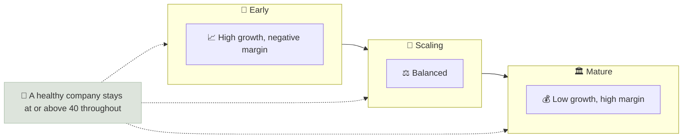

# The Rule of 40

The Rule of 40 says a healthy software company's revenue growth rate plus its profit margin should add up to at least 40%, so it can trade growth for profitability without losing overall balance.

```objectives
time: 30 min
outcomes:
  - Calculate a Rule of 40 score with the right growth and margin measures
  - Use the score to compare software companies at different stages
  - Explain the rule's limits and when to replace or supplement it
prerequisites:
  - "[Unit Economics & Gross Margin Defensibility](02-Unit-Economics-and-Gross-Margin.mdx)"
```

## Why It Matters

<div class="audience-beginner" markdown="1">

A young software company growing 60% a year can afford to lose money; an older one growing 10% a year should be making a healthy profit. The Rule of 40 puts both on one scale: add the growth rate and the profit margin. If the total is 40 or more, the company is balancing growth and profit well.

</div>

<div class="audience-analyst" markdown="1">

Growth and margin are substitutes at the margin: a company can raise sales and marketing spend to buy growth, or cut it to expand margins. The sum is roughly invariant to that choice and so says more about underlying efficiency than either component. Empirically, Rule-of-40 scores have explained a meaningful share of the cross-sectional variation in software EV/Revenue multiples - more than growth or margin alone.

</div>

## Formula

$$
\text{Rule of 40 score} = \text{Revenue growth (\%)} + \text{Profit margin (\%)}
$$

| Choice | Common convention | Notes |
|---|---|---|
| Growth | Year-over-year revenue growth (or ARR growth) | Use organic growth; strip acquisitions |
| Margin | Free cash flow margin | EBITDA margin is also common; adjusted EBITDA flatters |
| Stock comp | Subtract SBC from the margin for a stricter test | SBC can be 15-30% of revenue at some companies |

$$
\text{FCF margin} = \frac{\text{FCF}}{\text{Revenue}} \qquad \text{Strict margin} = \frac{\text{FCF} - \text{SBC}}{\text{Revenue}}
$$

## Worked Example

| Company | Revenue growth | FCF margin | SBC / revenue | Rule of 40 | Strict (after SBC) |
|---|---|---|---|---|---|
| A (early stage) | 55% | -10% | 12% | **45** | 33 |
| B (scaling) | 28% | 18% | 20% | **46** | 26 |
| C (mature) | 9% | 34% | 5% | **43** | 38 |
| D (struggling) | 12% | 5% | 10% | **17** | 7 |

A, B and C all pass the headline test at different stages. On the strict version, B's high stock compensation pulls it well below 40 - shareholders are paying for its "free" cash flow through dilution. D fails on either measure.

## Where the Score Sits



## Limits

- **Software-specific.** It assumes high gross margins and recurring revenue. Do not apply it to retailers, manufacturers or banks.
- **Quality of growth is ignored.** 40% growth bought with discounts and long-payback customers scores the same as organic, high-retention growth. Pair it with [unit economics](02-Unit-Economics-and-Gross-Margin.mdx) and NRR.
- **Stage matters.** Very early companies (growing 100%+) often exceed 40 easily; mature companies find it hard. Compare within a stage.
- **Margin definition is gameable.** Adjusted EBITDA can add back SBC, capitalized software and restructuring.
- **A single year misleads.** Use a trailing 3-year average for both components.

## Red Flags

- Rule of 40 met only on "adjusted EBITDA" margin while FCF margin is much lower.
- Score met by one-off margin boosts (a cut in marketing that will slow future growth).
- Growth measured on bookings or GMV rather than revenue.
- SBC above 15-20% of revenue, excluded from the calculation.

## Case Studies

**US - the 2022 re-rating.** When interest rates rose in 2022, US software valuations fell sharply, but the fall was not uniform. Companies with high growth and deep losses (low Rule of 40 scores) generally fell furthest, while companies at or above 40 with positive FCF held up better. The rule became a sorting tool for investors deciding which growth was worth paying for at higher discount rates.

**India - SaaS companies.** Indian-origin SaaS companies such as Freshworks (listed on Nasdaq) have used the Rule of 40 in investor communications as they shifted from growth-at-all-costs to profitable growth after 2022. Tracking both components quarterly, and the gap between adjusted and strict margins, shows how much of the improvement came from efficiency versus reduced investment.

> Figures are approximate and for teaching.

## Check Yourself

```quiz
- q: "A company grows revenue 32% with a -4% FCF margin. What is its Rule of 40 score?"
  options: ["36", "28", "32", "-128"]
  answer: 2
  explain: "32 + (-4) = 28, below 40."
- q: "Why is the Rule of 40 a sum of growth and margin rather than using either alone?"
  options: ["It is easier to calculate", "Companies can trade growth for margin by changing spending, so the sum better reflects underlying efficiency", "Regulators require it", "Margins do not matter for software"]
  answer: 2
  explain: "Spending more on sales raises growth and lowers margin; the sum is roughly stable across that trade-off."
- q: "Would you use the Rule of 40 to assess a supermarket chain?"
  options: ["Yes, it applies to all companies", "No - it assumes high gross margins and recurring revenue typical of software"]
  answer: 2
  explain: "Low-margin, non-recurring businesses cannot reach 40 and should be judged on ROIC, margins and turnover."
- q: "Why might you subtract stock-based compensation when computing the margin?"
  answer: "SBC is a real cost paid in shares. Excluding it makes FCF margins look higher while shareholders are diluted, so the strict version gives a fairer view of efficiency."
```

## Exercises

```exercise
- title: Rank five software companies
  task: |
    Choose five listed software companies (US or India). For the last three years, compute revenue growth, FCF margin, SBC / revenue, the Rule of 40 score and the strict score. Rank them, and compare your ranking with their EV/Revenue multiples. Do the multiples follow the scores?
```

## Study Notes

- **Rule of 40 = revenue growth % + FCF (or EBITDA) margin %** ≥ 40.
- The sum is stable when companies trade growth for margin, so it measures efficiency.
- Use a **strict** version (FCF - SBC) for heavy stock-comp companies.
- Software only; combine with unit economics and NRR.

## References

- Feld, [The Rule of 40% For a Healthy SaaS Company](https://feld.com/archives/2015/02/rule-40-healthy-saas-company/) (2015)
- McKinsey & Company, "SaaS and the Rule of 40: Keys to the critical value creation metric" (2021)
- Bain & Company, "Rule of 40: A Metric That Can Help Software Companies Plan for Success" (2023)
- Freshworks Inc., Form 10-K (2024)

*Last reviewed: 2026-09*
