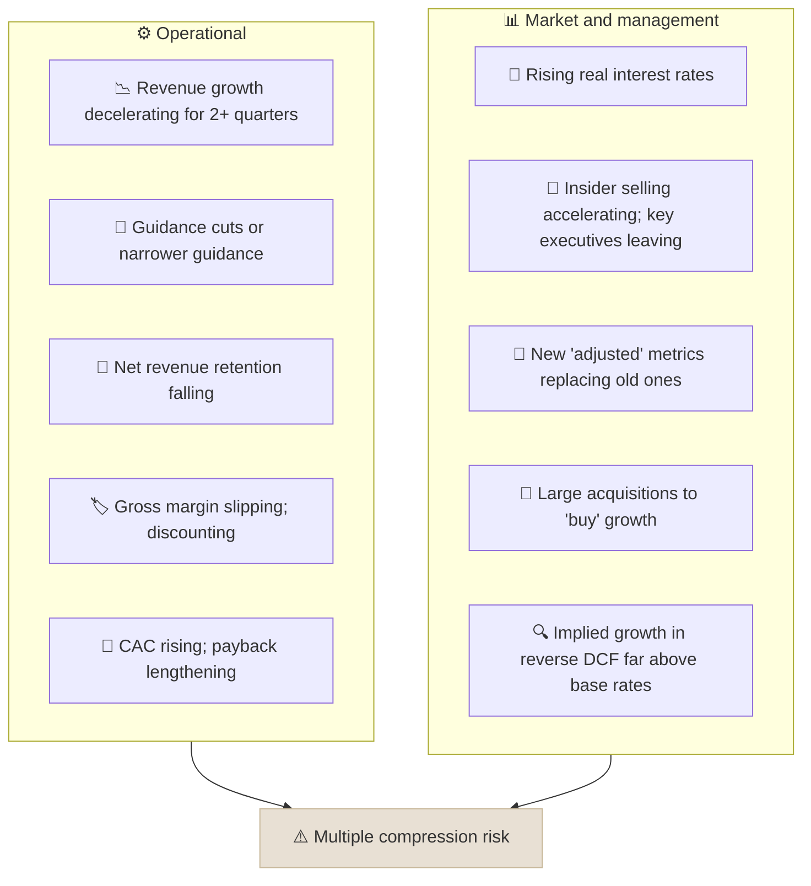

# Multiple Compression Warning Signs

Multiple compression is a fall in a stock's valuation multiple (P/E, EV/Sales) even while the business keeps growing; for high-multiple growth stocks it is the main source of large losses, and it is usually preceded by visible warning signs.

```objectives
time: 40 min
outcomes:
  - Quantify how much multiple compression can offset strong earnings growth
  - Explain why high-multiple stocks are more sensitive to growth disappointments and rising rates
  - List the operational and market warning signs that tend to precede compression
  - Build a monitoring checklist for a growth holding
prerequisites:
  - "[P/E vs PEG](../../05-Metric-Toolkit/Notes/01-PE-vs-PEG.mdx)"
  - "[Reverse DCF](../../06-Valuation/Notes/03-Reverse-DCF.mdx)"
```

## Why It Matters

<div class="audience-beginner" markdown="1">

A company can double its profits and its share price can still fall - if investors decide to pay much less for each unit of profit. This happens most to popular growth stocks priced for perfection. Knowing the early warning signs helps you avoid holding on while the story changes.

</div>

<div class="audience-analyst" markdown="1">

A high multiple is a long-duration asset: most of its value lies in distant cash flows, so it is highly sensitive to both the discount rate and the growth path. When growth decelerates, the market re-prices both the near-term earnings and the duration of excess returns - a double hit. Monitoring leading indicators of deceleration is therefore more important for growth holdings than for value holdings.

</div>

## The Arithmetic

$$
\text{Price return} = (1 + g_{\text{EPS}}) \times \frac{\text{P/E}_{\text{end}}}{\text{P/E}_{\text{start}}} - 1
$$

**Example.** EPS grows 25% a year for 3 years (+95% in total), but the P/E falls from 80 to 35:

$$
1.25^{3} \times \frac{35}{80} - 1 = 1.953 \times 0.4375 - 1 = -14.6\%
$$

Nearly doubling earnings still produced a loss.

### Why High Multiples Are Fragile

In a simple growth model, $$\text{P/E} \approx \frac{\text{payout}}{r - g}$$. When $$r - g$$ is small, small changes are amplified:

| r | g | r - g | Relative P/E |
|---|---|---|---|
| 10% | 8% | 2% | 100 |
| 10% | 7% | 3% | 67 (-33%) |
| 11% | 8% | 3% | 67 (-33%) |
| 10% | 4% | 6% | 33 |

A one-point cut in long-run growth, or a one-point rise in the discount rate, can cut a high multiple by a third. A low-multiple stock with a wide $$r - g$$ barely moves.

## Warning Signs



| Sign | Why it matters |
|---|---|
| Second derivative of growth turns negative | Markets price the rate of change, not only the level |
| Guidance misses or cuts | Signals management's visibility has worsened |
| Falling NRR or rising churn | Growth durability - the "duration" - is shrinking |
| Gross margin decline | Competition is arriving |
| Metric changes | Companies rarely stop disclosing metrics that look good |
| Rising rates | Discount rate increases hit long-duration assets hardest |
| Big M&A | Organic growth may be running out |
| Heavy insider selling | Insiders see the business first |

## What to Do

- **Pre-commit to thesis-break criteria** - for example, "sell if organic growth falls below 15% for two quarters while the P/E is above 40." Write them in your [investment thesis](../../12-Research-Templates/Templates/03-Investment-Thesis-and-Post-Mortem.mdx).
- **Re-run the reverse DCF each quarter.** If the implied growth rises while actual growth falls, expectations and reality are diverging.
- **Size high-multiple positions smaller**, because their downside in a de-rating is larger.
- **Separate "good company" from "good stock."** Many great businesses were poor investments for years after a multiple peak.

## Red Flags

- Holding because "the business is still growing" while growth is decelerating and the multiple is at a record.
- Anchoring on the price paid rather than on current expectations.
- Explaining every miss as temporary.

## Case Studies

**US - Zoom, 2020-2022.** Zoom's revenue grew over 300% in fiscal 2021 as the pandemic drove video calls. Its EV/Sales multiple exceeded 100x at the peak in October 2020. As growth decelerated sharply in 2021-2022 and competition from bundled products (Microsoft Teams) intensified, the multiple compressed to single digits. Revenue stayed far above pre-pandemic levels, but the stock fell about 85-90% from its peak.

**US - Microsoft, 2000-2013.** Microsoft's earnings grew substantially over 2000-2013, yet its share price in 2013 was below its 1999 peak, because its P/E fell from roughly 60-70x to about 10-15x. A great business did not rescue investors who paid a peak multiple.

**India - consumer and specialty chemical stocks, 2021-2023.** Several Indian specialty chemical companies traded at 50-80x earnings in 2021 on a "China plus one" growth story. As Chinese competitors cut prices in 2022-2023 and earnings growth stalled or reversed, multiples and earnings fell together, and many stocks lost 40-60%. The warning signs - falling realizations and gross margins - appeared in quarterly results before the worst of the fall.

> Figures are approximate and for teaching.

## Check Yourself

```quiz
- q: "EPS doubles over 4 years and the P/E falls from 60 to 30. What is the price return?"
  options: ["+100%", "0%", "-50%", "+50%"]
  answer: 2
  explain: "2.0 × (30 / 60) - 1 = 0%. Doubling earnings was fully offset by halving the multiple."
- q: "Why are high-multiple stocks more sensitive to a one-point rise in interest rates?"
  options: ["They pay higher dividends", "Their value is concentrated in distant cash flows, and a small r - g spread amplifies changes", "They have more debt", "Rates only affect growth stocks by regulation"]
  answer: 2
  explain: "Long-duration assets lose more value when discount rates rise, and P/E ≈ payout / (r - g) is very sensitive when r - g is small."
- q: "Which is the earliest typical warning sign of multiple compression?"
  options: ["The share price has already fallen 50%", "Revenue growth decelerating for two or more quarters, with falling retention", "An index deletion", "A stock split"]
  answer: 2
  explain: "Deceleration and weakening retention usually appear in results before the market fully re-prices the stock."
- q: "What is a thesis-break criterion, and why write it down in advance?"
  answer: "A specific, measurable condition under which you will sell or reduce (for example, organic growth below a threshold while the multiple stays high). Writing it in advance prevents rationalizing each disappointment after the fact."
```

## Exercises

```exercise
- title: De-rating scenarios
  task: |
    A stock trades at 50x forward earnings. You expect EPS growth of 20% a year for 5 years. What will your annual return be if the P/E ends at 50x, 35x and 25x?
  solution: |
    Earnings multiply by 1.2^5 = 2.488.
    - 50x: 2.488 - 1 = +149% total, **20.0%** a year.
    - 35x: 2.488 × 0.7 = 1.742, **11.7%** a year.
    - 25x: 2.488 × 0.5 = 1.244, **4.5%** a year.
    Even strong growth only delivers market-like returns if the multiple halves.
- title: Monitoring checklist
  task: |
    For one growth holding, write a quarterly monitoring checklist with five quantitative warning signs (with thresholds) drawn from this note, and apply it to the last four quarters of results.
```

## Study Notes

- **Price return = EPS growth × change in multiple.** Compression can wipe out strong growth.
- High multiples are fragile because **P/E ≈ payout / (r - g)** with a small r - g.
- Watch deceleration, guidance, NRR, gross margin, CAC, metric changes, rates, M&A and insider selling.
- Pre-commit to thesis-break rules; re-run the reverse DCF each quarter.

## References

- Mauboussin & Callahan, "Sales Growth: Base Rates, Deceleration and Valuation," Credit Suisse (2015)
- Rappaport & Mauboussin, *Expectations Investing*, revised ed. (Columbia Business School Publishing, 2021)
- Chancellor, *The Price of Time* (Atlantic Monthly Press, 2022) - on rates and asset duration
- Zoom Video Communications, Forms 10-K (fiscal 2021-2023)

*Last reviewed: 2026-09*
