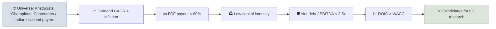

# Dividend Aristocrats & Contenders

Dividend Aristocrats, Kings and Contenders are companies classified by how many consecutive years they have raised their dividend; the lists are a practical starting universe for dividend growth investing, but a long streak is evidence of discipline, not a guarantee of future increases.

```objectives
time: 35 min
outcomes:
  - Define the Aristocrat, King, Champion, Contender and Challenger categories and who maintains each list
  - Explain the criteria this course uses for dividend growth candidates - dividend CAGR above inflation, FCF payout under 60%, low capital intensity, resilient balance sheet
  - Identify the Indian equivalents and data sources for dividend consistency
  - Explain survivorship bias in streak-based lists
prerequisites:
  - "[Dividend Payout & FCF Coverage](../../05-Metric-Toolkit/Notes/07-Dividend-Payout-and-FCF-Coverage.mdx)"
```

## Why It Matters

<div class="audience-beginner" markdown="1">

Some companies have raised their dividend every single year for 25, 50 or even 60+ years - through recessions, wars and market crashes. Those companies are usually strong, careful businesses. Lists of them are a good place to start looking for reliable, growing income. But a streak can end, so you still have to check the numbers.

</div>

<div class="audience-analyst" markdown="1">

A long dividend-growth streak is a costly signal: boards know that cutting a long-held dividend damages credibility, so a streak reveals management's confidence in the durability of free cash flow. Historically, dividend growers have delivered equity-like returns with lower volatility and smaller drawdowns than the broad market, partly through a quality tilt (profitability, low leverage) that can be captured more directly with the metrics in this course.

</div>

## The Categories

| Category | Definition | Maintained by |
|---|---|---|
| **Dividend Kings** | 50+ consecutive years of increases | Informal lists (e.g. Sure Dividend) |
| **S&P 500 Dividend Aristocrats** | S&P 500 member, 25+ consecutive years of increases, plus size and liquidity rules | S&P Dow Jones Indices (index launched 2005) |
| **Dividend Champions** | 25+ years, any US-listed company | DRiP Investing / community-maintained list |
| **Dividend Contenders** | 10-24 consecutive years | Same list |
| **Dividend Challengers** | 5-9 consecutive years | Same list |

**Contenders** are often the most interesting hunting ground: long enough to show discipline, young enough that the company may still be growing quickly. Many of today's Aristocrats were yesterday's Contenders.

### India

India has no official "Aristocrat" index, partly because many Indian companies have historically paid fixed or irregular dividends rather than raising them every year. Useful substitutes:

| Source | What it gives you |
|---|---|
| Nifty Dividend Opportunities 50 | 50 high-yield, liquid stocks with quality filters |
| S&P BSE Dividend Stability Index | Companies with consistent dividend histories |
| Screener.in custom query | Build your own streak screen (see [Screener.in Recipes](../../10-Stock-Screening/Notes/04-Screener-in-Recipes.mdx)) |
| Company annual reports | Dividend distribution policy (mandatory for the top 1,000 listed companies under SEBI LODR) |

For India, test **dividend per share CAGR over 5 and 10 years** rather than strict year-by-year increases.

## This Course's Dividend Growth Criteria

A candidate should pass all of these:

| Criterion | Threshold | Why |
|---|---|---|
| Dividend CAGR (5y and 10y) | Above inflation (above ~3% in the US, above ~6% in India) | Real income growth |
| FCF payout ratio | Below 60% | Room to keep growing through a bad year |
| Earnings payout ratio | Below 60-70% (below 75% for staples) | Consistency check |
| Capital intensity | Capex / sales below ~10%, or capex / D&A near 1-1.5x | More cash left for owners |
| Balance sheet | Net debt / EBITDA below ~2.5x, interest coverage above ~6x | Survives recessions |
| ROIC | Above WACC over a full cycle | Growth that adds value |
| Streak / history | 10+ years of increases (US) or no cuts in 10 years (India) | Evidence of discipline |



## Survivorship Bias

Streak lists only show companies that have **not yet** cut. Companies that cut drop off and disappear from the list's history, so backtests of "current Aristocrats" overstate what an investor could have earned. The S&P index itself rebalances annually, removing companies that fail to raise - which is realistic - but the cut usually comes after the price has already fallen.

Former long-streak payers that cut or froze dividends include General Electric (2009 and 2017), several US banks (2008-2009), AT&T (2022, after its WarnerMedia spin-off) and 3M (2024, after its Solventum spin-off).

## Red Flags

- **Token increases** - a 1% raise each year just to keep the streak, while EPS stagnates.
- **Payout ratio rising year after year** - the streak is being funded by an increasing share of earnings.
- **Streak kept alive with debt** - net debt rising alongside the dividend.
- **High-yield Aristocrats** - the highest-yielding members are often the ones the market expects to cut.

## Case Studies

**US - Walgreens Boots Alliance.** Walgreens was a Dividend Aristocrat with over 45 years of increases. Pharmacy reimbursement pressure, a costly acquisition strategy and weak retail trends eroded its free cash flow. Its payout ratio rose, and in January 2024 it cut its dividend by about 48%, ending the streak. The warning signs - flat EPS, rising payout, falling FCF - were visible in the years before.

**US - Procter & Gamble.** P&G has raised its dividend for more than 65 consecutive years, supported by strong brands, pricing power and FCF payout generally in the 50-70% range. It is a textbook Dividend King, though its dividend growth has been in the mid-single digits in recent years - the streak says "reliable," not "fast."

**India - ITC and Infosys.** ITC and Infosys have both paid rising dividends over long periods, supported by high cash conversion and low capital needs, though not always with year-on-year increases. Their dividend distribution policies commit to paying a large share of free cash flow. Indian investors often combine these "reliable payers" with a check on dividend CAGR rather than a strict streak.

> Figures and streak lengths are approximate. Check S&P Dow Jones Indices and company filings for current data.

## Check Yourself

```quiz
- q: "What is required for a company to be an S&P 500 Dividend Aristocrat?"
  options: ["A dividend yield above 3%", "S&P 500 membership plus at least 25 consecutive years of dividend increases", "50 years of dividends paid", "A payout ratio below 50%"]
  answer: 2
  explain: "The index requires S&P 500 membership, 25+ consecutive annual increases, and meets size and liquidity rules."
- q: "A company has 12 consecutive years of dividend increases. Which category is it?"
  options: ["King", "Aristocrat", "Contender", "Challenger"]
  answer: 3
  explain: "Contenders have 10-24 consecutive years of increases."
- q: "Why do backtests of today's Aristocrats overstate historical returns?"
  options: ["They ignore dividends", "Survivorship bias - companies that cut dividends and fell have been removed from today's list", "They use the wrong currency", "They double-count buybacks"]
  answer: 2
  explain: "Looking only at current survivors excludes the failures an investor would actually have held."
- q: "Why does this course use dividend CAGR over 5 and 10 years for Indian stocks, rather than strict consecutive increases?"
  answer: "Many Indian companies pay fixed or irregular dividends and do not raise every year, even when they grow dividends strongly over time. A CAGR test captures real dividend growth without excluding consistent payers that do not follow the US annual-raise convention."
```

## Exercises

```exercise
- title: Screen the Contenders
  task: |
    Download the current Dividend Champions/Contenders list (US) or build a 10-year dividend-per-share history for 20 large Indian companies. Apply this course's criteria table. How many survive? For each survivor, record its dividend CAGR, FCF payout and net debt / EBITDA.
- title: Spot the next cut
  task: |
    Among current S&P 500 Dividend Aristocrats, find the five with the highest earnings payout ratios. For each, check FCF payout and the 5-year trend in net debt / EBITDA. Which one, if any, looks most at risk of freezing or cutting its dividend, and why?
```

## Study Notes

- **Kings** 50+ years; **Aristocrats** 25+ years and S&P 500; **Contenders** 10-24; **Challengers** 5-9.
- Course criteria: **dividend CAGR > inflation, FCF payout < 60%, low capital intensity, net debt / EBITDA < 2.5x, ROIC > WACC**.
- India: use dividend CAGR and the dividend distribution policy, not strict streaks.
- Streak lists suffer from survivorship bias; watch rising payouts and token raises.

## References

- S&P Dow Jones Indices, [S&P 500 Dividend Aristocrats Methodology](https://www.spglobal.com/spdji/en/indices/dividends-factors/sp-500-dividend-aristocrats/) (2024)
- DRiP Investing Resource Center, [U.S. Dividend Champions list](https://www.dripinvesting.org/) (updated monthly)
- NSE Indices, [Nifty Dividend Opportunities 50 factsheet](https://www.niftyindices.com/) (accessed 2026)
- SEBI, Listing Obligations and Disclosure Requirements Regulations, Regulation 43A - dividend distribution policy (as amended 2021)
- Walgreens Boots Alliance, Form 8-K on dividend reduction (January 2024)

*Last reviewed: 2026-09*
