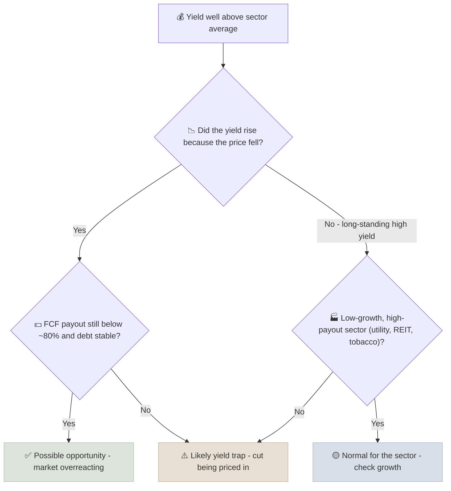

# Dividend Safety Checklist

The dividend safety checklist is an eight-point test of whether a company can keep paying and growing its dividend through a recession, combining cash coverage, balance sheet strength, business stability and management intent.

```objectives
time: 40 min
outcomes:
  - Score a dividend payer on the eight-point safety checklist
  - Stress-test dividend coverage for a recession-level fall in cash flow
  - Distinguish a sustainable high yield from a yield trap
  - Estimate dividend growth capacity from payout, ROE and FCF growth
prerequisites:
  - "[Dividend Aristocrats & Contenders](01-Aristocrats-and-Contenders.mdx)"
  - "[Debt-to-Equity & Net Debt / EBITDA](../../05-Metric-Toolkit/Notes/05-Leverage-Ratios.mdx)"
```

## Why It Matters

<div class="audience-beginner" markdown="1">

For someone living on dividends, a cut hurts twice: income falls, and the share price usually falls too. The checklist asks eight simple questions. If a company passes most of them, its dividend is likely to survive a bad year. If it fails several, a high yield is more likely a warning than a gift.

</div>

<div class="audience-analyst" markdown="1">

Dividend cuts are rarely sudden to anyone reading cash flow statements. They follow a recognizable sequence: FCF coverage thins, leverage rises to bridge the gap, the payout ratio drifts up, and the yield rises as the market prices the risk. The checklist codifies that sequence into leading indicators, weighted toward cash and balance-sheet tests that management cannot easily manage around.

</div>

## The Eight Points

| # | Test | Pass | Warning | Fail |
|---|---|---|---|---|
| 1 | FCF payout ratio (3-year average) | Below 60% | 60-80% | Above 80% (above 100% outside utilities/REITs) |
| 2 | Earnings payout ratio | Below 60% | 60-75% | Above 75% |
| 3 | Net debt / EBITDA | Below 2x | 2-3x | Above 3x (sector-adjusted) |
| 4 | Interest coverage (EBIT / interest) | Above 8x | 4-8x | Below 4x |
| 5 | Recession stress: FCF falls 30%, still covers dividend? | Yes, with room | Just | No |
| 6 | Revenue and earnings stability (10 years) | No year with EPS down over 25% | One or two | Frequent large drops |
| 7 | Dividend growth vs EPS growth (5 years) | DPS growth ≤ EPS growth | DPS slightly faster | DPS much faster (payout creeping up) |
| 8 | Management commitment | Clear policy, long record, no cuts | Policy vague | Recent cut, or policy "under review" |

**Scoring:** 2 points for a pass, 1 for a warning, 0 for a fail. A score of **13-16** is safe, **9-12** needs monitoring, and **8 or below** is at risk. Any fail on tests 1, 3 or 5 deserves a close look regardless of the total.

## The Recession Stress Test

$$
\text{Stressed coverage} = \frac{\text{FCF} \times (1 - \text{stress})}{\text{Dividends}}
$$

Choose the stress from history: the company's worst peak-to-trough FCF fall, or a sector guide (staples 10-20%, industrials 30-50%, commodities 50%+).

**Example.** FCF 1,000, dividends 550, stress 30%: stressed coverage = 700 / 550 = **1.27x** - the dividend survives. With dividends of 800, stressed coverage = 700 / 800 = 0.88x - the company would need to borrow or cut.

## Yield Trap or Opportunity?



## Dividend Growth Capacity

Sustainable dividend growth is capped by earnings and FCF growth:

$$
g_{\text{DPS}} \approx g_{\text{EPS}} \approx \text{ROE} \times (1 - \text{payout}) \quad \text{(if payout stays constant)}
$$

A company with ROE of 22% and a 45% payout can grow its dividend about 12% a year without raising its payout ratio. One with ROE of 10% and an 80% payout can manage about 2%.

## Red Flags

- FCF payout above 100% for two years outside regulated sectors.
- The dividend held flat for several years after a long record of increases - often a prelude to a cut.
- Asset sales or debt issuance quoted as "funding the dividend."
- "Scrip" (stock) dividends replacing cash dividends.
- In India: dividends from a holding company funded by upstream payments from heavily indebted subsidiaries.

## Case Studies

**US - Intel's 2023 dividend cut.** Intel's dividend looked safe on earnings payout for years. But as margins fell and capex for new fabs surged, FCF turned negative in 2022-2023. The checklist would have failed tests 1 (FCF payout), 5 (stress) and 7 (dividend growing while EPS fell). Intel cut its dividend by about two-thirds in February 2023, and suspended it in 2024.

**US - Verizon.** Verizon has long offered a high yield (6%+ at times) that screens as a possible trap. Its FCF covers the dividend, but leverage is high (net debt / EBITDA around 2.5-3x) and dividend growth has been slow. On the checklist it scores in the "monitor" range: safe today, with little room for error.

**India - Vedanta.** Vedanta paid exceptionally large dividends in 2022-2023, partly to service debt at its parent, Vedanta Resources. Dividends were at times above FCF, while group-level debt stayed high. The checklist would flag tests 1, 3 and 7. High yields paid to support a parent's balance sheet are a governance question, not only a coverage question.

> Figures are approximate and for teaching.

## Check Yourself

```quiz
- q: "FCF is 800 and dividends are 600. Under a 40% FCF stress, what is stressed coverage?"
  options: ["1.33x", "0.80x", "1.60x", "0.40x"]
  answer: 2
  explain: "Stressed FCF = 800 × 0.6 = 480. 480 / 600 = 0.80x - the dividend would not be covered."
- q: "A stock yields 9%, up from 4% a year ago because the price fell by half. What should you check first?"
  options: ["The ticker symbol", "FCF payout, net debt trend and whether the market is pricing a cut", "Whether the company is an Aristocrat", "The P/E only"]
  answer: 2
  explain: "A yield that rises because of a price collapse often signals an expected cut. Cash coverage and leverage decide which it is."
- q: "ROE is 18% and the payout ratio is 50%. Roughly what dividend growth is sustainable without raising the payout ratio?"
  options: ["18%", "9%", "5%", "36%"]
  answer: 2
  explain: "g ≈ ROE × retention = 18% × 0.5 = 9%."
- q: "Why are tests 1, 3 and 5 treated as especially important?"
  answer: "They measure cash coverage, leverage and resilience under stress - the things that actually force a cut. A company can pass the softer tests (policy, history) and still be forced to cut if cash and debt fail."
```

## Exercises

```exercise
- title: Score three dividend stocks
  task: |
    Pick three dividend payers - one staple, one utility or telecom, and one cyclical - in your market. Score each on all eight tests, run a stress test using its own worst historical FCF decline, and rank them by dividend safety.
- title: The trap test
  task: |
    Find the five highest-yielding stocks in the S&P 500 or Nifty 100 today. Run each through the yield-trap flowchart. How many look like opportunities and how many like traps?
```

## Study Notes

- Eight tests: **FCF payout, earnings payout, net debt / EBITDA, coverage, recession stress, stability, DPS vs EPS growth, management commitment**.
- Score 2/1/0; 13-16 safe, 9-12 monitor, 8 or below at risk.
- **Stressed coverage** = FCF × (1 - stress) / dividends.
- A yield that jumped because the price fell is guilty until proven innocent.
- Sustainable dividend growth ≈ ROE × (1 - payout).

## References

- Arnott & Asness, "Surprise! Higher Dividends = Higher Earnings Growth," *Financial Analysts Journal* (2003)
- Lintner, "Distribution of Incomes of Corporations Among Dividends, Retained Earnings, and Taxes," *American Economic Review* (1956)
- Intel Corporation, dividend announcement press release and Form 8-K (February 2023)
- Vedanta Ltd., Annual Reports (fiscal 2022-2024)

*Last reviewed: 2026-09*
