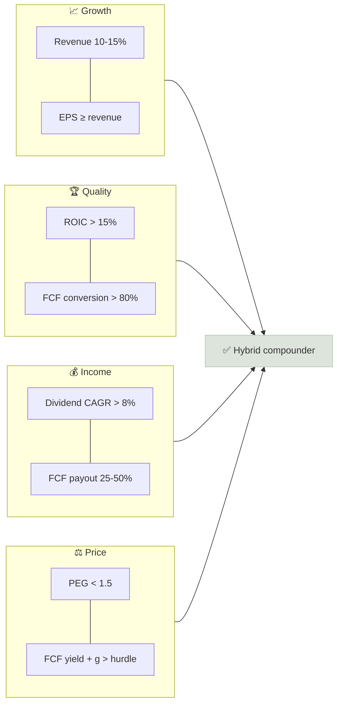

# GARP + Dividend Growth Framework

The hybrid framework selects companies that compound revenue at roughly 10-15% a year, convert that growth into rising earnings and free cash flow, raise their dividend every year, and still trade at a reasonable price relative to that growth - growth at a reasonable price (GARP) with a growing income stream on top.

```objectives
time: 55 min
outcomes:
  - Apply the eleven hybrid criteria to a candidate stock
  - Estimate expected total return as dividend yield plus growth plus change in valuation
  - Use the Chowder rule as a quick dividend-growth filter
  - Compare the growth, dividend and hybrid frameworks and choose one for a given investor
prerequisites:
  - "[Growth Investing](../../07-Growth-Investing/INDEX.mdx)"
  - "[Dividend Safety Checklist](../../08-Dividend-Investing/Notes/02-Dividend-Safety-Checklist.mdx)"
  - "[How the Metrics Interact](../../05-Metric-Toolkit/Notes/09-How-the-Metrics-Interact.mdx)"
```

## Why It Matters

<div class="audience-beginner" markdown="1">

Pure growth stocks can be thrilling but painful when they fall. Pure high-dividend stocks are steady but often barely grow. The hybrid approach looks for the middle: good businesses that grow steadily, pay you a small but rising dividend every year, and are not priced for perfection. For many long-term investors this is the core of a portfolio.

</div>

<div class="audience-analyst" markdown="1">

The hybrid framework targets the quality factor with a valuation constraint. High ROIC lets these companies fund 10-15% growth from internal cash while still paying out 25-50% of FCF. The dividend acts as a capital allocation discipline and a signal of cash-flow confidence; the valuation constraint (PEG, FCF yield) limits exposure to multiple compression. Expected returns come mostly from fundamentals rather than re-rating, which is what makes them repeatable.

</div>

## Expected Total Return

$$
E[R] \approx \text{Dividend yield} + g_{\text{EPS}} + \Delta\text{Valuation}
$$

where $$\Delta\text{Valuation}$$ is the annualized change in the P/E: $$(\text{P/E}_{\text{exit}} / \text{P/E}_{\text{entry}})^{1/n} - 1$$.

**Example.** Yield 1.8%, EPS growth 12%, P/E 26 today falling to 22 in 7 years: $$(22/26)^{1/7} - 1 = -2.4\%$$. Expected return ≈ 1.8% + 12% - 2.4% = **11.4%** a year, with about 13.8 percentage points from fundamentals.

### The Chowder Rule

A quick filter for dividend growth stocks:

$$
\text{Chowder number} = \text{Current dividend yield} + \text{5-year dividend CAGR}
$$

| Current yield | Passes if Chowder number is at least |
|---|---|
| 3% or higher | 12 |
| Below 3% | 15 |
| Utilities (slow growth) | 8 |

Hybrid candidates typically yield 1-3% and grow dividends 10%+, so they pass through the "15" line.

## The Eleven Criteria

| Group | Criterion | Target |
|---|---|---|
| **Growth** | Revenue CAGR (5y and 10y) | 10-15% |
| | EPS CAGR (5y) | At least revenue CAGR |
| | Share count (5y) | Flat or falling |
| **Quality** | ROIC (ex-goodwill, 5y avg) | Above 15%, and above WACC every year |
| | Gross margin trend | Stable or rising |
| | FCF conversion (FCF / net income) | Above 80% |
| **Income** | Dividend CAGR (5y) | Above 8% and at least inflation + 4 points |
| | FCF payout ratio | 25-50% (leaves room for both growth and increases) |
| **Safety** | Net debt / EBITDA | Below 2x |
| **Valuation** | PEG (forward P/E / expected EPS growth) | Below about 1.5 |
| | FCF yield + expected FCF growth | Above your required return (e.g. 11-12%) |



Few stocks pass all eleven. Treat 9-10 passes with a clear explanation for the misses as a candidate for full research using the [Annual Report Analysis](../../11-Annual-Report-Analysis/INDEX.mdx) workflow.

## The Three Frameworks Compared

| | High growth | Dividend growth | Hybrid (GARP + dividend) |
|---|---|---|---|
| Revenue growth | 20%+ | 3-8% | 10-15% |
| Main return source | EPS growth + (often) re-rating | Yield + modest growth | Growth + yield, little re-rating |
| Dividend | None or token | 2.5-5% yield, 5-8% growth | 1-3% yield, 10%+ growth |
| Key metrics | TAM, unit economics, Rule of 40, NRR | FCF payout, coverage, leverage, streak | ROIC, EPS vs revenue CAGR, PEG, FCF payout |
| Main risk | Multiple compression | Dividend cut, low growth, rate sensitivity | Paying too much for quality |
| Volatility | High | Low to moderate | Moderate |
| Suits | Long horizon, high risk tolerance | Income needs, retirees | Core long-term holdings for most investors |

## Worked Example

| Metric | Candidate | Target | Pass? |
|---|---|---|---|
| Revenue CAGR 5y / 10y | 12% / 11% | 10-15% | Yes |
| EPS CAGR 5y | 14% | ≥ revenue | Yes |
| Share count 5y | -1% a year | Flat or falling | Yes |
| ROIC | 24% | > 15% | Yes |
| Gross margin | 52% → 54% | Stable / rising | Yes |
| FCF conversion | 92% | > 80% | Yes |
| Dividend CAGR 5y | 11% | > 8% | Yes |
| FCF payout | 38% | 25-50% | Yes |
| Net debt / EBITDA | 0.8x | < 2x | Yes |
| PEG | 28 / 13 = 2.2 | < 1.5 | **No** |
| FCF yield + g | 3.1% + 12% = 15.1% | > 11% | Yes |

Ten of eleven pass; the PEG fails. But FCF yield plus growth clears the hurdle comfortably, which suggests the P/E is inflated by non-cash charges or that growth may last longer than the 5-year estimate. That is the question to answer in full research - not a reason to discard the stock automatically.

## Red Flags

- **"GARP" stocks where growth came from one-off margin expansion** - check EPS vs revenue CAGR.
- **Dividend growth outpacing EPS growth for years**, so the payout ratio is creeping up.
- **Growth funded with acquisitions and debt**, with ROIC including goodwill falling.
- **PEG built on an analyst's optimistic 5-year growth estimate** rather than history.

## Case Studies

**US - Microsoft and Visa as hybrid compounders.** Over 2014-2024, both companies grew revenue at roughly low-teens rates, grew EPS faster, raised their dividends every year at double-digit rates, and kept FCF payouts well below 50% - while also buying back stock. Their yields were only around 0.7-1.0%, so they fail pure dividend screens, but they are archetypal hybrid compounders.

**India - Pidilite and Bajaj Auto.** Pidilite Industries (adhesives, Fevicol) has compounded revenue at low-to-mid teens with very high ROCE and a steadily rising dividend; its main challenge for the framework is valuation, with P/E often above 60x. Bajaj Auto has combined solid growth, net cash and a high, rising payout. Indian hybrid candidates often pass the quality and income tests easily and fail on valuation, which makes patience - and a watchlist - essential.

> Figures are approximate and for teaching.

## Check Yourself

```quiz
- q: "A stock yields 2%, you expect 11% EPS growth, and you think its P/E will stay constant. What is the expected annual total return?"
  options: ["11%", "13%", "9%", "22%"]
  answer: 2
  explain: "With no change in valuation, E[R] ≈ 2% + 11% = 13%."
- q: "A stock yields 1.5% and its 5-year dividend CAGR is 12%. Does it pass the Chowder rule?"
  options: ["Yes - 13.5 is above 12", "No - for yields below 3% the threshold is 15, and 13.5 is below it", "The Chowder rule does not apply"]
  answer: 2
  explain: "For yields below 3%, the Chowder number must be at least 15."
- q: "Why does the hybrid framework prefer an FCF payout of 25-50% rather than as low as possible?"
  options: ["Regulators require it", "It balances funding growth internally with a meaningful, growable dividend", "Low payouts are always bad", "It maximizes the P/E"]
  answer: 2
  explain: "Too low and there is little income; too high and there is no room to reinvest or raise the dividend in a bad year."
- q: "What is the main risk of the hybrid framework, and how does the framework try to manage it?"
  answer: "Paying too much for quality - high-quality compounders often trade at high multiples, exposing investors to multiple compression. The PEG and FCF-yield-plus-growth tests, plus a margin of safety and patience, are there to limit that risk."
```

## Exercises

```exercise
- title: Score two candidates
  task: |
    Choose one US and one Indian company you believe could be hybrid compounders. Score each on all eleven criteria with sources for every number. Compute expected total return under three exit P/E assumptions (current, 20% lower, 40% lower).
- title: Framework fit
  task: |
    Recommend a framework (growth, dividend, hybrid, or a mix) for each investor and justify it in two sentences: (a) a 28-year-old software engineer saving for retirement, (b) a 66-year-old retiree needing income, (c) a 45-year-old saving for a child's university fees in 8 years plus retirement.
  solution: |
    (a) Mostly hybrid with a growth sleeve - a long horizon can absorb volatility, but quality compounders reduce the risk of permanent loss. (b) Mostly dividend growth plus bonds - reliable, rising income and lower volatility matter more than maximum growth. (c) Hybrid core for retirement, with the education fund moving gradually into bonds and cash as the 8-year date approaches.
```

## Study Notes

- Hybrid target: **revenue 10-15%, EPS ≥ revenue, ROIC > 15%, dividend CAGR > 8%, FCF payout 25-50%, net debt / EBITDA < 2x, PEG < 1.5**.
- **E[R] ≈ yield + EPS growth + annualized P/E change**.
- **Chowder rule**: yield + 5y dividend CAGR ≥ 12 (yield ≥ 3%) or ≥ 15 (yield < 3%).
- Main risk: overpaying for quality - use a watchlist and margin of safety.

## References

- Lynch, *One Up on Wall Street* (Simon & Schuster, 1989) - growth at a reasonable price
- Asness, Frazzini & Pedersen, "Quality Minus Junk," *Review of Accounting Studies* (2019)
- Novy-Marx, "The Other Side of Value: The Gross Profitability Premium," *Journal of Financial Economics* (2013)
- Chowder rule - originated on the Seeking Alpha dividend growth investing community (c. 2008)
- Microsoft, Visa, Pidilite Industries and Bajaj Auto annual reports (2014-2024)

*Last reviewed: 2026-09*
