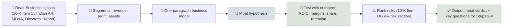

# Step 1 - Business Model & Moat

The first step of analyzing an annual report is to understand exactly how the company makes money, and to verify - from its own numbers, not its claims - whether it has a durable competitive advantage (a moat) that protects those profits.

```objectives
time: 60 min (plus reading time for one annual report)
outcomes:
  - Describe a company's business model in one paragraph using its segment disclosures
  - Identify the moat source (if any) and test it against quantitative evidence
  - Map the company's customers, suppliers, competitors and substitutes with a five forces view
  - List the key risks from the risk factors section and rank them
prerequisites:
  - "[How the Metrics Interact](../../05-Metric-Toolkit/Notes/09-How-the-Metrics-Interact.mdx)"
```

## Why It Matters

<div class="audience-beginner" markdown="1">

Before looking at any ratio, you need to be able to explain how the company earns money in plain words - who pays it, for what, and why they don't go elsewhere. If you can't, the numbers won't mean much. The "moat" is the reason customers keep choosing this company and competitors can't easily take its profits.

</div>

<div class="audience-analyst" markdown="1">

Moats are claims about the future persistence of excess returns. The annual report provides the evidence for or against them: segment ROIC, margin stability, customer concentration, pricing history, and market share data. Step 1 frames the hypothesis that Steps 2-4 test: what earns the returns, how durable they are, and what could break them.

</div>

## The Workflow



## Checklist

### 1. How the company makes money

- [ ] What does it sell, to whom, and how is it priced (per unit, subscription, commission, spread)?
- [ ] Revenue, operating profit and assets **by segment** (10-K segment note; Indian AR segment reporting under Ind AS 108)
- [ ] Revenue by **geography** and currency exposure
- [ ] **Customer concentration** - any customer above 10% of revenue must be disclosed in a 10-K
- [ ] **Recurring vs one-off revenue** - contracts, subscriptions, repeat purchase rates
- [ ] **Cost structure** - fixed vs variable, key inputs, labor intensity

Write it in one paragraph: *"The company earns X% of profit from selling Y to Z, priced by W; customers buy because V; the main costs are U."*

### 2. Moat hypothesis and evidence

| Moat source | What it looks like | Quantitative evidence to check |
|---|---|---|
| **Intangible assets** (brands, patents, licenses) | Customers pay a premium; rivals are excluded | Gross margin above peers for 10+ years; price increases without volume loss |
| **Switching costs** | Leaving is costly or risky for customers | Low churn, high renewal rates, rising revenue per customer |
| **Network effects** | Value rises with users | Stable or rising take rates; share gains as the market grows |
| **Cost advantage** (scale, process, location) | Lower unit costs than rivals | Operating margin above peers at similar prices; stable share in downturns |
| **Efficient scale** | A market only big enough for one or two profitable players | Few competitors; stable, regulated or niche returns |

**The acid test:** ROIC above WACC for 10 years, including through a downturn, with stable or rising margins. Without that, a moat is a story.

### 3. Industry structure (Porter's five forces)

| Force | Question | Where to look |
|---|---|---|
| Rivalry | How many competitors; is there price competition? | Competition section; industry reports |
| Buyer power | Are customers concentrated or able to switch? | Customer concentration; pricing history |
| Supplier power | Are key inputs concentrated or scarce? | Cost notes; commodity exposure |
| Threat of new entrants | Capital, regulation, scale or brand barriers? | Capex needs; licensing |
| Substitutes | Can customers meet the need another way? | Technology and pricing trends |

### 4. Risk factors

- [ ] Read all risk factors (10-K Item 1A; Indian annual reports' risk management section and the MD&A)
- [ ] Mark the **three risks that could cause permanent loss** - not the boilerplate ones
- [ ] Compare this year's risk factors with last year's: **new or expanded risks** are the signal
- [ ] Check **legal proceedings** and **contingent liabilities** (Indian AR notes often list tax disputes)

## Where to Find It

| Item | US 10-K | Indian annual report |
|---|---|---|
| Business description | Item 1 - Business | Management Discussion & Analysis; Directors' Report |
| Risks | Item 1A - Risk Factors | Risk management section; MD&A |
| Segments | Notes - segment information | Notes - segment reporting (Ind AS 108) |
| Customer concentration | Item 1 and notes | Notes (if disclosed); MD&A |
| Legal matters | Item 3 - Legal Proceedings | Notes - contingent liabilities |
| Sustainability, customers, supply chain | Item 1; proxy | Business Responsibility and Sustainability Report (BRSR) |

## Red Flags

- You still cannot explain the business model in one paragraph after reading the report.
- **Segment definitions change** frequently, breaking comparisons.
- **One customer or supplier** is a large share of revenue or inputs.
- Moat language ("market leader", "strong brand") with **no margin or ROIC evidence**.
- **New risk factors** about going concern, regulatory investigations or key customer losses.

## Case Studies

**US - Visa's network moat.** Visa's 10-K shows operating margins above 60% and very high returns on tangible capital. The moat is a two-sided network: merchants accept Visa because consumers carry it, and consumers carry it because merchants accept it. The risk factors section points to what could erode it - interchange regulation, real-time payment systems and litigation - which is exactly where an analyst should focus.

**India - Asian Paints vs new entrants.** Asian Paints' annual reports show a dealer network of well over 100,000 retailers, tinting machines installed across the country, and decades of ROCE above 25%. When a large, well-funded new entrant launched a paints business in 2024 with an aggressive dealer strategy, the moat hypothesis became testable: watch dealer additions, discounting, and gross margin in quarterly results.

## Check Yourself

```quiz
- q: "Which is the strongest quantitative evidence of a moat?"
  options: ["The CEO says the company is a market leader", "ROIC above WACC for 10 years, including a downturn, with stable margins", "Revenue grew 30% last year", "A high P/E ratio"]
  answer: 2
  explain: "Sustained excess returns through a full cycle are what a moat produces. Claims and one-year growth are not evidence."
- q: "Where in a US 10-K do you find the company's main risks?"
  options: ["Item 7", "Item 1A", "Item 8", "Item 3"]
  answer: 2
  explain: "Item 1A is Risk Factors. Item 7 is MD&A, Item 8 the financial statements, Item 3 legal proceedings."
- q: "Why compare this year's risk factors with last year's?"
  answer: "Boilerplate risks repeat every year; new or expanded risk factors show what management and its lawyers have newly become worried about, often before the issue shows up in the numbers."
```

## Exercises

```exercise
- title: One-paragraph business model
  task: |
    Pick one company from your screens. Read its business section and segment note, and write the one-paragraph business model using the template in the checklist. Then write your moat hypothesis and list three numbers that would prove or disprove it.
- title: Risk factor diff
  task: |
    Compare the risk factors in the last two annual reports of the same company (a text-diff tool helps). List every added or materially changed risk, and rank the top three by potential for permanent loss.
```

## Study Notes

- Explain the business in **one paragraph** before touching ratios.
- Moat sources: **intangibles, switching costs, network effects, cost advantage, efficient scale**.
- The test: **ROIC > WACC for 10 years, through a downturn**, with stable margins.
- Use five forces to map the industry; rank the three risks that could cause permanent loss.
- Diff the risk factors year over year.

## References

- Porter, "The Five Competitive Forces That Shape Strategy," *Harvard Business Review* (2008)
- Dorsey, *The Little Book That Builds Wealth* (Wiley, 2008) - moat sources
- SEC Office of Investor Education and Advocacy, *Investor Bulletin: How to Read a 10-K* (2011)
- SEBI, Business Responsibility and Sustainability Reporting circular (2021)
- Visa Inc., Form 10-K (fiscal 2024); Asian Paints Ltd., Integrated Annual Report (fiscal 2024)

*Last reviewed: 2026-09*
