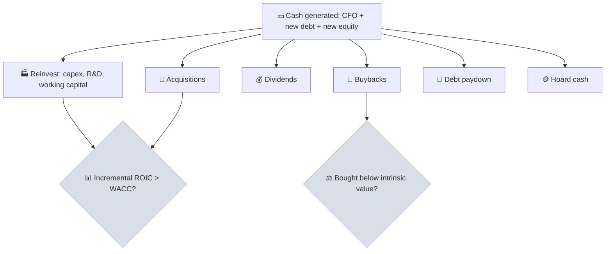

# Step 3 - Management & Capital Allocation

The third step judges the people running the company: whether their track record matches their promises, how well they have allocated the cash the business produced, and whether they own enough of the company - on the same terms as outside shareholders - to care about the outcome.

```objectives
time: 60 min
outcomes:
  - Build a capital allocation history showing where 10 years of cash went and what it earned
  - Evaluate management's track record by comparing past guidance with results
  - Assess insider ownership, insider transactions, pledging and compensation alignment
  - Spot related-party and governance red flags in US proxy statements and Indian annual reports
prerequisites:
  - "[Step 2 - Three-Statement Reconciliation](02-Three-Statement-Reconciliation.mdx)"
  - "[ROIC vs WACC](../../05-Metric-Toolkit/Notes/03-ROIC-vs-WACC.mdx)"
```

## Why It Matters

<div class="audience-beginner" markdown="1">

After ten years, the managers of a company will have decided what to do with a huge amount of cash - often more than the company's whole value today. Did they spend it well? Did they do what they said they would? Do they own shares themselves, so they win and lose along with you? Good managers make a good business better; poor ones can waste even a great one.

</div>

<div class="audience-analyst" markdown="1">

Over a decade, a company with a 5% FCF yield and moderate growth will generate cash equal to most of its current market value. Capital allocation therefore largely determines long-run per-share value. The analyst evaluates the incremental ROIC on capital deployed, the price discipline on buybacks and acquisitions, and whether incentive structures reward per-share value or mere size.

</div>

## Capital Allocation: Where Did the Cash Go?



Build a 10-year table from the cash flow statements:

| Use of cash | 10-year total | % of total | Evidence of return |
|---|---|---|---|
| Capex (net of D&A = growth capex) | | | Incremental ROIC |
| Acquisitions | | | ROIC including goodwill; impairments |
| Dividends | | | - |
| Buybacks | | | Average price paid vs intrinsic value |
| Net debt change | | | Leverage trend |

**Incremental ROIC** - what the new capital actually earned:

$$
\text{Incremental ROIC} = \frac{\text{NOPAT}_{t} - \text{NOPAT}_{t-n}}{\text{Invested capital}_{t-1} - \text{Invested capital}_{t-n-1}}
$$

Measure it over 3-5 years to smooth timing.

## Track Record

- [ ] Collect **guidance and targets** from 5 years of annual reports, shareholder letters and earnings calls. Did results match?
- [ ] Read the **CEO letters from 5-10 years ago**. Were the strategies they described executed? Were failures admitted?
- [ ] How did management behave in the **last downturn** - cut capex sensibly, protect the balance sheet, or chase growth?
- [ ] **Acquisition record** - write-downs and impairments of past deals are admissions of overpayment.
- [ ] **Candor** - are bad results explained clearly, or buried in adjusted metrics?

## Skin in the Game

| Check | US source | India source | Good sign | Red flag |
|---|---|---|---|---|
| Insider / promoter ownership | Proxy statement (DEF 14A) | Shareholding pattern (quarterly) | Meaningful personal stake | Tiny ownership by executives |
| Insider buying and selling | Form 4 filings | SAST and PIT disclosures to exchanges | Open-market buying | Heavy, sustained selling |
| Pledged shares | Proxy footnotes | Shareholding pattern (encumbered shares) | None | Rising pledges |
| Compensation design | Proxy - Compensation Discussion & Analysis | Annual report - remuneration disclosures | Pay tied to per-share value, ROIC, FCF | Pay tied to revenue, "adjusted" EBITDA or size |
| Dilution | Share count, SBC | Preferential allotments, ESOPs, warrants to promoters | Flat or falling share count | Warrants issued to promoters at low prices |
| Related-party transactions | Proxy - related-person transactions | Notes - related party disclosures; AOC-2 form | Small, arm's length | Loans, guarantees, royalties to promoter entities |

In India, also check **royalty payments to a foreign parent** (multinational subsidiaries), **inter-corporate loans** to group companies, and **brand fees** paid to promoter entities - all ways value can leak from minority shareholders.

## Red Flags

- Acquisitions followed by goodwill impairments within 3-5 years.
- Buybacks concentrated at share-price peaks, and none after crashes.
- Compensation metrics changed when the old ones would not have paid out.
- A CEO who is also the chair, with a board of long-tenured, related or low-independence directors.
- Promoter warrants or preferential allotments at prices below market.
- Frequent changes in CFO or auditor.
- Guidance consistently missed, with a new explanation each time.

## Case Studies

**US - Berkshire Hathaway and Constellation Software.** Both publish unusually candid owner letters that report per-share value measures and discuss mistakes openly. Constellation's founder, Mark Leonard, explained its acquisition hurdle rates and ROIC in detail for years; its per-share results followed. Candor and clear capital allocation rules are themselves evidence of good management.

**US - General Electric, 2000-2017.** GE spent heavily on acquisitions and buybacks, including roughly 40 billion dollars of buybacks around 2015-2016 at prices far above where the stock later traded, while its power and financial businesses deteriorated. Large goodwill impairments followed. The capital allocation record, not just the operating results, explained the destruction of shareholder value.

**India - related-party leakage.** Several Indian companies have seen minority shareholders lose value through loans and guarantees to promoter group entities that were later written off. SEBI's rules now require audit committee and, for material transactions, shareholder approval of related-party transactions - but approvals are only as good as the independence of the directors granting them. Reading the related-party note every year is basic diligence for Indian stocks.

## Check Yourself

```quiz
- q: "Over five years, NOPAT rose from 400 to 520 while invested capital rose from 2,000 to 3,500. What is the incremental ROIC?"
  options: ["26%", "8%", "15%", "34%"]
  answer: 2
  explain: "Incremental ROIC = (520 - 400) / (3,500 - 2,000) = 120 / 1,500 = 8%. If WACC is 10%, the new capital destroyed value."
- q: "Which compensation design best aligns management with long-term shareholders?"
  options: ["Bonus tied to revenue growth", "Bonus tied to adjusted EBITDA", "Long-term awards tied to per-share value, ROIC and FCF over 3-5 years", "Fixed salary only"]
  answer: 3
  explain: "Revenue and adjusted EBITDA can be grown by destroying value; per-share, return-based, multi-year metrics cannot easily be gamed."
- q: "Where do you find promoter pledging data for an Indian company?"
  options: ["The Directors' Report only", "The quarterly shareholding pattern filed with the exchanges (encumbered shares)", "The auditor's report", "The balance sheet"]
  answer: 2
  explain: "Pledged (encumbered) promoter shares are disclosed in the shareholding pattern and in SAST disclosures."
- q: "Why can buybacks destroy value?"
  answer: "A buyback is an investment in the company's own shares. If shares are bought above intrinsic value, remaining shareholders lose value, even though EPS may rise. Buybacks create value only when the price paid is below intrinsic value."
```

## Exercises

```exercise
- title: Ten-year capital allocation map
  task: |
    For your research company, build the 10-year uses-of-cash table and compute incremental ROIC over two 5-year windows. Plot buyback amounts against the share price. Write a one-paragraph grade (A-F) of management's capital allocation with evidence.
- title: Promise vs delivery
  task: |
    Find three specific targets management set 3-5 years ago (margins, revenue, ROCE, debt). Compare each with what was delivered. What does the record tell you about how to treat their current guidance?
```

## Study Notes

- Over 10 years, capital allocation largely decides per-share value.
- Map **where the cash went** and compute **incremental ROIC**.
- Buybacks create value only **below intrinsic value**; acquisitions only if ROIC with goodwill > WACC.
- Check **ownership, insider trades, pledges, compensation design and related-party transactions**.
- Read old CEO letters: promises vs delivery.

## References

- Thorndike, *The Outsiders: Eight Unconventional CEOs and Their Radically Rational Blueprint for Success* (Harvard Business Review Press, 2012)
- Mauboussin & Callahan, "Capital Allocation: Results, Analysis, and Assessment," Morgan Stanley Investment Management (2022)
- Berkshire Hathaway, [Shareholder Letters](https://www.berkshirehathaway.com/letters/letters.html) (1977-present); Constellation Software, President's letters (2007-2023)
- SEBI, LODR Regulation 23 - related party transactions (as amended 2021)
- SEC, Regulation S-K Item 404 - related-person transactions

*Last reviewed: 2026-09*
