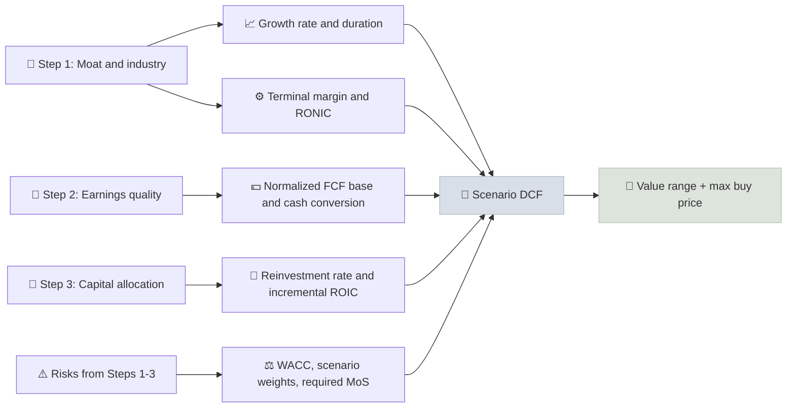

# Step 4 - Margin of Safety & DCF

The final step turns the evidence from Steps 1-3 into a valuation range - a scenario-based DCF, a reverse DCF of the current price, and a cross-check with multiples - and from that range sets a maximum buy price with a margin of safety.

```objectives
time: 90 min
outcomes:
  - Convert Steps 1-3 findings into explicit bear, base and bull DCF drivers
  - Run a reverse DCF and judge the plausibility of market expectations using base rates
  - Triangulate the DCF with multiples and set a maximum buy price
  - Write a one-page valuation summary and decision
prerequisites:
  - "[DCF Modeling](../../06-Valuation/Notes/02-DCF-Modeling.mdx)"
  - "[Reverse DCF](../../06-Valuation/Notes/03-Reverse-DCF.mdx)"
  - "[Margin of Safety](../../06-Valuation/Notes/05-Margin-of-Safety.mdx)"
```

## Why It Matters

<div class="audience-beginner" markdown="1">

By now you know how the business works, whether its numbers are real, and whether management is trustworthy. The last question is price: is the share cheap enough that you are likely to do well even if things go worse than you expect? This step turns everything you learned into a range of values and a price you are willing to pay.

</div>

<div class="audience-analyst" markdown="1">

The valuation should be the output of the research, not an independent exercise. Each driver - growth, margin, reinvestment, risk - should trace back to evidence from Steps 1-3: moat durability sets the length of the competitive advantage period; earnings quality sets the base for margins and cash conversion; capital allocation sets the expected incremental ROIC. Scenario weights and the required margin of safety should reflect the confidence of that evidence.

</div>

## From Evidence to Drivers



## The Four Tasks

### 1. Normalize the starting point

- Start from **normalized FCF**, not last year's: adjust for one-offs, working capital swings and SBC (from Step 2).
- For cyclicals, use **mid-cycle margins**.
- Use the **fully diluted** share count, including options and convertibles.

### 2. Build three scenarios

| Driver | Bear | Base | Bull | Evidence |
|---|---|---|---|---|
| Revenue CAGR, years 1-5 | | | | Step 1 TAM and share; history |
| Revenue CAGR, years 6-10 | | | | Base rates for companies of this size |
| Operating margin, year 10 | | | | Step 1 moat; peer margins |
| Reinvestment (or incremental ROIC) | | | | Step 3 incremental ROIC |
| WACC | | | | CAPM; country risk |
| Terminal growth | | | | Nominal GDP ceiling |
| Probability | | | | Confidence in the evidence |

Compute value per share for each, then a probability-weighted value.

### 3. Reverse DCF and cross-checks

- Solve for the growth the current price implies (see [Reverse DCF](../../06-Valuation/Notes/03-Reverse-DCF.mdx)). Is it closer to your bear, base or bull case?
- Compare implied **EV/EBITDA, P/E and FCF yield** at your base-case value with peers and the company's own 10-year history.
- If the DCF and multiples disagree widely, find out why before trusting either.

### 4. Set the buy price

$$
\text{Maximum buy price} = \min\left(\text{Expected value} \times (1 - \text{MoS}),\ \frac{\text{Bear value}}{1 - \text{Max acceptable bear loss}}\right)
$$

Choose the margin of safety from the confidence of Steps 1-3: strong moat, clean accounts and aligned management justify a smaller margin (around 20-25%); any serious doubt calls for a larger one or a pass.

## Worked Example

| Scenario | Value per share | Probability |
|---|---|---|
| Bear (growth 5%, margin compresses 3 pts) | 620 | 25% |
| Base (growth 11%, stable margin) | 980 | 55% |
| Bull (growth 15%, margin +3 pts) | 1,400 | 20% |
| **Expected value** | **974** | |

Current price: 900. The reverse DCF implies about 10% growth - close to the base case.

- MoS rule (25% required): 974 × 0.75 = **731**
- Bear-loss rule (maximum 20% loss): 620 / 0.80 = **775**
- **Maximum buy price = 731.** At 900, the stock is fairly valued, not cheap. Decision: add to the watchlist at a 731 buy price; revisit after each quarterly result.

## The One-Page Summary

Finish every analysis with a summary for your [Company Deep Dive](../../12-Research-Templates/Templates/01-Company-Deep-Dive.mdx):

1. **Business and moat** (Step 1) - two sentences
2. **Earnings quality** (Step 2) - pass / concerns
3. **Management** (Step 3) - capital allocation grade
4. **Valuation** - bear / base / bull, expected value, implied expectations
5. **Decision** - buy, watchlist with buy price, or pass
6. **Kill criteria** - what would make you sell or abandon the thesis

## Red Flags

- A DCF whose base case is the company's own guidance.
- Scenarios that differ only in WACC, not in business drivers.
- Terminal value above 80% of total for a mature company.
- A buy decision where the reverse DCF implies more than your bull case.

## Case Studies

**US - Meta Platforms, late 2022.** When Meta fell to around 90 dollars in late 2022, a reverse DCF implied that its advertising cash flows would decline for years, well below most analysts' bear cases - while the company still held large net cash and generated substantial FCF even after heavy metaverse spending. Investors who had done Steps 1-3 (moat intact, heavy but discretionary spending, a management capable of cutting costs) could see the gap between implied expectations and a reasonable bear case. The stock rose several-fold over the next two years after management cut costs.

**India - valuing a high-quality consumer franchise.** Indian consumer leaders often look expensive on every multiple. A scenario DCF typically shows that the base case already assumes 12-15 years of double-digit growth, so the margin of safety comes only from market-wide corrections. Many disciplined Indian investors keep these companies on a watchlist with pre-computed buy prices and act during broad sell-offs such as March 2020.

> Figures are approximate and for teaching.

## Check Yourself

```quiz
- q: "Scenario values are bear 50 (30%), base 80 (50%), bull 120 (20%). What is the expected value?"
  options: ["80", "79", "83.3", "75"]
  answer: 2
  explain: "0.3 × 50 + 0.5 × 80 + 0.2 × 120 = 15 + 40 + 24 = 79."
- q: "Why start a DCF from normalized FCF rather than last year's reported FCF?"
  options: ["Reported FCF is not audited", "Last year may include one-offs, working capital swings or cyclical peaks that distort the base for all future years", "Normalized FCF is always higher", "Regulators require it"]
  answer: 2
  explain: "Every forecast year compounds from the starting point, so a distorted base distorts the whole valuation."
- q: "The reverse DCF implies 18% growth; your bull case assumes 15%. What should you conclude?"
  options: ["Buy - the market agrees with you", "The price assumes more than your most optimistic case; pass or wait", "Raise your bull case to 18%", "The DCF is broken"]
  answer: 2
  explain: "If the price requires more than your bull case, there is no margin of safety - only downside if reality falls short."
- q: "How should Steps 1-3 influence the required margin of safety?"
  answer: "Strong evidence - a proven moat, clean earnings and aligned, capable management - narrows the value range and justifies a smaller margin. Doubts in any step widen the range and call for a larger margin or a pass."
```

## Exercises

```exercise
- title: Complete the valuation
  task: |
    For the company you followed through Steps 1-3, complete the scenario table with evidence for every driver, compute expected value, run a reverse DCF, and set a maximum buy price. Write the one-page summary, including three kill criteria.
- title: Two rules, one price
  task: |
    Bear 400, base 650, bull 900 with probabilities 20%, 60%, 20%. You require a 30% MoS and a maximum bear loss of 15%. What is the maximum buy price, and which rule binds?
  solution: |
    Expected value = 80 + 390 + 180 = **650**. MoS rule: 650 × 0.7 = **455**. Bear rule: 400 / 0.85 = **470.6**. The MoS rule binds: maximum buy price **455**.
```

## Study Notes

- Drivers must trace back to evidence from **Steps 1-3**.
- Normalize the base; build **bear, base and bull** scenarios with probabilities.
- Run a **reverse DCF** and cross-check with multiples.
- **Max buy price** = lower of expected value × (1 - MoS) and the bear-loss limit.
- End with a one-page summary and **kill criteria**.

## References

- Koller, Goedhart & Wessels, *Valuation*, 7th ed. (McKinsey & Company, 2020)
- Damodaran, *Narrative and Numbers* (Columbia Business School Publishing, 2017)
- Rappaport & Mauboussin, *Expectations Investing*, revised ed. (Columbia Business School Publishing, 2021)
- Meta Platforms, Forms 10-K (2022-2024)

*Last reviewed: 2026-09*
