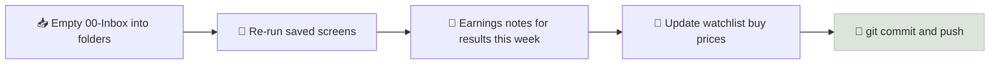

# Repository Setup

A research repository is a version-controlled folder of Markdown notes - opened in Obsidian and backed up to GitHub - that holds your course notes, company research, earnings notes, theses and post-mortems in one consistent structure you can search and build on for years.

```objectives
time: 60 min
outcomes:
  - Create a research repository with a clear, numbered folder taxonomy
  - Apply consistent file naming, frontmatter properties and tags
  - Connect Obsidian templates and a Dataview dashboard to the three research templates
  - Version the repository with Git and GitHub, keeping private data out of public repos
prerequisites:
  - None - set this up before your first company deep dive
```

## Why It Matters

<div class="audience-beginner" markdown="1">

Over a few years you will read hundreds of reports and write dozens of notes. Without a system, they end up scattered across downloads folders and chat messages. A simple folder structure with the same templates every time turns your notes into a personal library you can search in seconds.

</div>

<div class="audience-analyst" markdown="1">

Institutional research teams run on shared, structured research management systems so that theses, models and earnings reviews are auditable and comparable. A Git-backed Markdown vault reproduces the essentials for an individual: plain-text durability, full history of how each thesis evolved, structured metadata for querying, and a portfolio of work to show employers.

</div>

## Folder Taxonomy

```text
finance-research/
├── 00-Inbox/                      # quick captures, to be filed weekly
├── 01-Macro-and-Assets/           # compounding, asset classes, risk and return, macro notes
├── 02-Valuation-and-Accounting/   # accounting notes, metric toolkit, DCF models
├── 03-Stock-Screening/            # saved screens, results by date
│   └── results/
├── 04-Company-Research/           # one folder per company
│   └── TICKER/
│       ├── TICKER - Deep Dive.md
│       ├── TICKER - Investment Thesis.md
│       ├── earnings/
│       │   └── TICKER - Q2 FY26.md
│       └── models/                # spreadsheets, DCF files
├── 05-Portfolio-Design/           # allocation, IPS, rebalancing log, watchlist
├── 06-Advisory-and-Compliance/    # fiduciary, suitability, regulation, licensing study notes
├── 07-Post-Mortems/               # closed theses and lessons learned
├── _templates/                    # the three research templates
├── _assets/                       # images, PDFs of filings (keep large files out of Git)
└── README.md                      # how the repository is organized
```

The first six folders follow the brief's suggested structure and map onto this course's tracks:

| Folder | Course modules |
|---|---|
| 01-Macro-and-Assets | [Money & Compounding](../../01-Money-and-Compounding/INDEX.mdx), [Asset Classes](../../02-Asset-Classes/INDEX.mdx), [Risk & Return](../../03-Risk-and-Return/INDEX.mdx) |
| 02-Valuation-and-Accounting | [Accounting](../../04-Accounting-Foundations/INDEX.mdx), [Metric Toolkit](../../05-Metric-Toolkit/INDEX.mdx), [Valuation](../../06-Valuation/INDEX.mdx) |
| 03-Stock-Screening | [Growth](../../07-Growth-Investing/INDEX.mdx), [Dividends](../../08-Dividend-Investing/INDEX.mdx), [GARP](../../09-GARP-and-Hybrid/INDEX.mdx), [Screening](../../10-Stock-Screening/INDEX.mdx) |
| 04-Company-Research | [Annual Report Analysis](../../11-Annual-Report-Analysis/INDEX.mdx), this module |
| 05-Portfolio-Design | [Portfolio Construction](../../13-Portfolio-Construction/INDEX.mdx) |
| 06-Advisory-and-Compliance | [Advisory Practice](../../14-Advisory-Practice/INDEX.mdx), [Licensing & Career](../../15-Licensing-and-Career/INDEX.mdx) |

## Conventions

| Item | Convention | Example |
|---|---|---|
| Company folder | Exchange ticker (add suffix for India) | `AAPL/`, `ASIANPAINT.NS/` |
| Deep dive | `TICKER - Deep Dive.md` | `COST - Deep Dive.md` |
| Earnings note | `TICKER - Qn FYyy.md` | `INFY.NS - Q2 FY26.md` |
| Screens | `YYYY-MM-DD - screen name.md` | `2026-09-30 - hybrid US.md` |
| Dates | ISO 8601, `YYYY-MM-DD` | `2026-09-30` |
| Tags | Lower-case, hyphenated | `#deep-dive`, `#watchlist`, `#india` |
| Links | Wiki links between notes | `[[COST - Investment Thesis]]` |

Every research note starts with **frontmatter** (the `---` block at the top of each template). Obsidian shows it as properties; GitHub renders it as a table. Keep field names identical across notes so queries work.

## Obsidian Setup

1. Install [Obsidian](https://obsidian.md) and open the `finance-research` folder as a vault.
2. Enable the core **Templates** plugin and set the template folder to `_templates/`. (The community **Templater** plugin adds dates and prompts if you want them.)
3. Download the three templates into `_templates/`:
   - [company-deep-dive.md](/templates/company-deep-dive.md)
   - [quarterly-earnings-note.md](/templates/quarterly-earnings-note.md)
   - [investment-thesis-and-post-mortem.md](/templates/investment-thesis-and-post-mortem.md)
4. Install the community **Dataview** plugin and create `05-Portfolio-Design/Dashboard.md` with queries like these:

```text
TABLE ticker, market, status, price_at_writing, date
FROM #deep-dive
WHERE status = "watchlist" OR status = "owned"
SORT date DESC
```

```text
TABLE ticker, date_opened, entry_price, position_size_pct
FROM #thesis
WHERE status = "open"
SORT date_opened ASC
```

(In the dashboard note, wrap each query in a code fence whose language is `dataview`.)

## Git and GitHub

Scaffold the folders and put the vault under version control:

```bash
mkdir -p finance-research && cd finance-research
mkdir -p 00-Inbox 01-Macro-and-Assets 02-Valuation-and-Accounting \
         03-Stock-Screening/results 04-Company-Research 05-Portfolio-Design \
         06-Advisory-and-Compliance 07-Post-Mortems _templates _assets

cat > .gitignore <<'EOF'
.obsidian/workspace*.json
.obsidian/cache
.trash/
_assets/**/*.pdf
_assets/**/*.xlsx
.DS_Store
EOF

git init && git add . && git commit -m "Initial research repository"
gh repo create finance-research --private --source=. --push
```

**Keep the repository private** if it contains your holdings, position sizes, account details or client information. Publish a separate, public repository for course notes and anonymized sample research if you want a portfolio to show employers. Never commit client data - advisory rules on client confidentiality apply (see [Fiduciary Duty](../../14-Advisory-Practice/Notes/01-Fiduciary-Duty.mdx)).

## Weekly Routine



## Check Yourself

```quiz
- q: "Why keep frontmatter field names identical across all deep dives?"
  options: ["Obsidian will not open the file otherwise", "Queries (such as Dataview tables) can only filter and sort on consistent field names", "GitHub requires it", "It reduces file size"]
  answer: 2
  explain: "Structured, consistent properties are what make it possible to query your whole research library."
- q: "Which of these should never go into a public GitHub repository?"
  options: ["Your notes on the Sharpe ratio", "An anonymized sample deep dive", "Client names, holdings and account details", "The course templates"]
  answer: 3
  explain: "Client data is confidential under advisory rules and privacy law; keep it out of any public repository."
- q: "Why use ISO dates (YYYY-MM-DD) in file names?"
  answer: "They sort chronologically as plain text, are unambiguous across US and Indian date formats, and work consistently across operating systems and tools."
```

## Exercises

```exercise
- title: Build your repository
  task: |
    Create the folder structure, add the three templates, set up Obsidian Templates and Dataview, and push a private repository to GitHub. Create one deep dive from the template and confirm it appears in your dashboard query.
- title: Import your course notes
  task: |
    Write a short note for each module you have finished in this course, in the matching repository folder, with links back to the course pages. Link at least three notes to each other with wiki links.
```

## Study Notes

- Numbered top-level folders: **Macro and Assets, Valuation and Accounting, Screening, Company Research, Portfolio Design, Advisory and Compliance, Post-Mortems**.
- One folder per company; consistent file names, ISO dates and frontmatter.
- Obsidian **Templates** + **Dataview** turn notes into a queryable research system.
- Git gives history; keep anything personal or client-related **private**.

## References

- Obsidian, [Help: Templates and Properties](https://help.obsidian.md/) (accessed 2026)
- Dataview plugin, [documentation](https://blacksmithgu.github.io/obsidian-dataview/) (accessed 2026)
- GitHub, [About repositories - public vs private](https://docs.github.com/en/repositories/creating-and-managing-repositories/about-repositories) (accessed 2026)
- Ahrens, *How to Take Smart Notes* (2017)

*Last reviewed: 2026-09*
