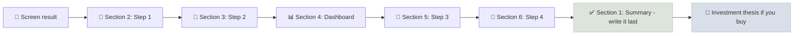

# Company Deep Dive Template

The company deep dive is the full, institutional-style research report on one company: business model and moat, financial quality, the eight-metric dashboard, management and capital allocation, and a scenario valuation ending in a decision and kill criteria.

```objectives
time: 20 min to set up; 8-15 hours per company
outcomes:
  - Record a complete four-step annual report analysis in one structured document
  - Produce a decision (buy, watchlist with buy price, or pass) backed by evidence in every section
  - Maintain the deep dive over time with a changelog as new results arrive
prerequisites:
  - "[Annual Report Analysis](../../11-Annual-Report-Analysis/INDEX.mdx) - the four-step workflow"
  - "[Repository Setup](../Notes/01-Repository-Setup.mdx)"
```

## Why It Matters

<div class="audience-beginner" markdown="1">

Writing your research down in the same structure every time does two things. It makes sure you never skip a step - like checking the debt or reading the auditor's report. And it gives you a record to look back on, so you can see later whether your reasoning was right, not just whether the stock went up.

</div>

<div class="audience-analyst" markdown="1">

Sell-side initiation reports and buy-side investment memos follow a stable structure because it forces completeness and comparability across names. A consistent template also makes post-mortems possible: when every thesis records its drivers, evidence and kill criteria up front, outcomes can be attributed to specific analytical errors rather than to hindsight.

</div>

## How to Use It



| Section | Filled from | Tip |
|---|---|---|
| 1. Summary | Everything below | Write it **last**, then move it to the top |
| 2. Business model and moat | [Step 1](../../11-Annual-Report-Analysis/Notes/01-Business-Model-and-Moat.mdx) | If the one-paragraph model is hard to write, stop and read more |
| 3. Financial quality | [Step 2](../../11-Annual-Report-Analysis/Notes/02-Three-Statement-Reconciliation.mdx) | Five years minimum; ten for cyclicals |
| 4. Dashboard | [How the Metrics Interact](../../05-Metric-Toolkit/Notes/09-How-the-Metrics-Interact.mdx) | Signal column: strength / neutral / concern |
| 5. Management | [Step 3](../../11-Annual-Report-Analysis/Notes/03-Management-and-Capital-Allocation.mdx) | Quote old CEO letters for promises vs delivery |
| 6. Valuation | [Step 4](../../11-Annual-Report-Analysis/Notes/04-Margin-of-Safety-and-DCF.mdx) | Every driver needs an evidence note |
| 7-9. Catalysts, sources, changelog | Ongoing | Update after each [earnings note](02-Quarterly-Earnings-Note.mdx) |

**Download:** [company-deep-dive.md](/templates/company-deep-dive.md) - save it into your repository's `_templates/` folder. The frontmatter at the top becomes Obsidian properties, so you can filter deep dives by `status`, `market` or `sector`.

## The Template

```markdown
---
type: deep-dive
company:
ticker:
exchange:
market: US | India
sector:
currency:
date:
price_at_writing:
status: researching | watchlist | owned | passed
tags: [deep-dive]
---

# Company Name (TICKER) - Deep Dive

## 1. Summary

- **One-line thesis:**
- **Decision:** Buy / Watchlist at ___ / Pass
- **Expected value per share:** ___ | **Price:** ___ | **Max buy price:** ___
- **Framework:** Growth / Dividend growth / Hybrid
- **Kill criteria:**
  1.
  2.
  3.

## 2. Business Model and Moat (Step 1)

### How the company makes money

The company earns __% of profit from selling ___ to ___, priced by ___. Customers buy because ___. The main costs are ___.

### Segments

| Segment | Revenue | % of total | Operating profit | Margin | Growth (3y CAGR) |
|---|---|---|---|---|---|
| | | | | | |

### Moat hypothesis and evidence

- **Moat source:** intangibles / switching costs / network effects / cost advantage / efficient scale / none
- **Evidence for:**
- **Evidence against:**
- **10-year ROIC vs WACC:**

### Industry structure

| Force | Assessment (low / medium / high) | Note |
|---|---|---|
| Rivalry | | |
| Buyer power | | |
| Supplier power | | |
| Threat of new entrants | | |
| Substitutes | | |

### Top three risks (ranked by potential for permanent loss)

1.
2.
3.

## 3. Financial Quality (Step 2)

### Five-year reconciliation

| | Y-4 | Y-3 | Y-2 | Y-1 | Y0 |
|---|---|---|---|---|---|
| Revenue | | | | | |
| Net income | | | | | |
| Cash from operations | | | | | |
| Capex | | | | | |
| Free cash flow | | | | | |
| FCF / net income | | | | | |
| DSO / DIO / DPO | | | | | |

- **Cumulative net income vs cumulative CFO:**
- **Auditor, opinion, key audit matters:**
- **Earnings quality checklist (10 points) - warnings:**

## 4. Eight-Metric Dashboard

| Metric | Company | 5-yr avg | Sector range | Signal |
|---|---|---|---|---|
| ROIC (ex-goodwill) vs WACC | | | | |
| Gross margin / trend | | | | |
| Operating margin / trend | | | | |
| Revenue CAGR (5y / 10y) | | | | |
| EPS CAGR (5y / 10y) | | | | |
| Forward P/E / PEG | | | | |
| EV/EBITDA | | | | |
| FCF yield / cash conversion | | | | |
| Net debt / EBITDA, interest coverage | | | | |
| Payout ratio / FCF coverage | | | | |

## 5. Management and Capital Allocation (Step 3)

### Uses of cash (10 years)

| Use | Total | % | Evidence of return |
|---|---|---|---|
| Growth capex | | | |
| Acquisitions | | | |
| Dividends | | | |
| Buybacks | | | |
| Net debt change | | | |

- **Incremental ROIC (two 5-year windows):**
- **Promises vs delivery:**
- **Ownership, insider trades, pledges:**
- **Compensation design:**
- **Related-party transactions:**
- **Capital allocation grade (A-F):**

## 6. Valuation (Step 4)

| Driver | Bear | Base | Bull | Evidence |
|---|---|---|---|---|
| Revenue CAGR, years 1-5 | | | | |
| Revenue CAGR, years 6-10 | | | | |
| Operating margin, year 10 | | | | |
| Incremental ROIC | | | | |
| WACC | | | | |
| Terminal growth | | | | |
| **Value per share** | | | | |
| **Probability** | | | | |

- **Expected value:**
- **Reverse DCF - growth implied by current price:**
- **Multiples cross-check (P/E, EV/EBITDA, FCF yield vs history and peers):**
- **Required margin of safety and why:**
- **Maximum buy price:**

## 7. Catalysts and What Would Change My Mind

- Catalysts:
- Evidence that would make me more bullish:
- Evidence that would make me sell:

## 8. Sources

- Annual reports / 10-Ks:
- Earnings call transcripts:
- Industry sources:

## 9. Changelog

| Date | Change |
|---|---|
| | Initial deep dive |
```

## Check Yourself

```quiz
- q: "Why is the Summary section written last?"
  options: ["It is the least important", "It must reflect the conclusions of every other section, which are only known at the end", "Obsidian requires it", "To save time"]
  answer: 2
  explain: "Writing the summary first anchors you on a conclusion before the evidence is in."
- q: "Which section of the deep dive should you update after each quarterly result?"
  options: ["Only the ticker", "Sections 7-9 (catalysts, sources, changelog), plus any metric or valuation driver that changed", "None - the deep dive is written once", "Only the price"]
  answer: 2
  explain: "The deep dive is a living document; the changelog records how the thesis evolves with new evidence."
- q: "What is the purpose of the frontmatter block at the top of the template?"
  answer: "It stores structured fields (ticker, market, sector, status, dates) that Obsidian treats as properties and GitHub renders as metadata, so you can search, filter and build dashboards across all your deep dives."
```

## Exercises

```exercise
- title: Your first deep dive
  task: |
    Complete the full template for one company that passed one of your screens. Every number must have a source, and every valuation driver an evidence note. Finish with a decision and three kill criteria.
- title: Peer review
  task: |
    Swap deep dives with a study partner (or re-read your own after a week). For each section, mark one claim that lacks evidence. Fix them.
```

## Study Notes

- Nine sections; the summary is written **last** and read **first**.
- Sections map one-to-one onto the four-step annual report workflow plus the dashboard.
- Keep it alive: changelog entries after each earnings note.
- Frontmatter makes deep dives searchable and filterable.

## References

- Valentine, *Best Practices for Equity Research Analysts* (McGraw-Hill, 2011)
- CFA Institute, *Equity Research Report Essentials* (Research Challenge guidelines, 2024)
- Obsidian, [Properties documentation](https://help.obsidian.md/Editing+and+formatting/Properties) (accessed 2026)

*Last reviewed: 2026-09*
