# Investment Thesis & Post-Mortem Template

The investment thesis records, before you buy, exactly why you expect to make money and what would prove you wrong; the post-mortem, completed when you sell or after three years, compares what happened with what you expected, so you learn from process rather than from outcomes.

```objectives
time: 60 min to write; 30-60 min for each post-mortem
outcomes:
  - Write a falsifiable three-sentence thesis with a variant perception
  - Set measurable milestones and pre-committed kill criteria
  - Run a pre-mortem before buying and a post-mortem after selling
  - Separate skill from luck using the process vs outcome matrix
prerequisites:
  - "[Company Deep Dive](01-Company-Deep-Dive.mdx)"
  - "[Margin of Safety](../../06-Valuation/Notes/05-Margin-of-Safety.mdx)"
```

## Why It Matters

<div class="audience-beginner" markdown="1">

If you buy a stock and it goes up, it is tempting to think you were clever. If it goes down, it is tempting to blame bad luck. Neither teaches you anything. Writing down your reasons before you buy - and checking them honestly afterwards - is how investors actually get better over time.

</div>

<div class="audience-analyst" markdown="1">

Outcomes in investing are noisy; a single result says little about decision quality. Recording theses ex ante eliminates hindsight bias, and pre-committed kill criteria counter the disposition effect and escalation of commitment. Aggregated post-mortems reveal systematic errors (for example, consistently overestimating margin expansion) that no single outcome can.

</div>

## How to Use It

```mermaid
flowchart LR
    DD["📘 Deep dive complete"] --> TH["📝 Write thesis, milestones, kill criteria"]
    TH --> PM["🔮 Pre-mortem: why might this fail?"]
    PM --> BUY["💼 Buy and size the position"]
    BUY --> Q["📅 Quarterly earnings notes check milestones"]
    Q -->|"Kill criterion hit"| EXIT["🚪 Exit"]
    Q -->|"3 years or target reached"| EXIT
    EXIT --> POST["🔍 Post-mortem: skill or luck?"]
    POST --> RULES["📏 Update checklist and rules"]

    style PM fill:#e8e0d4,stroke:#c8b89a
    style POST fill:#d8dfe8,stroke:#b0bac8
    style RULES fill:#dde4dc,stroke:#b0c4b0
```



**A good thesis is falsifiable.** "Great company, long runway" cannot be proven wrong. "Revenue grows above 12% for three years as the company wins share in segment X, while gross margin stays above 55%" can.

**Kill criteria should be specific and measurable** - for example, "sell if net revenue retention falls below 105% for two consecutive quarters" or "sell if the promoter's pledged shares exceed 10%."

**The pre-mortem** (Gary Klein) asks you to imagine the investment has already failed and explain why. It surfaces risks that optimism hides.

**Download:** [investment-thesis-and-post-mortem.md](/templates/investment-thesis-and-post-mortem.md).

## The Template

```markdown
---
type: thesis
company:
ticker:
date_opened:
entry_price:
position_size_pct:
framework: Growth | Dividend growth | Hybrid
status: open | closed
date_closed:
deep_dive: "[[TICKER - Deep Dive]]"
tags: [thesis]
---

# TICKER - Investment Thesis

## 1. The Thesis in Three Sentences

1. What the business is and why it is good:
2. What the market is missing (variant perception):
3. What it is worth and why the price gives a margin of safety:

## 2. Why the Market Is Wrong

- Consensus view:
- My view:
- Evidence for my view:
- Why the gap exists (time horizon, neglect, controversy, complexity):

## 3. Drivers and Milestones

| Driver | Measurable milestone | By when | Source to check |
|---|---|---|---|
| | | | |
| | | | |
| | | | |

## 4. Valuation and Position

- Bear / base / bull value: ___ / ___ / ___
- Expected value: ___ | Entry price: ___ | Margin of safety: ___%
- Position size and why:
- Expected annual return (yield + growth + valuation change):

## 5. Kill Criteria (pre-committed)

I will sell or cut the position if:

1.
2.
3.

## 6. Pre-Mortem

It is three years from now and this investment lost 40%. The most likely reasons are:

1.
2.
3.

---

# Post-Mortem (complete on exit, or after three years)

## 7. Outcome

| | Value |
|---|---|
| Holding period | |
| Total return (incl. dividends) | |
| Benchmark return (same period) | |
| Excess return | |
| Exit reason | Target reached / kill criterion / better idea / thesis broken / other |

## 8. What Happened vs the Thesis

| Driver | Expected | Actual | Right for the right reason? |
|---|---|---|---|
| | | | |
| | | | |

## 9. Skill or Luck?

| | Good outcome | Bad outcome |
|---|---|---|
| **Good process** | Deserved success | Bad luck - keep the process |
| **Bad process** | Dumb luck - fix the process | Deserved failure |

This decision belongs in: ___ because ___.

## 10. Process Review

- [ ] Did I follow all four steps of the annual report workflow?
- [ ] Did I anchor on my entry price?
- [ ] Did I seek out disconfirming evidence?
- [ ] Did I respect my kill criteria?
- [ ] Was the position size appropriate for the uncertainty?

## 11. Lessons and Rule Changes

- Lesson:
- Change to my checklist or process:
```

## Check Yourself

```quiz
- q: "Which of these is a falsifiable thesis statement?"
  options: ["This is a great long-term compounder", "Management is excellent", "Operating margin expands from 14% to at least 18% within three years as the new plant reaches full utilization", "The stock is undervalued"]
  answer: 3
  explain: "It names a measurable outcome, a threshold and a time frame, so it can clearly be proven right or wrong."
- q: "A stock you bought doubled, but for reasons unrelated to your thesis. Where does it belong in the skill-or-luck matrix?"
  options: ["Good process, good outcome", "Bad process, good outcome - dumb luck, unless your process was sound and simply wrong on the driver", "Good process, bad outcome", "Bad process, bad outcome"]
  answer: 2
  explain: "A good outcome for the wrong reason does not validate the analysis. Record it honestly so the process can improve."
- q: "What is a pre-mortem and why do it before buying?"
  answer: "Imagining that the investment has already failed and writing down the most likely reasons. It counters overconfidence and confirmation bias by forcing you to articulate the risks while you can still act on them - by sizing smaller, adding kill criteria, or passing."
```

## Exercises

```exercise
- title: Write and pre-mortem a thesis
  task: |
    For a stock you own or plan to own, write the full thesis section of the template: three sentences, variant perception, three milestones with dates, three kill criteria and a pre-mortem. Did the pre-mortem change your position size?
- title: Post-mortem a past decision
  task: |
    Choose an investment you sold (or one that has fallen sharply). Reconstruct, as honestly as you can, what you believed when you bought. Complete the post-mortem section and place it in the skill-or-luck matrix. Write one rule you will add to your process.
```

## Study Notes

- A thesis must be **falsifiable**: measurable drivers, thresholds and dates.
- **Kill criteria** are pre-committed sell rules.
- **Pre-mortem** before buying; **post-mortem** on exit or after three years.
- Judge the **process**, not only the outcome; update your rules from patterns across many post-mortems.

## References

- Klein, "Performing a Project Premortem," *Harvard Business Review* (2007)
- Duke, *Thinking in Bets* (Portfolio, 2018)
- Mauboussin, *The Success Equation: Untangling Skill and Luck in Business, Sports, and Investing* (Harvard Business Review Press, 2012)
- Kahneman, *Thinking, Fast and Slow* (Farrar, Straus and Giroux, 2011)

*Last reviewed: 2026-09*
