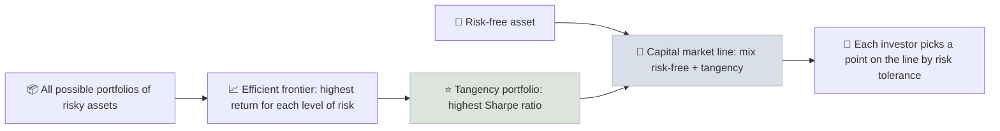

# Modern Portfolio Theory

Modern portfolio theory (MPT) shows that a portfolio's risk depends not only on the risk of each holding but on how the holdings move together, so combining imperfectly correlated assets can raise expected return per unit of risk - the one "free lunch" in investing.

```objectives
time: 55 min
outcomes:
  - Calculate the expected return and volatility of a two-asset portfolio for any correlation
  - Explain the efficient frontier, the tangency portfolio and the capital market line
  - Relate MPT to CAPM, beta and the separation of systematic and idiosyncratic risk
  - Describe MPT's practical limits and how practitioners work around them
prerequisites:
  - "[Sharpe Ratio](../../03-Risk-and-Return/Notes/02-Sharpe-Ratio.mdx)"
  - "[Asset Class Comparison](../../02-Asset-Classes/Notes/06-Asset-Class-Comparison.mdx)"
```

## Why It Matters

<div class="audience-beginner" markdown="1">

If you own two things that don't always go up and down together, the dips in one are partly cushioned by the other. The mix is smoother than either on its own - sometimes without giving up much return. That is diversification, and MPT is the maths behind it. It is why advisors build portfolios of different asset classes instead of picking the single "best" one.

</div>

<div class="audience-analyst" markdown="1">

Markowitz (1952) framed portfolio choice as optimizing mean against variance, with covariance as the key input. Adding a risk-free asset (Tobin, 1958) produces two-fund separation: all investors should hold the same tangency portfolio, levered or de-levered to their risk tolerance. CAPM (Sharpe, 1964) follows if all investors do this, making beta - covariance with the market - the only priced risk. Advisory practice uses the framework while correcting for its estimation-error problem.

</div>

## Two-Asset Portfolio Math

$$
E[R_p] = w_1 E[R_1] + w_2 E[R_2]
$$

$$
\sigma_p^{2} = w_1^{2}\sigma_1^{2} + w_2^{2}\sigma_2^{2} + 2 w_1 w_2 \rho_{12}\, \sigma_1 \sigma_2
$$

Expected return is a weighted average. Volatility is **less** than the weighted average whenever correlation $$\rho < 1$$.

**Example.** Stocks: expected return 10%, volatility 18%. Bonds: 4%, 6%. Risk-free rate 3%.

| Stocks / bonds | Expected return | Volatility (ρ = 1) | Volatility (ρ = 0.1) | Volatility (ρ = -0.2) | Sharpe (ρ = 0.1) |
|---|---|---|---|---|---|
| 100 / 0 | 10.0% | 18.0% | 18.0% | 18.0% | 0.39 |
| 80 / 20 | 8.8% | 15.6% | 14.6% | 14.2% | 0.40 |
| 60 / 40 | 7.6% | 13.2% | 11.3% | 10.6% | 0.41 |
| 40 / 60 | 6.4% | 10.8% | 8.4% | 7.4% | 0.41 |
| 0 / 100 | 4.0% | 6.0% | 6.0% | 6.0% | 0.17 |

With ρ = 0.1, a 60/40 portfolio has the same 7.6% expected return at 11.3% volatility instead of 13.2% - diversification removed about 14% of the risk for free. The lower the correlation, the bigger the benefit.

**Minimum-variance weight** for two assets:

$$
w_1^{*} = \frac{\sigma_2^{2} - \rho\,\sigma_1\sigma_2}{\sigma_1^{2} + \sigma_2^{2} - 2\rho\,\sigma_1\sigma_2}
$$

With these inputs and ρ = 0.1, the minimum-variance portfolio holds about 7% in stocks.

## The Efficient Frontier and the Capital Market Line



$$
E[R_p] = R_f + \frac{E[R_T] - R_f}{\sigma_T}\,\sigma_p
$$

The slope of the capital market line is the tangency portfolio's Sharpe ratio. The separation principle means the **choice of risky portfolio** (same for everyone, in theory) is separate from the **choice of how much risk** (depends on the client) - exactly the split between portfolio construction and [client risk profiling](../../14-Advisory-Practice/Notes/02-Client-Risk-Profiling.mdx).

## Systematic vs Idiosyncratic Risk

As you add stocks, portfolio volatility falls quickly and then levels off. What remains is **systematic** (market) risk, which cannot be diversified away; what disappears is **idiosyncratic** (company-specific) risk. CAPM says only systematic risk earns a premium:

$$
E[R_i] = R_f + \beta_i \left(E[R_m] - R_f\right) \qquad \beta_i = \frac{\text{Cov}(R_i, R_m)}{\sigma_m^{2}}
$$

For US large caps, most diversifiable risk is gone by about 20-30 stocks, though tracking the index closely needs many more. This is the theoretical case for index funds and for the diversification rules in [Position Sizing](04-Position-Sizing.mdx).

## Limits in Practice

| Limit | Practical response |
|---|---|
| **Estimation error** - optimizers amplify errors in expected returns and produce extreme weights | Constrain weights; use Black-Litterman or resampling; start from market-cap weights |
| **Correlations are unstable** and rise in crises | Stress-test with crisis correlations; hold some assets that diversify in inflation too |
| **Volatility is not the only risk** - drawdowns, liquidity, tail events matter | Add drawdown and Sortino analysis; set liquidity rules |
| **Returns are not normal** (fat tails, skew) | Scenario analysis; avoid leverage based on volatility alone |
| **Investors have liabilities and goals**, not just a risk tolerance | Goal-based and asset-liability approaches (see [Asset-Liability Matching](../../14-Advisory-Practice/Notes/03-Asset-Liability-Matching.mdx)) |

## Red Flags

- An optimized portfolio with extreme weights driven by small differences in assumed returns.
- "Diversification" across assets that all depend on the same driver (for example, several equity-like credit funds).
- Correlation estimates from calm periods only.
- Recommending leverage based on a high historical Sharpe ratio.

## Case Studies

**US - the 60/40 portfolio.** For most of 2000-2021, US stocks and Treasuries had low or negative correlation, and a 60/40 portfolio delivered much of the equity return with far lower drawdowns - in 2008, Treasuries rose while stocks fell by about 37%. In 2022, with inflation driving rates up, both fell together and a 60/40 portfolio lost about 16-17%, one of its worst years in decades. MPT did not fail, but its correlation inputs did.

**India - adding international equity.** Indian equity and US equity returns have had moderate correlation, and the rupee has tended to weaken when global risk appetite falls. For an Indian investor, a 15-25% allocation to US equities (via international funds, within overseas investment limits) has historically reduced portfolio volatility in rupee terms while adding exposure to sectors under-represented in India, such as large-cap technology.

> Figures are approximate and for teaching.

## Check Yourself

```quiz
- q: "Two assets have volatilities of 20% and 10% and a correlation of 1. What is the volatility of a 50/50 portfolio?"
  options: ["15%", "11.2%", "22.4%", "10%"]
  answer: 1
  explain: "With perfect correlation there is no diversification benefit, so volatility is the weighted average: 0.5 × 20% + 0.5 × 10% = 15%."
- q: "What does the separation principle say?"
  options: ["Stocks and bonds should be held in separate accounts", "The choice of risky portfolio is the same for all investors, and only the mix with the risk-free asset depends on risk tolerance", "Risk and return are unrelated", "Each investor needs a different efficient frontier"]
  answer: 2
  explain: "With a risk-free asset, everyone holds the tangency portfolio and adjusts risk by adding cash or leverage."
- q: "Why does adding more stocks to a portfolio eventually stop reducing its volatility?"
  options: ["Transaction costs rise", "Only idiosyncratic risk can be diversified away; systematic market risk remains", "Correlations become negative", "Volatility is fixed by regulation"]
  answer: 2
  explain: "Company-specific risk averages out, but all stocks share exposure to the market."
- q: "Why did a 60/40 portfolio perform so badly in 2022?"
  answer: "Inflation-driven rate rises hit both bonds (falling prices as yields rose) and stocks (lower valuations) at the same time, so the usual low or negative stock-bond correlation turned positive and diversification failed."
```

## Exercises

```exercise
- title: Two-asset portfolio
  task: |
    Equities: expected return 9%, volatility 16%. Bonds: 5%, 7%. Correlation 0.2. Compute the expected return and volatility of a 70/30 portfolio. With a 3% risk-free rate, is its Sharpe ratio higher than equities alone?
  solution: |
    E[R] = 0.7 × 9% + 0.3 × 5% = **7.8%**.
    Variance = 0.49 × 0.0256 + 0.09 × 0.0049 + 2 × 0.7 × 0.3 × 0.16 × 0.07 × 0.2 = 0.012544 + 0.000441 + 0.000941 = 0.013926, so volatility ≈ **11.8%**.
    Sharpe: portfolio (7.8 - 3) / 11.8 = **0.41**; equities (9 - 3) / 16 = 0.375. The portfolio is more efficient.
- title: Correlation matrix
  task: |
    Download 10 years of monthly returns for a US or Indian equity index, a government bond index and gold. Compute the correlation matrix for the full period and for the worst 12 months of equity returns. How much do correlations change in the stress period?
```

## Study Notes

- **Portfolio variance** includes a covariance term; volatility falls whenever ρ < 1.
- The **tangency portfolio** has the highest Sharpe ratio; the **CML** mixes it with the risk-free asset.
- **Separation**: what to hold vs how much risk to take.
- Only **systematic risk** is priced (CAPM, beta).
- Practical limits: estimation error, unstable correlations, fat tails, goals and liabilities.

## References

- Markowitz, "Portfolio Selection," *Journal of Finance* (1952)
- Tobin, "Liquidity Preference as Behavior Towards Risk," *Review of Economic Studies* (1958)
- Sharpe, "Capital Asset Prices: A Theory of Market Equilibrium under Conditions of Risk," *Journal of Finance* (1964)
- Black & Litterman, "Global Portfolio Optimization," *Financial Analysts Journal* (1992)
- CFA Institute, *Portfolio Management: Portfolio Risk and Return Part I and II*, CFA Program Level I curriculum (2025)

*Last reviewed: 2026-09*
