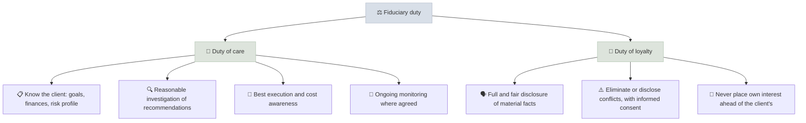

# Fiduciary Duty

A fiduciary duty is a legal obligation to act in the client's best interest - putting the client's interests ahead of your own and your firm's, with care, loyalty and full disclosure of conflicts - which is the standard that separates professional advice from product sales.

```objectives
time: 45 min
outcomes:
  - Explain the duty of care and the duty of loyalty and what each requires in practice
  - Compare the fiduciary standard, Regulation Best Interest and suitability in the US
  - Explain SEBI's investment adviser regime in India, including the separation of advice and distribution
  - Identify common conflicts of interest and how a fiduciary handles each
prerequisites:
  - None - this note frames the whole Advisory Practice module
```

## Why It Matters

<div class="audience-beginner" markdown="1">

Many people who call themselves "financial advisors" are really paid to sell products - the more they sell, or the more expensive the product, the more they earn. A fiduciary must recommend what is best for you, even if it earns them less. Knowing the difference is the first thing any client, and any future advisor, should understand.

</div>

<div class="audience-analyst" markdown="1">

Retail stock picking optimizes return on one's own capital. Advisory practice optimizes a client's outcome under legal duties, disclosure obligations and documented suitability. The same recommendation can be excellent analysis and a regulatory breach if it was not suitable for the client, if a conflict was not disclosed, or if a cheaper equivalent was available and ignored.

</div>

## Advisor vs Stock Picker

| | Retail stock picking | Professional advisory |
|---|---|---|
| Whose money | Your own | The client's |
| Objective | Maximize your return for your risk | Meet the client's goals within their risk profile |
| Standard | None | Fiduciary or best-interest obligation |
| Documentation | Optional | Required: KYC, risk profile, rationale, disclosures |
| Portfolio basis | Best ideas | Asset allocation, diversification, MPT, liabilities |
| Taxes and withdrawals | Your own situation | Client-specific tax planning and cash-flow needs |
| Accountability | To yourself | To the client and the regulator |

## The Two Duties



## United States

| Standard | Who it applies to | Core requirement |
|---|---|---|
| **Fiduciary duty** (Investment Advisers Act of 1940; SEC interpretation, 2019) | Registered investment advisers (RIAs) and their representatives | Duty of care and loyalty over the whole relationship |
| **Regulation Best Interest** (effective June 2020) | Broker-dealers recommending to retail customers | Act in the customer's best interest at the time of the recommendation; disclose and mitigate conflicts; Form CRS |
| **Suitability** (FINRA Rule 2111) | Broker-dealers (non-retail and residual cases) | Recommendation must be suitable for the customer's profile |
| **CFP Board fiduciary duty** (Code and Standards, 2019) | CFP professionals when providing financial advice | Fiduciary duty regardless of registration type |

"Dual registrants" can act as a broker in one account and an adviser in another; the client must be told which hat is on. Form ADV Part 2 (the adviser's brochure) discloses fees, conflicts and disciplinary history.

## India

| Role | Registration | Can do | Cannot do |
|---|---|---|---|
| **Investment Adviser (IA)** | SEBI (Investment Advisers) Regulations, 2013, as amended | Give advice for a fee paid by the client | Receive commissions from product providers on the same client |
| **Research Analyst (RA)** | SEBI (Research Analysts) Regulations, 2014 | Publish research and recommendations | Give personalized portfolio advice (without IA registration) |
| **Mutual fund distributor** | AMFI registration (ARN) with NISM Series V-A | Distribute funds and earn commissions | Call themselves an "adviser" |

Key features of SEBI's IA regime (as amended in 2020 and later):

- **Separation of advice and distribution** - an IA and its family cannot both advise and distribute to the same client (client-level segregation).
- **Fee caps** per family - either a fixed fee or a percentage of assets under advice, with limits set by SEBI (check the current caps).
- **Mandatory risk profiling and suitability** - advice must match the documented risk profile.
- **Written agreement** with the client, record-keeping and annual compliance audits.
- **Qualifications** - NISM Series X-A and X-B certifications (see [India Licensing Path](../../15-Licensing-and-Career/Notes/03-India-Licensing-Path.mdx)).

## Common Conflicts and the Fiduciary Response

| Conflict | Example | Fiduciary response |
|---|---|---|
| Commission-based pay | Recommending a product that pays a higher commission | Use fee-only compensation, or disclose and justify |
| Proprietary products | Firm's own funds when cheaper equivalents exist | Compare with the market; disclose; document why |
| Revenue sharing | Fund companies paying the firm | Disclose in Form ADV / client agreement |
| AUM-based fees | Advising against paying off a mortgage because it lowers AUM | Advise on the whole balance sheet; disclose the incentive |
| Rollover recommendations | Moving a 401(k) or EPF into managed products | Document the cost and benefit comparison |
| Personal trading | Trading ahead of client orders | Code of ethics, pre-clearance, reporting |

## Red Flags (from a client's point of view)

- The "advisor" is paid only when you buy something.
- Recommended products are all from one company, especially the advisor's own.
- No written risk profile or documented reasons for recommendations.
- Insurance-linked investment plans recommended for pure investment goals.
- Reluctance to disclose total annual cost in currency terms.

## Case Studies

**US - the 2016-2020 fiduciary debate.** The US Department of Labor's 2016 fiduciary rule, extending fiduciary duty to retirement advice, was vacated by a federal court in 2018. The SEC's Regulation Best Interest (2019, effective 2020) instead raised broker-dealer standards without making them fiduciaries. The Department of Labor proposed a new rule in 2023-2024, which faced legal challenges. For clients, the practical question remains: "Are you a fiduciary at all times, for all my accounts?"

**India - regular vs direct plans and the IA regime.** Before SEBI's 2020 amendments, many Indian distributors offered "free advice" funded by commissions from regular mutual fund plans. The client-level separation of advice and distribution, and the growth of direct plans, pushed the market toward either commission-based distribution (clearly labelled) or fee-based advice (with fiduciary-style duties). A registered IA recommending direct plans for a fee is the Indian equivalent of a fee-only fiduciary.

## Check Yourself

```quiz
- q: "What are the two components of fiduciary duty?"
  options: ["Care and loyalty", "Speed and accuracy", "Returns and fees", "Suitability and disclosure"]
  answer: 1
  explain: "The duty of care (competent, informed advice) and the duty of loyalty (the client's interest first, conflicts disclosed or eliminated)."
- q: "In the US, which standard applies to a broker-dealer recommending a stock to a retail customer?"
  options: ["No standard", "Regulation Best Interest", "The Investment Advisers Act fiduciary duty only", "Only FINRA's know-your-customer rule"]
  answer: 2
  explain: "Since June 2020, Reg BI requires broker-dealers to act in retail customers' best interest when making recommendations."
- q: "Under SEBI's rules, can a registered investment adviser also earn distribution commissions from the same client?"
  options: ["Yes, if disclosed", "No - advice and distribution must be segregated at the client level", "Only for mutual funds", "Only for insurance"]
  answer: 2
  explain: "The 2020 amendments require client-level segregation of advisory and distribution activities."
- q: "Give two ways a fee based on assets under management can create a conflict of interest."
  answer: "It can discourage advice that reduces managed assets - paying off a mortgage, buying an annuity, funding a business, or keeping money in a bank or employer plan - and it rewards gathering assets rather than giving the best advice. A fiduciary must advise on the whole balance sheet and disclose the incentive."
```

## Exercises

```exercise
- title: Read a Form ADV
  task: |
    Look up one US advisory firm on the SEC's Investment Adviser Public Disclosure site (adviserinfo.sec.gov) and read its Form ADV Part 2A. List its fee structure, three conflicts of interest it discloses, and any disciplinary history. Would you be comfortable as its client?
- title: Conflict role-play
  task: |
    A client with 20 lakh rupees (or 200,000 dollars) in savings and a 7% home loan asks whether to prepay the loan or invest through you. You charge 1% of assets under advice. Write the advice you would give as a fiduciary, including how you disclose your conflict.
  solution: |
    A fiduciary compares the guaranteed, after-tax return of prepaying (7%, less any tax benefit on interest) with the risk-adjusted expected return of investing, and considers liquidity, emergency funds and the client's risk profile. A reasonable answer often splits the money: keep an emergency fund, prepay part of the loan, and invest the rest according to the client's horizon. The advisor must state in writing that investing with them increases their fee while prepaying does not, and document why the recommendation is in the client's interest regardless.
```

## Study Notes

- Fiduciary = **duty of care + duty of loyalty**, for the whole relationship.
- US: **RIAs are fiduciaries**; broker-dealers follow **Reg BI**; CFP professionals owe a fiduciary duty when advising.
- India: **SEBI IA** (fee-based, advice/distribution separated), **RA** (research), **distributors** (commissions, not advisers).
- Identify, eliminate or disclose conflicts, with informed consent.
- Advisory ≠ stock picking: documentation, suitability, goals, taxes and liabilities.

## References

- SEC, [Commission Interpretation Regarding Standard of Conduct for Investment Advisers](https://www.sec.gov/rules/interp/2019/ia-5248.pdf) (2019)
- SEC, [Regulation Best Interest](https://www.sec.gov/regulation-best-interest) (2019, effective June 30, 2020)
- CFP Board, [Code of Ethics and Standards of Conduct](https://www.cfp.net/ethics/code-of-ethics-and-standards-of-conduct) (effective 2019)
- SEBI, [Investment Advisers Regulations, 2013](https://www.sebi.gov.in/) (as amended, including 2020 amendments)
- FINRA, [Rule 2111 - Suitability](https://www.finra.org/rules-guidance/rulebooks/finra-rules/2111)

*Last reviewed: 2026-09*
