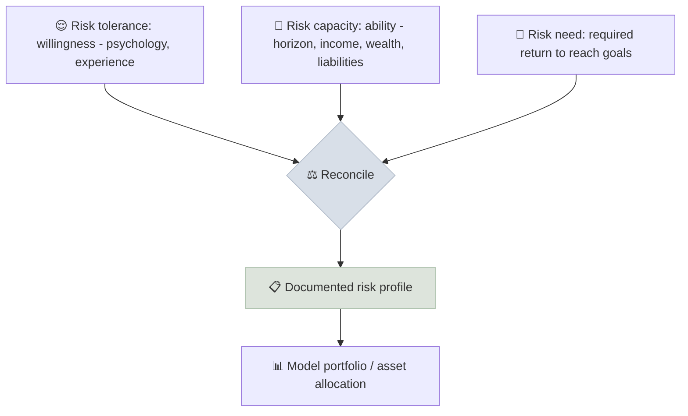

# Client Risk Profiling

Client risk profiling measures three different things - how much risk a client is willing to take (tolerance), how much they can afford to take (capacity) and how much they need to take to reach their goals (need) - and reconciles them into a documented risk profile that drives the portfolio.

```objectives
time: 50 min
outcomes:
  - Distinguish risk tolerance, risk capacity and risk need, and measure each
  - Score a risk questionnaire and map the result to a model portfolio
  - Resolve conflicts between tolerance, capacity and need with a defensible rule
  - Document a risk profile that satisfies US and Indian suitability requirements
prerequisites:
  - "[Fiduciary Duty](01-Fiduciary-Duty.mdx)"
  - "[Modern Portfolio Theory](../../13-Portfolio-Construction/Notes/01-Modern-Portfolio-Theory.mdx)"
```

## Why It Matters

<div class="audience-beginner" markdown="1">

Two people with the same savings can need very different portfolios. One sleeps badly when their account drops 10%; another shrugs off a 30% fall. One needs the money in three years; another in thirty. Risk profiling asks the right questions so the portfolio fits the person - and so they can stick with it when markets fall.

</div>

<div class="audience-analyst" markdown="1">

MPT's separation principle says the risky portfolio is common and only the mix with safe assets differs by client. Risk profiling is how that mix is chosen. The practical challenge is that stated tolerance is noisy and pro-cyclical (it rises in bull markets), while capacity is objective and need is computable. A robust process anchors on capacity and need and uses tolerance as a behavioural constraint.

</div>

## The Three Dimensions



| Dimension | Question | How to measure |
|---|---|---|
| **Tolerance** (willingness) | How much volatility and loss can the client endure without selling? | Psychometric questionnaire; past behavior in crashes |
| **Capacity** (ability) | How much loss can the client absorb without harming essential goals? | Horizon, income stability, emergency fund, net worth, dependants, liabilities |
| **Need** | What return is required to reach the goals? | Financial plan: required return from goals, savings and horizon |

### Required Return

$$
\text{Goal} = \text{PV} \times (1 + r)^{n} + \text{PMT} \times \frac{(1 + r)^{n} - 1}{r}
$$

Solve for $$r$$. If the required return is 4%, there is little need for an aggressive portfolio even if tolerance is high; if it is 12%, the plan may need more saving, a later date or a smaller goal rather than more risk.

## Reconciling Conflicts

| Situation | Rule |
|---|---|
| Tolerance > capacity | **Capacity wins.** A young, risk-loving client with an unstable income and no emergency fund still gets a conservative core. |
| Capacity > tolerance | Start at tolerance; educate; move gradually. A portfolio the client abandons in a crash is worse than a milder one they keep. |
| Need > both | Change the plan (save more, retire later, lower the goal), not the risk level. |
| Need < both | Consider taking less risk than allowed - "you have already won the game." |

The final profile is usually the **lowest** of the three, adjusted by discussion and documented with reasons.

## A Sample Questionnaire (Tolerance)

| # | Question | Answers (score) |
|---|---|---|
| 1 | Your portfolio falls 20% in three months. You... | Sell everything (1) / Sell some (2) / Hold (3) / Buy more (4) |
| 2 | Which annual outcome range would you choose? | +4% to +6% (1) / -5% to +15% (2) / -15% to +25% (3) / -30% to +45% (4) |
| 3 | How familiar are you with equity investing? | None (1) / Some funds (2) / Stocks and funds (3) / Professional (4) |
| 4 | In 2020 or 2008, what did you actually do? | Sold (1) / Stopped investing (2) / Held (3) / Invested more (4) / N/A (2) |
| 5 | What matters most? | Protecting capital (1) / Steady income (2) / Balanced growth (3) / Maximum growth (4) |

**Score 5-8:** conservative. **9-12:** moderate. **13-16:** growth. **17-20:** aggressive. Validated psychometric tools (for example, FinaMetrica-style questionnaires) are more reliable than ad hoc ones; actual past behavior is the best evidence of all.

## Mapping to Model Portfolios

| Profile | Equity | Bonds | Cash / short-term | Max expected drawdown (rough) |
|---|---|---|---|---|
| Conservative | 20-30% | 50-60% | 15-25% | -10% to -15% |
| Moderate | 40-60% | 30-50% | 5-10% | -20% to -25% |
| Growth | 60-80% | 15-35% | 0-5% | -30% to -35% |
| Aggressive | 85-100% | 0-15% | 0-5% | -40% to -50% |

Each goal can have its own profile: a house deposit in 2 years is "conservative" even for an aggressive client.

## Regulatory Requirements

| | US | India |
|---|---|---|
| Know-your-customer | FINRA Rule 2090; adviser duty of care | SEBI KYC through KYC Registration Agencies (KRAs) |
| Profile factors | Reg BI / suitability: age, other investments, financial situation, tax status, objectives, horizon, liquidity, risk tolerance | SEBI IA Regulations: risk profiling mandatory; advice must be suitable; profile shared with the client |
| Documentation | Records of profile and rationale | Written risk profile, client acknowledgement, periodic review |

## Red Flags

- A single questionnaire score used as the whole profile, with no capacity or need analysis.
- Profiles updated upward after a bull market to justify more risk.
- The same portfolio recommended to every client.
- Clients with high-cost debt or no emergency fund put into equity-heavy portfolios.

## Case Studies

**US - retirees in 2008.** Many US near-retirees held 70-80% equity allocations in 2007 based on high stated risk tolerance after a strong market. When equities fell by about half from their 2007 peak to their March 2009 low, some sold near the bottom and locked in losses they could not recover before retiring. Their capacity (short horizon, no earned income ahead) should have limited their allocation regardless of tolerance.

**India - new investors in 2020-2021.** Millions of first-time Indian investors opened demat accounts during the 2020-2021 rally, often with little experience of a bear market. Surveys and exchange data showed many trading derivatives with high losses (SEBI's 2023 study found about 9 in 10 individual F&O traders lost money). Risk profiling that tested behavior and capacity - not just enthusiasm - would have steered many toward diversified SIPs instead.

## Check Yourself

```quiz
- q: "A 30-year-old with high stated risk tolerance has no emergency fund, credit card debt and a commission-only income. Which dimension should dominate?"
  options: ["Tolerance - they want risk", "Capacity - their finances cannot absorb large losses", "Need - they want high returns", "None - use the market portfolio"]
  answer: 2
  explain: "When tolerance exceeds capacity, capacity wins. Fix the emergency fund and debt first."
- q: "A client needs only a 3% return to fund all goals but has high tolerance and capacity. What might a fiduciary suggest?"
  options: ["The most aggressive portfolio", "Considering less risk than allowed, since the goals do not require it", "Only cash", "Leverage"]
  answer: 2
  explain: "When need is low, taking unnecessary risk can jeopardize goals already within reach."
- q: "Why is past behavior in a crash better evidence of tolerance than a questionnaire?"
  answer: "Questionnaires capture what people say they would do, which shifts with recent market moves. What they actually did under real losses reveals their true willingness to hold through volatility."
```

## Exercises

```exercise
- title: Profile a client
  task: |
    Profile this client and recommend an allocation: age 52, salaried, 60 lakh rupees (or 600,000 dollars) invested, saves 30% of income, one child starting university in 4 years (cost 25 lakh / 250,000), wants to retire at 60 with a corpus of 3 crore (or 3 million). Questionnaire score 15. Compute the required return for retirement and explain how you reconcile tolerance, capacity and need.
  hints:
    - "Separate the university goal (4 years) from the retirement goal (8 years)."
- title: Required return
  task: |
    A client has 1,000,000 today, saves 50,000 a year and needs 2,500,000 in 12 years. What annual return is required?
  solution: |
    Solve 1,000,000 × (1 + r)^12 + 50,000 × ((1 + r)^12 - 1) / r = 2,500,000. By trial: at 5%, FV = 1,795,856 + 795,856 = 2,591,712, which is slightly above target. At 4.5%, FV = 1,695,881 + 773,202 = 2,469,083, slightly below. The required return is about **4.6%** - achievable with a moderate portfolio.
```

## Study Notes

- **Tolerance** (willing), **capacity** (able), **need** (required).
- Capacity overrides tolerance; if need exceeds both, change the plan, not the risk.
- Map profiles to model portfolios; profile **each goal** separately.
- Document profiles and reasons (Reg BI / suitability in the US; SEBI IA rules in India).

## References

- CFA Institute, *Private Wealth Management: Asset Allocation to Achieve Client Goals*, CFA Program Level III curriculum (2025)
- Grable & Lytton, "Financial Risk Tolerance Revisited," *Financial Services Review* (1999)
- FINRA, [Rule 2090 - Know Your Customer](https://www.finra.org/rules-guidance/rulebooks/finra-rules/2090)
- SEBI, Investment Advisers Regulations, 2013 - risk profiling and suitability provisions (as amended)
- SEBI, *Study on analysis of profit and loss of individual traders dealing in equity F&O segment* (January 2023), available on sebi.gov.in

*Last reviewed: 2026-09*
