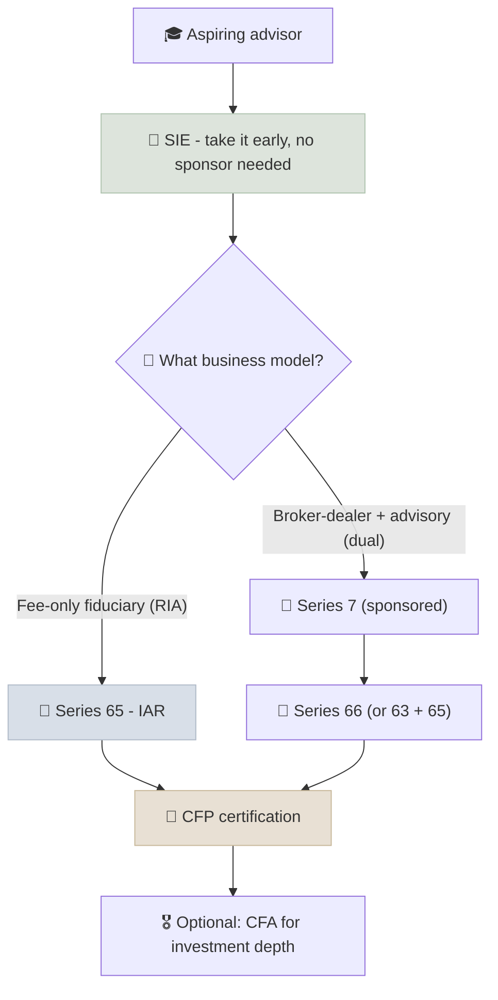

# US Path - SIE, Series 7/65/66, CFP

In the US, giving investment advice or selling securities requires passing FINRA and NASAA qualification exams and registering through a firm or as an adviser; the CFP certification then adds a planning credential with its own education, exam, experience and ethics requirements.

```objectives
time: 40 min
outcomes:
  - Map each US exam (SIE, Series 7, 63, 65, 66) to the role it qualifies you for
  - Explain which exams need firm sponsorship and which do not
  - Plan a route to becoming an investment adviser representative and CFP professional
  - Identify the designations that can waive the Series 65
prerequisites:
  - "[Fiduciary Duty](../../14-Advisory-Practice/Notes/01-Fiduciary-Duty.mdx) - broker-dealers vs advisers"
```

> Exam formats, question counts, fees and state rules change. Treat this page as a map and confirm details with FINRA, NASAA, your state securities regulator and CFP Board before registering.

## Why It Matters

<div class="audience-beginner" markdown="1">

You can study investing on your own forever, but to be paid for advising other people in the US you need specific licenses. The good news is the path is well defined, and the first exam (the SIE) can be taken by anyone aged 18 or over, before you even have a finance job.

</div>

<div class="audience-analyst" markdown="1">

The licensing map mirrors the regulatory split between broker-dealers (FINRA-registered representatives, commission-based, Reg BI) and investment advisers (state or SEC-registered, fiduciary, fee-based). Choosing exams is therefore a choice of business model. The CFP and CFA are voluntary credentials that signal competence and, in most states, substitute for the Series 65.

</div>

## The Exams

| Exam | Administered by | Qualifies you for | Firm sponsorship? | Format (approximate) |
|---|---|---|---|---|
| **SIE** (Securities Industry Essentials) | FINRA | Foundation for FINRA representative licenses; valid 4 years | **No** - open to anyone 18+ | 75 scored questions, 1 hr 45 min, 70% to pass |
| **Series 7** (General Securities Representative) | FINRA | Selling most securities at a broker-dealer (with SIE) | **Yes** | 125 scored questions, 3 hr 45 min, 72% to pass |
| **Series 63** (Uniform Securities Agent State Law) | NASAA | State registration as a securities agent | No | 60 scored questions, 75 min |
| **Series 65** (Uniform Investment Adviser Law) | NASAA | Investment adviser representative (IAR) - fee-based advice | **No** | 130 scored questions, 180 min |
| **Series 66** (Uniform Combined State Law) | NASAA | Combines 63 + 65 for those who also hold the Series 7 | No, but requires the Series 7 to be effective | 100 scored questions, 150 min |

## Choosing a Route



| Target role | Typical licenses |
|---|---|
| Fee-only adviser at an RIA | Series 65 (or waiver via CFP/CFA), state IAR registration |
| Financial advisor at a wirehouse or broker-dealer | SIE, Series 7, Series 66 (or 63 + 65) |
| Equity research analyst at a broker-dealer | SIE, Series 7, Series 86/87 (Research Analyst) |
| Portfolio manager at an asset manager | Often none required; CFA charter strongly preferred |

**Series 65 waivers:** most states waive the Series 65 for holders of the **CFP, CFA, ChFC, PFS or CIC** designations. Check your state.

## CFP Certification

CFP Board's "four E's":

| Requirement | Detail (approximate) |
|---|---|
| **Education** | A bachelor's degree, plus CFP Board-registered coursework covering the planning topics (or a qualifying credential such as the CFA charter or a CPA) |
| **Exam** | 170 multiple-choice questions over two 3-hour sessions, covering professional conduct, general planning, risk and insurance, investments, tax, retirement, estate and psychology of financial planning |
| **Experience** | 6,000 hours of professional planning experience, or 4,000 hours under an apprenticeship standard |
| **Ethics** | Commit to CFP Board's Code of Ethics and Standards of Conduct, including a fiduciary duty when giving financial advice |

The exam can be taken before the experience is complete; certification is granted once all four are met. Continuing education is required every two years.

## A Realistic Timeline

| Stage | Months | Output |
|---|---|---|
| This course, modules 1-14 | 6-12 | Foundations, analysis, portfolio and advisory knowledge |
| SIE | 1-2 | Passed exam; resume signal for entry-level roles |
| Entry-level role (paraplanner, associate, operations) | Ongoing | Sponsorship, experience hours |
| Series 65 (or 7 + 66 if sponsored) | 2-3 | Registered as an IAR / representative |
| CFP coursework and exam | 12-18 | CFP exam passed |
| Experience completes | 24-36 from start | CFP certification |

## Red Flags

- "Advisors" who hold only insurance licenses recommending securities portfolios.
- Planning to pass the Series 7 without a sponsoring firm - it is not possible.
- Unverified credentials - check any individual on FINRA BrokerCheck and the SEC's Investment Adviser Public Disclosure site.

## Check Yourself

```quiz
- q: "Which exam can you take without being sponsored by a firm?"
  options: ["Series 7", "SIE", "Series 86", "Series 24"]
  answer: 2
  explain: "The SIE is open to anyone 18 or older. The Series 7 requires firm sponsorship."
- q: "Which exam qualifies you as an investment adviser representative for fee-based advice?"
  options: ["Series 63", "Series 65", "Series 7", "SIE"]
  answer: 2
  explain: "The Series 65 (Uniform Investment Adviser Law) qualifies IARs."
- q: "What must a candidate hold for a Series 66 to cover both agent and adviser registration?"
  options: ["The CFA charter", "The Series 7", "A CPA license", "Nothing"]
  answer: 2
  explain: "The Series 66 combines the 63 and 65 but requires the Series 7 as a corequisite."
- q: "Name the four requirements for CFP certification."
  answer: "Education (a bachelor's degree plus registered coursework), the CFP exam, professional experience (6,000 hours or 4,000 under an apprenticeship standard), and ethics (agreeing to CFP Board's Code and Standards)."
```

## Exercises

```exercise
- title: Plan your route
  task: |
    Decide which role you are targeting (fee-only RIA adviser, broker-dealer advisor, research analyst or portfolio manager). List the exams and credentials you need, whether each needs sponsorship, and a month-by-month plan for the next 24 months.
- title: Check a professional
  task: |
    Look up two financial professionals on FINRA BrokerCheck or adviserinfo.sec.gov. Record their licenses, registrations, employment history and any disclosures. What would you ask them before becoming a client?
```

## Study Notes

- **SIE** (no sponsor) → **Series 7** (sponsor) for brokers; **Series 65** (no sponsor) for advisers; **Series 66** = 63 + 65 with the Series 7.
- CFP/CFA/ChFC/PFS/CIC can **waive the Series 65** in most states.
- **CFP**: education, exam, experience, ethics - with a fiduciary duty when advising.
- Choose exams by **business model**: fee-only fiduciary vs broker-dealer.

## References

- FINRA, [Qualification Exams](https://www.finra.org/registration-exams-ce/qualification-exams) (accessed 2026)
- NASAA, [Exams: Series 63, 65 and 66](https://www.nasaa.org/exams/) (accessed 2026)
- CFP Board, [Become a CFP Professional](https://www.cfp.net/become-a-cfp-professional) (accessed 2026)
- FINRA, [BrokerCheck](https://brokercheck.finra.org/); SEC, [Investment Adviser Public Disclosure](https://adviserinfo.sec.gov/)

*Last reviewed: 2026-09*
