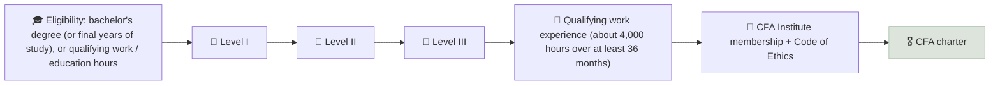

# The CFA Program

The Chartered Financial Analyst (CFA) Program is a three-level, self-study graduate-level curriculum and exam series in investment analysis and portfolio management, run by CFA Institute and recognized globally; the charter also requires qualifying work experience and a commitment to its Code of Ethics.

```objectives
time: 35 min
outcomes:
  - Describe the structure, topics and format of CFA Levels I, II and III
  - Explain the eligibility and work-experience requirements for the charter
  - Map this course's modules onto the CFA curriculum
  - Decide whether the CFA, the CFP, or both fit your target career
prerequisites:
  - "[US Path - SIE, Series 7/65/66, CFP](01-US-Licensing-Path.mdx) or [India Path](03-India-Licensing-Path.mdx)"
```

> CFA Institute updates the curriculum, exam format and fees regularly. Confirm current details at cfainstitute.org before registering.

## Why It Matters

<div class="audience-beginner" markdown="1">

The CFA charter is one of the most respected qualifications in investment management worldwide. It takes most people three to four years of study alongside a job, and many candidates do not pass every level the first time. It is not required to be an advisor, but it is strong proof that you understand investments deeply.

</div>

<div class="audience-analyst" markdown="1">

The CFA is a breadth-then-depth program: Level I tests knowledge across ten topic areas, Level II tests application through valuation-heavy vignettes, and Level III tests synthesis in portfolio management and wealth planning. It overlaps heavily with this course's analytical modules and complements the CFP, which is broader on tax, estate and insurance planning.

</div>

## Structure

| Level | Focus | Format (approximate) | Recommended study |
|---|---|---|---|
| **Level I** | Tools and concepts: ethics, quantitative methods, economics, financial statement analysis, corporate issuers, equity, fixed income, derivatives, alternatives, portfolio management | 180 multiple-choice questions in two sessions (about 4.5 hours) | 300+ hours |
| **Level II** | Application and valuation, especially equity, fixed income, FRA and derivatives | Item-set vignettes | 300+ hours |
| **Level III** | Portfolio management and wealth planning, with a choice of specialized pathways (for example portfolio management, private markets or private wealth) | Item sets and constructed-response (essay) questions | 300+ hours |

CFA Institute has also added **Practical Skills Modules** (for example, financial modeling and Python) that candidates complete alongside the exams.

## Eligibility and the Charter



Historical pass rates have typically been around 40-50% at Level I and similar or lower at later levels; they vary by sitting. The whole program commonly takes 3-4 years.

## How This Course Maps to the CFA Curriculum

| This course | CFA topic areas |
|---|---|
| [Money & Compounding](../../01-Money-and-Compounding/INDEX.mdx) | Quantitative Methods (time value of money) |
| [Asset Classes](../../02-Asset-Classes/INDEX.mdx) | Fixed Income, Equity, Alternatives |
| [Risk & Return](../../03-Risk-and-Return/INDEX.mdx), [Portfolio Construction](../../13-Portfolio-Construction/INDEX.mdx) | Portfolio Management |
| [Accounting](../../04-Accounting-Foundations/INDEX.mdx), [Metric Toolkit](../../05-Metric-Toolkit/INDEX.mdx), [Annual Report Analysis](../../11-Annual-Report-Analysis/INDEX.mdx) | Financial Statement Analysis, Corporate Issuers |
| [Valuation](../../06-Valuation/INDEX.mdx) | Equity Investments (Levels I and II) |
| [Fiduciary Duty](../../14-Advisory-Practice/Notes/01-Fiduciary-Duty.mdx) | Ethical and Professional Standards |
| [Advisory Practice](../../14-Advisory-Practice/INDEX.mdx) | Level III private wealth topics |

## CFA vs CFP

| | CFA | CFP |
|---|---|---|
| Focus | Investment analysis and portfolio management | Comprehensive personal financial planning |
| Depth in valuation and markets | Very deep | Moderate |
| Coverage of tax, estate, insurance, retirement | Limited (more at Level III) | Deep |
| Typical time | 3-4 years | 1.5-3 years |
| Best for | Research analysts, portfolio managers, institutional roles | Client-facing planners and advisors |
| Recognition | Global | Strongest in the US; offered in India via FPSB India and in many other countries |

Many senior wealth advisors hold both: the CFA for investment depth, the CFP for planning breadth.

## Red Flags

- Starting Level I without a study plan and 300+ hours budgeted.
- Treating the charter as a substitute for licensing - it does not by itself register you to advise clients (though it can waive the Series 65 in most US states).

## Check Yourself

```quiz
- q: "Which CFA level focuses on portfolio management and wealth planning?"
  options: ["Level I", "Level II", "Level III"]
  answer: 3
  explain: "Level III is about synthesis in portfolio management and private wealth, including constructed-response questions."
- q: "Which is true about the CFA charter?"
  options: ["Passing Level III is enough to use the charter", "You also need qualifying work experience and CFA Institute membership", "It replaces all licensing exams", "It can only be earned in the US"]
  answer: 2
  explain: "The charter requires passing all three levels, qualifying work experience, and membership with a commitment to the Code of Ethics."
- q: "Which credential fits a client-facing planner who needs depth in tax, estate and retirement planning better - CFA or CFP - and why?"
  answer: "The CFP, because its curriculum covers comprehensive personal financial planning, including tax, estate, insurance and retirement, while the CFA focuses on investment analysis and portfolio management."
```

## Exercises

```exercise
- title: Level I readiness check
  task: |
    Take the CFA Institute's free Level I sample questions (or practice exam). Score each topic area, map weak areas to this course's modules using the table above, and build a 20-week study plan from the [Study Checklists](04-Study-Checklists.mdx).
```

## Study Notes

- Three levels: **knowledge (I), application (II), synthesis (III)**; about 300+ study hours each.
- Charter = exams + **work experience** + membership + ethics.
- Strong fit for analysts and portfolio managers; pair with the **CFP** for client planning.
- Can waive the **Series 65** in most US states.

## References

- CFA Institute, [CFA Program](https://www.cfainstitute.org/programs/cfa-program) - curriculum, eligibility and exam information (accessed 2026)
- CFA Institute, [Code of Ethics and Standards of Professional Conduct](https://www.cfainstitute.org/standards/professionals/code-ethics-standards) (accessed 2026)
- FPSB India, [CFP certification in India](https://www.fpsbindia.org/) (accessed 2026)

*Last reviewed: 2026-09*
