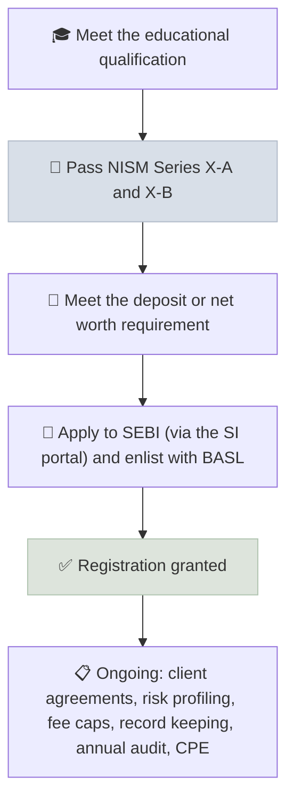

# India Path - NISM & SEBI RIA

In India, securities market professionals qualify through NISM certification exams, and anyone giving investment advice for a fee or publishing research recommendations must register with SEBI as an Investment Adviser (RIA) or Research Analyst (RA), subject to qualification, deposit or net worth, and conduct rules.

```objectives
time: 40 min
outcomes:
  - Map the main NISM certifications to the roles they qualify you for
  - Explain the difference between a mutual fund distributor, an investment adviser and a research analyst in India
  - Outline the SEBI registration process for an individual investment adviser
  - Plan a route to becoming a SEBI-registered investment adviser
prerequisites:
  - "[Fiduciary Duty](../../14-Advisory-Practice/Notes/01-Fiduciary-Duty.mdx) - SEBI's IA regime"
```

> SEBI regulations, NISM exam formats and eligibility rules are revised regularly - including significant amendments to the IA and RA regulations in late 2024. Treat this page as a map and confirm current requirements on sebi.gov.in and nism.ac.in before applying.

## Why It Matters

<div class="audience-beginner" markdown="1">

In India, anyone can talk about stocks - but charging a fee for personal investment advice, or publishing buy and sell recommendations, legally requires SEBI registration. The first step is passing the right NISM exams, which anyone can take online.

</div>

<div class="audience-analyst" markdown="1">

India's regime separates three roles more sharply than most markets: distribution (commission-based, AMFI/ARN), advice (fee-based, SEBI IA, with client-level separation from distribution) and research (SEBI RA). The choice of registration defines permitted revenue models, disclosure duties and supervision - by BSE Administration and Supervision Ltd (BASL) for IAs and RAs.

</div>

## The Roles

| Role | Registration | Key NISM exam(s) | Paid by | Can give personalized advice? |
|---|---|---|---|---|
| **Mutual fund distributor** | AMFI (ARN) | Series V-A | Commissions from AMCs | No - may not call themselves "adviser" |
| **Investment Adviser (RIA)** | SEBI (IA Regulations, 2013) | Series X-A (Level 1) and X-B (Level 2) | Fees from clients only | Yes, with risk profiling and suitability |
| **Research Analyst (RA)** | SEBI (RA Regulations, 2014) | Series XV | Subscribers / employer | Research and recommendations, not portfolio advice |
| **PMS distributor / manager** | SEBI (PMS Regulations) | Series XXI-A (distributors), XXI-B (managers) | Fees | Discretionary portfolio management (managers) |
| **Stockbroker staff / dealers** | Through a SEBI-registered broker | Series VII, VIII (derivatives) | Employer | Execution, not advice |

NISM certificates are generally valid for **three years**, renewed by retaking the exam or through continuing professional education (CPE).

## Becoming an Individual Investment Adviser



**Qualification.** Under the 2020 rules, individual advisers needed a relevant postgraduate degree, or a graduate degree plus five years of relevant experience. SEBI's late-2024 amendments relaxed the qualification and experience requirements and replaced the net worth requirement for individuals with a deposit that scales with the number of clients. Check the current regulation text for exact numbers.

**Conduct rules** (see [Fiduciary Duty](../../14-Advisory-Practice/Notes/01-Fiduciary-Duty.mdx)):

- Client-level **separation of advice and distribution**
- **Fee caps** - a fixed-fee limit or a percentage of assets under advice, per family
- Written **agreement**, **risk profiling** and **suitability** for every client
- Disclosure of conflicts, and an **annual compliance audit**
- Grievance redressal through **SCORES** and the online dispute resolution (ODR) platform

## Other Credentials

| Credential | Offered by | Fit |
|---|---|---|
| **CFP (India)** | FPSB India | Comprehensive financial planning; recognized alongside RIA registration |
| **CFA charter** | CFA Institute | Research, portfolio management, institutional roles |
| **NISM Series XV (RA)** + CFA | NISM, CFA Institute | Equity research at brokers and independent research firms |
| **NISM Series XXI-B** | NISM | Portfolio manager at a PMS |

## A Realistic Route

| Stage | Months | Output |
|---|---|---|
| This course, modules 1-14 | 6-12 | Foundations, analysis, portfolio and advisory knowledge |
| NISM Series V-A | 1 | Understanding of mutual fund products and regulation |
| NISM Series XV | 1-2 | Research analyst certification - useful for research roles |
| NISM Series X-A and X-B | 3-4 | Required for IA registration |
| Work at an RIA, PMS, AMC or broker | Ongoing | Experience and client exposure |
| SEBI IA registration (or join an RIA firm) | When ready | Registered to give fee-based advice |
| CFP (FPSB India) or CFA (optional) | 12-36 | Additional credibility and depth |

## Red Flags

- "Advisers" on social media or messaging apps charging fees for tips without SEBI RA or IA registration - SEBI has repeatedly acted against unregistered "finfluencers."
- Distributors describing themselves as independent advisers.
- Guaranteed-return claims, which SEBI rules prohibit.
- Any request to share login credentials or trade in a client's account.

## Check Yourself

```quiz
- q: "Which NISM certifications are required for SEBI investment adviser registration?"
  options: ["Series V-A only", "Series X-A and X-B", "Series VIII", "Series XV only"]
  answer: 2
  explain: "Investment advisers need NISM Series X-A (Level 1) and X-B (Level 2)."
- q: "Which registration do you need to publish buy and sell recommendations on listed stocks for paying subscribers?"
  options: ["AMFI ARN", "SEBI Research Analyst", "No registration", "A stockbroker license"]
  answer: 2
  explain: "Publishing securities recommendations for compensation requires SEBI RA registration (NISM Series XV)."
- q: "Can a mutual fund distributor with an ARN call themselves a 'financial adviser'?"
  options: ["Yes", "No - SEBI rules reserve 'adviser' for registered investment advisers", "Only for insurance products"]
  answer: 2
  explain: "Distributors must not use the term adviser; advice for a fee requires IA registration."
- q: "Why does SEBI separate advice and distribution at the client level?"
  answer: "To remove the conflict of interest in which the person advising a client is also paid commissions by the product providers they recommend. A client either receives fee-based advice or commission-based distribution from a given adviser family, not both."
```

## Exercises

```exercise
- title: Verify a registration
  task: |
    On SEBI's website, look up the list of registered investment advisers and research analysts. Find two registered IAs in your city and record their registration numbers and validity. Then find a well-known social media stock-tips account and check whether it is registered.
- title: Plan your certifications
  task: |
    Choose your target role (distributor, IA, RA or PMS). List the NISM exams and registrations you need, their order, and a 12-month study calendar using the [Study Checklists](04-Study-Checklists.mdx).
```

## Study Notes

- **Distributor** (AMFI, V-A, commissions) vs **IA** (SEBI, X-A + X-B, fees) vs **RA** (SEBI, XV, research).
- IA duties: **separation of advice and distribution, fee caps, risk profiling, suitability, audit**.
- NISM certificates last about **three years**; renew via CPE or re-examination.
- IA and RA rules were amended significantly in late 2024 - always check the current text.

## References

- SEBI, [Investment Advisers Regulations, 2013](https://www.sebi.gov.in/) (as amended, including 2020 and 2024 amendments)
- SEBI, [Research Analysts Regulations, 2014](https://www.sebi.gov.in/) (as amended)
- NISM, [Certification examinations](https://www.nism.ac.in/) (accessed 2026)
- BSE Administration and Supervision Ltd (BASL) - administration and supervision body for IAs and RAs (see the BSE website)
- AMFI, [ARN registration for mutual fund distributors](https://www.amfiindia.com/) (accessed 2026)

*Last reviewed: 2026-09*
