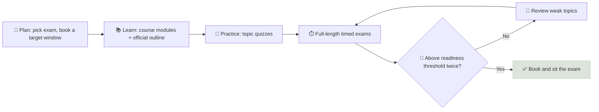

# Study Checklists

Actionable, week-by-week study plans for the main exams on the path from beginner to licensed advisor - the SIE, Series 65, CFP, CFA Level I and the NISM X-A, X-B and XV certifications - each mapped to the modules of this course that cover the same ground.

```objectives
time: 20 min to plan; weeks to months to execute
outcomes:
  - Choose the exam sequence that fits your target role and market
  - Follow a week-by-week plan with explicit course modules, practice targets and review checkpoints
  - Track readiness with objective practice-exam thresholds rather than feel
prerequisites:
  - "[US Path](01-US-Licensing-Path.mdx) or [India Path](03-India-Licensing-Path.mdx)"
```

## How to Use These Checklists

<div class="audience-beginner" markdown="1">

Copy the checklist for your exam into your [research repository](../../12-Research-Templates/Notes/01-Repository-Setup.mdx), tick items off as you go, and do not book the exam until you are consistently scoring above the readiness threshold on practice tests.

</div>

<div class="audience-analyst" markdown="1">

Readiness is best measured by timed, full-length practice exams under exam conditions, tracked by topic. Aim for a margin of 5-10 points above the pass mark before booking; score variance on the real exam is real, and the cost of a retake is weeks, not money.

</div>



## SIE (US) - 6 weeks, about 60-80 hours

- [ ] **Week 1** - Capital markets, market participants and structure. Course: [Equities](../../02-Asset-Classes/Notes/03-Equities.mdx), [Cash Equivalents](../../02-Asset-Classes/Notes/01-Cash-Equivalents.mdx)
- [ ] **Week 2** - Products: equities, debt, options basics, packaged products. Course: [Bonds](../../02-Asset-Classes/Notes/02-Sovereign-and-Corporate-Bonds.mdx), [Funds](../../02-Asset-Classes/Notes/04-Index-Funds-ETFs-and-Mutual-Funds.mdx)
- [ ] **Week 3** - Investment risks, trading, customer accounts
- [ ] **Week 4** - Regulatory framework, prohibited activities, FINRA rules
- [ ] **Week 5** - Topic quizzes; two full practice exams
- [ ] **Week 6** - Review weak topics; two more full exams
- [ ] **Readiness:** 80%+ on two consecutive full practice exams (pass mark 70%)

## Series 65 (US) - 8 weeks, about 80-100 hours

- [ ] **Weeks 1-2** - Economic factors and business information; time value of money, statistics. Course: [Money & Compounding](../../01-Money-and-Compounding/INDEX.mdx), [Risk & Return](../../03-Risk-and-Return/INDEX.mdx)
- [ ] **Weeks 3-4** - Investment vehicle characteristics. Course: [Asset Classes](../../02-Asset-Classes/INDEX.mdx), [Valuation](../../06-Valuation/INDEX.mdx)
- [ ] **Week 5** - Client investment recommendations and strategies. Course: [Portfolio Construction](../../13-Portfolio-Construction/INDEX.mdx), [Client Risk Profiling](../../14-Advisory-Practice/Notes/02-Client-Risk-Profiling.mdx)
- [ ] **Week 6** - Laws, regulations and ethics (the largest section). Course: [Fiduciary Duty](../../14-Advisory-Practice/Notes/01-Fiduciary-Duty.mdx)
- [ ] **Weeks 7-8** - Four or more full practice exams; review
- [ ] **Readiness:** 80%+ on full practice exams (pass mark about 72%)

## CFA Level I - 20 weeks, about 300 hours

| Weeks | Topics | Course modules |
|---|---|---|
| 1-2 | Quantitative methods | [Money & Compounding](../../01-Money-and-Compounding/INDEX.mdx), [Risk & Return](../../03-Risk-and-Return/INDEX.mdx) |
| 3 | Economics | - |
| 4-7 | Financial statement analysis | [Accounting](../../04-Accounting-Foundations/INDEX.mdx), [Metric Toolkit](../../05-Metric-Toolkit/INDEX.mdx), [Annual Report Analysis](../../11-Annual-Report-Analysis/INDEX.mdx) |
| 8 | Corporate issuers | [ROIC vs WACC](../../05-Metric-Toolkit/Notes/03-ROIC-vs-WACC.mdx), [Leverage](../../05-Metric-Toolkit/Notes/05-Leverage-Ratios.mdx) |
| 9-10 | Equity investments | [Equities](../../02-Asset-Classes/Notes/03-Equities.mdx), [Valuation](../../06-Valuation/INDEX.mdx) |
| 11-12 | Fixed income | [Bonds](../../02-Asset-Classes/Notes/02-Sovereign-and-Corporate-Bonds.mdx), [Reinvestment Risk](../../01-Money-and-Compounding/Notes/02-Reinvestment-Risk.mdx) |
| 13 | Derivatives | - |
| 14 | Alternative investments | [Alternatives](../../02-Asset-Classes/Notes/05-Alternatives-REITs-and-Commodities.mdx) |
| 15 | Portfolio management | [Modern Portfolio Theory](../../13-Portfolio-Construction/Notes/01-Modern-Portfolio-Theory.mdx) |
| 16 | Ethical and professional standards | [Fiduciary Duty](../../14-Advisory-Practice/Notes/01-Fiduciary-Duty.mdx) + CFA Standards handbook |
| 17-20 | Mock exams and review | Knowledge Check quizzes |

- [ ] **Readiness:** 70%+ on at least two full mock exams, with no topic below 60%

## CFP Exam - after coursework, 12 weeks

- [ ] **Weeks 1-2** - Professional conduct and regulation; general planning principles
- [ ] **Weeks 3-4** - Investment planning. Course: this course's Foundations and Portfolio tracks
- [ ] **Weeks 5-6** - Tax planning. Course: [Tax-Efficient Withdrawals](../../14-Advisory-Practice/Notes/04-Tax-Efficient-Withdrawals.mdx)
- [ ] **Weeks 7-8** - Retirement savings and income planning; risk management and insurance
- [ ] **Week 9** - Estate planning; psychology of financial planning
- [ ] **Weeks 10-12** - Case studies and full practice exams
- [ ] **Readiness:** consistently above about 70% on full-length practice exams

## NISM Series X-A and X-B (India) - 8 weeks each

**X-A (Level 1)**

- [ ] **Weeks 1-2** - Investment landscape, asset classes and products. Course: [Asset Classes](../../02-Asset-Classes/INDEX.mdx)
- [ ] **Weeks 3-4** - Risk and return, time value of money, behavioral finance. Course: [Money & Compounding](../../01-Money-and-Compounding/INDEX.mdx), [Risk & Return](../../03-Risk-and-Return/INDEX.mdx)
- [ ] **Weeks 5-6** - Regulatory framework, IA regulations, ethics. Course: [Fiduciary Duty](../../14-Advisory-Practice/Notes/01-Fiduciary-Duty.mdx), [India Path](03-India-Licensing-Path.mdx)
- [ ] **Weeks 7-8** - NISM workbook end-of-chapter questions; mock tests

**X-B (Level 2)**

- [ ] **Weeks 1-2** - Financial planning process, goal planning, risk profiling. Course: [Client Risk Profiling](../../14-Advisory-Practice/Notes/02-Client-Risk-Profiling.mdx)
- [ ] **Weeks 3-4** - Asset allocation and portfolio construction. Course: [Portfolio Construction](../../13-Portfolio-Construction/INDEX.mdx)
- [ ] **Weeks 5-6** - Retirement, tax and estate planning (Indian rules). Course: [Tax-Efficient Withdrawals](../../14-Advisory-Practice/Notes/04-Tax-Efficient-Withdrawals.mdx)
- [ ] **Weeks 7-8** - Case studies; mock tests
- [ ] **Readiness (each):** 75%+ on mock tests (the pass mark is set by NISM; check the current figure)

## NISM Series XV (Research Analyst) - 6 weeks

- [ ] **Week 1** - Securities markets and research analyst regulations
- [ ] **Weeks 2-3** - Fundamentals: accounting, ratios, valuation. Course: [Metric Toolkit](../../05-Metric-Toolkit/INDEX.mdx), [Valuation](../../06-Valuation/INDEX.mdx)
- [ ] **Week 4** - Industry and company analysis. Course: [Annual Report Analysis](../../11-Annual-Report-Analysis/INDEX.mdx)
- [ ] **Week 5** - Economic analysis, technical basics, report writing. Course: [Company Deep Dive](../../12-Research-Templates/Templates/01-Company-Deep-Dive.mdx)
- [ ] **Week 6** - Mock tests and review
- [ ] **Readiness:** 75%+ on mock tests

## General Study Habits

- Schedule fixed daily blocks (for example 90 minutes on weekdays, 3-4 hours at weekends).
- Use active recall - this course's Check Yourself quizzes and exercises - rather than rereading.
- Keep an **error log**: every missed practice question, why you missed it, and the rule you learned.
- Space reviews: revisit each topic after 1 day, 1 week and 1 month.

## Check Yourself

```quiz
- q: "What is the best evidence that you are ready to book an exam?"
  options: ["You have read the whole curriculum once", "You score comfortably above the pass mark on consecutive timed, full-length practice exams", "Your study group feels ready", "The exam date is close"]
  answer: 2
  explain: "Timed, full-length practice under exam conditions is the most reliable readiness signal."
- q: "Why keep an error log during exam preparation?"
  answer: "It turns mistakes into specific rules, reveals patterns (topics, question types, careless errors) and focuses review time where it improves the score most."
```

## Exercises

```exercise
- title: Your plan
  task: |
    Choose your first exam. Copy its checklist into your repository, add dates for every week, book a target exam window, and schedule your first full practice exam. Review progress every Sunday.
```

## Study Notes

- Pick the exam sequence by **target role and market**.
- Learn from the course modules mapped to each topic, then **practice under exam conditions**.
- Book only after scoring **5-10 points above the pass mark** twice.
- Use active recall, spaced review and an error log.

## References

- FINRA, [SIE Exam content outline](https://www.finra.org/registration-exams-ce/qualification-exams/securities-industry-essentials-exam) (accessed 2026)
- NASAA, [Series 65 exam outline](https://www.nasaa.org/exams/) (accessed 2026)
- CFA Institute, [Level I topic weights](https://www.cfainstitute.org/programs/cfa-program) (accessed 2026)
- CFP Board, [CFP exam principal knowledge topics](https://www.cfp.net/) (accessed 2026)
- NISM, [Series X-A, X-B and XV workbooks](https://www.nism.ac.in/) (accessed 2026)
- Brown, Roediger & McDaniel, *Make It Stick: The Science of Successful Learning* (Belknap Press, 2014)

*Last reviewed: 2026-09*
